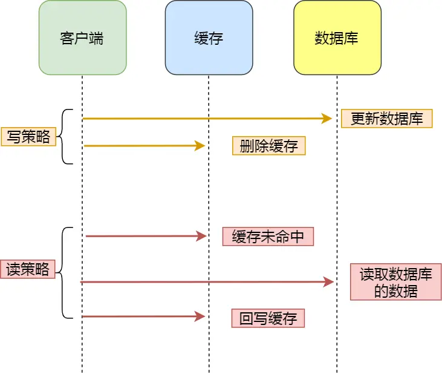

> Redis/面试

> 整理一些关于Redis的面试问题

<div align=center></div>

1. 针对Redis中热点数据的缓存怎么处理？

    > 当前key是一个热点key（例如一个热门的娱乐新闻），并发量非常大重建缓存不能在短时间完成，可能是一个复杂计算，例如复杂的SQL、多次IO、多个依赖等在缓存失效的瞬间，有大量线程来重建缓存，造成后端负载加大，甚至可能会让应用崩溃。

    **方案一：互斥锁（mutex）**，只允许一个线程重建缓存，其他线程等待重建缓存的线程执行完，重新从缓存获取数据。

    * **具体逻辑**

        1）从Redis获取数据，如果值不为空，则直接返回值；否则执行下面的2.1）和2.2）步骤   
            2.1）如果set（nx和ex）结果为true，说明此时没有其他线程重建缓存， 那么当前线程执行缓存构建逻辑。  
            2.2）如果set（nx和ex）结果为false，说明此时已经有其他线程正在执行构建缓存的工作，那么当前线程将休息指定时间（例如这里是50毫秒，取决于构建缓存的速度）后，重新执行函数，直到获取到数据。

        > Redis 的 set 命令允许将键值对存储在 Redis 中。其中，参数 nx 和 ex 可用于控制键值对的存储。
        >
        > nx 参数表示当键不存在时才执行 set 操作。如果键已经存在，则不执行 set 操作并返回错误信息。
        >
        > ex 参数表示设置键的过期时间，单位为秒。如果键在指定时间内未被访问，则 Redis 会自动删除该键。
        >
        > 示例：
        >
        > ```shell
        > 127.0.0.1:6379> set key value nx ex 10
        > OK
        > ```
        >
        > 这个例子中，将 key 和 value 设置为键值对，并在键不存在时才执行 set 操作，并设置键的过期时间为10s。

    * **优缺点**

        如果构建缓存过程出现问题或者时间较长，可能会存在**死锁和线程池阻塞的风险**，但是这种方法能够较好地降低后端存储负载，并在**一致性上做得比较好**。

    **方案二：永远不过期**，设置热点数据的缓存为永不过期。

    * **具体逻辑**

        从缓存层面来看，确实没有设置过期时间，所以不会出现热点key过期 后产生的问题，也就是“物理”不过期。

        从功能层面来看，为每个value设置一个逻辑过期时间，当发现超过逻辑过期时间后，会**使用单独的线程去构建缓存**。

    * **优缺点**

        由于没有设置真正的过期时间，实际上已经**不存在热点key产生的一系列危害**，但是会存在**数据不一致的情况**，同时代码复杂度会增大。

    **问题：怎么知道哪些数据是热点数据？因为本地缓存资源有限，不可能把所有的商品数据进行缓存，它只会缓存热点的数据。那怎么知道数据是热点数据呢？**

    利用redis4.x自身特性，**LFU机制**发现热点数据。实现很简单，只要把redis内存淘汰机制设置为`allkeys-lfu`或者`volatile-lfu`方式，再执行`./redis-cli --hotkeys`会返回访问频率高的key，并从高到底的排序,在设置key时，需要把商品id带上，这样就是知道是哪些商品了。

1. 更新Redis和MySQL时的数据一致性问题

    在更新Redis和MySQL数据的时候，存在以下几种情况：

    * 先更新数据库，后更新Redis

        请求A和B同时请求过来，请求A更新数据为2，请求B更新数据为3。请求A先更新数据库，请求B先更新数据库，请求B先更新缓存，请求A后更新缓存。此时数据库数据为3，缓存数据为2，数据不一致。

    * 先更新Redis，后更新数据库

        请求A和B同时请求过来，请求A更新数据为2，请求B更新数据为3。请求A先更新缓存，请求B先更新缓存，请求B先更新数据库，请求A后更新数据库。此时缓存数据为3，数据库数据为2，数据不一致。

    上面讲到的两种情况都不能很好的解决数据更新的问题，接下来我们讨论另外的一种策略。

    **Cache Aside 策略**，中文是叫旁路缓存策略。该策略又分为写策略和读策略。

    <div align=center></div>

    **写策略的步骤：**

    - 先更新数据库中的数据，再删除缓存中的数据。

    **读策略的步骤：**

    - 如果读取的数据命中了缓存，则直接返回数据；
    - 如果读取的数据没有命中缓存，则从数据库中读取数据，然后将数据写入到缓存，并且返回给用户。

    策略分析：

    * 先删除Redis中的缓存，后更新数据库

        读请求A和写请求B同时过来，目前数据库的数据是1，写请求要将其修改为2。此时请求B先删除了缓存，接着请求A发现缓存不存在，就将数据库数据1读出并重新缓存，最后请求B将数据2更新到数据库。此时缓存数据为1，数据库存储数据为2。

    * 先更新数据库中的数据，后删除Redis中的缓存

        写请求A和读请求B同时过来，目前数据库的数据是1，写请求要将其修改为2。此时请求B先请求缓存，发现缓存不存在，就会将数据库中的1读出来。接着请求A先修改数据库中的数据为2，更新到数据库中，此时数据库是1，然后删除缓存。最后请求B数据1缓存到缓存中。此时存在不一致。

        但是上面说到的这种情况是很少见的，因为请求B从数据库中读取到1后，写入缓存的速度是远远快于请求A数据库的操作，所以**先更新数据库中的数据，后删除Redis中的缓存是可以保证缓存一致性的**。

    除了上面讲到的这一点外，在进行数据缓存时一定要**保证互斥性**；第二缓存的数据一定要**加有效时间**。

1. Redis集群中是否存在分布式一致性问题？

    Redis 集群中存在分布式一致性问题。在分布式系统中，数据通常会被分散存储在多个节点上，每个节点都可以独立地进行读写操作。如果没有适当的一致性协议来协调这些节点的操作，就可能会出现数据不一致的情况。

    为了解决这个问题，Redis 集群采用了一种称为**Redis Cluster的一致性协议**。该协议通过使用Gossip协议来传播集群状态信息，并使用Raft算法来保证数据的一致性。
    具体来说，当一个客户端向 Redis 集群发送一个**写操作**时，该操作会被转发到**主节点上进行处理**。主节点会将写操作广播给其他从节点，并等待大多数从节点确认写入成功后，再将结果返回给客户端。这样可以保证数据在多个节点上的一致性。

    然而，即使采用了 Redis Cluster 一致性协议，仍然可能会出现一些分布式一致性问题，例如网络延迟、节点故障等。为了提高系统的可靠性和容错性，通常需要采用一些额外的措施，如数据备份、故障恢复等。

1. Redis的事务是怎么做的？

    Redis 的事务是指将一组命令组合在一起，以原子性的方式执行这些命令。事务中的所有命令要么全部成功执行，要么全部失败执行，不会出现部分成功部分失败的情况。

    在 Redis 中，可以使用以下命令来执行事务：

    ```
    MULTI
    // 一组命令
    EXEC
    ```

    其中，MULTI命令表示开始一个事务，EXEC命令表示执行事务中的命令。

    以下是一个使用 Redis 事务的示例：

    ```
    127.0.0.1:6379> MULTI
    OK
    127.0.0.1:6379> SET key1 value1
    QUEUED
    127.0.0.1:6379> SET key2 value2
    QUEUED
    127.0.0.1:6379> GET key1
    QUEUED
    127.0.0.1:6379> GET key2
    QUEUED
    127.0.0.1:6379> EXEC
    1) OK
    2) OK
    3) "value1"
    4) "value2"
    ```

    在这个示例中，我们首先使用MULTI命令开始一个事务，然后依次执行了四个命令：

    * `SET key1 value1`：将key1的值设置为value1。
    * `SET key2 value2`：将key2的值设置为value2。
    * `GET key1`：获取key1的值。
    * `GET key2`：获取key2的值。

    最后，我们使用EXEC命令执行事务中的命令。可以看到，事务中的四个命令都被成功执行了。

1. Redis的事务支持回滚吗，换句话说支持原子性吗？

    **不支持。**

    按照我们对关系型数据库的理解：

    * **原子性**：数据库中的某个事务A中要更新t1表、t2表的某条记录，当事务提交，t1、t2两个表都被更新，若其中一个表操作失败，事务将回滚。
    * **非原子性**：数据库中的某个事务A中要更新t1表、t2表的某条记录，当事务提交，t1、t2两个表都被更新，若其中一个表操作失败，另一个表操作继续，事务不会回滚。

    Redis的事务执行不是原子的性的，我们来看两个例子：

    * **语法错误（编译器错误）**，在开启事务后，修改k1值为11，k2值为22，但k2语法错误，最终导致事务提交失败，此时事务会滚，k1、k2保留原值。

        ```
        127.0.0.1:6379> set k1 v1
        OK
        127.0.0.1:6379> set k2 v2
        OK
        127.0.0.1:6379> multi
        OK
        127.0.0.1:6379(TX)> set k1 11
        QUEUED
        127.0.0.1:6379(TX)> sets k2 22
        (error) ERR unknown command `sets`, with args beginning with: `k2`, `22`, 
        127.0.0.1:6379(TX)> exec
        (error) EXECABORT Transaction discarded because of previous errors.
        127.0.0.1:6379> get k1
        "v1"
        127.0.0.1:6379> get k2
        "v2"
        ```

    * **Redis类型错误（运行时错误）**，在开启事务后，修改k1值为11，k2值为22，但将k2的类型作为List，在运行时检测类型错误，最终导致事务提交失败，此时事务并没有回滚，而是跳过错误命令继续执行， 结果k1值改变、k2保留原值。

        ```
        127.0.0.1:6379> set k1 v1
        OK
        127.0.0.1:6379> set k2 v2
        OK
        127.0.0.1:6379> multi
        OK
        127.0.0.1:6379(TX)> set k1 11
        QUEUED
        127.0.0.1:6379(TX)> lpush k2 22
        QUEUED
        127.0.0.1:6379(TX)> exec
        1) OK
        2) (error) WRONGTYPE Operation against a key holding the wrong kind of value
        127.0.0.1:6379> git k1
        (error) ERR unknown command `git`, with args beginning with: `k1`, 
        127.0.0.1:6379> get k1
        "11"
        127.0.0.1:6379> get k2
        "v2"
        ```

    **以上两个例子总结出，多数事务失败是由语法错误或者数据结构类型错误导致的，语法错误说明在命令入队前就进行检测的，而类型错误是在执行时检测的，Redis为提升性能而采用这种简单的事务，这是不同于关系型数据库的，特别要注意区分。**

1. Redis的数据类型

    - String
        - 使用场景
            - 缓存对象
            - 常规计数
            - 分布式锁
            - 共享session
        - 存储的最大容量
            - Redis 一个字符串类型的值最大可以存储512MB的数据。这是因为Redis使用了一个sds数据结构（simple dynamic string），这种数据结构在Redis中被广泛使用，可以实现高效的字符串操作，并且支持动态扩容。而sds的最大长度是2^32-1字节，也就是4GB，但在Redis中，字符串类型的值除了存储数据外，还需要存储一些元数据信息（例如长度等），所以实际上字符串类型的值能存储的最大容量是512MB。
    - List
    - Hash
    - Set
    - Zset

1. 使用Redis有哪些好处？

  * 快速性能：Redis 是基于内存的数据库，因此它的读写速度非常快，可以达到每秒数万次的读写操作。
  * 数据类型丰富：Redis 支持多种数据类型，包括字符串、列表、集合、哈希、有序集合等，可以满足不同的应用场景。
  * 数据持久化：Redis 支持数据持久化，可以将数据存储在磁盘上，以防止数据丢失。
  * 高可用性：Redis 支持主从复制和哨兵机制，可以实现高可用性。
  * 分布式支持：Redis 支持分布式部署，可以通过 Redis Sentinel 和 Redis Cluster 实现。
  * 简单易用：Redis 的命令简单易用，学习成本低，可以快速上手。
  * 应用广泛：Redis 被广泛应用于缓存、会话存储、排行榜、计数器等场景。

1. Memcache和Redis的区别

  * 数据类型：Memcache 只支持简单的key-value结构，而 Redis 支持更多的数据类型，如字符串、列表、集合、哈希、有序集合等。
  * 数据持久化：Memcache 不支持数据持久化，数据存储在内存中，当服务器重启或关闭时，数据会丢失。而 Redis 支持数据持久化，可以将数据存储在磁盘上，以防止数据丢失。
  * 内存管理：Memcache 使用固定大小的内存块来存储数据，当内存块已满时，会淘汰最近最少使用的数据。而 Redis 使用动态内存管理，可以根据需要分配内存。
  * 性能：Memcache 在简单的缓存场景下性能较好，但在处理复杂的数据结构和操作时性能较差。而 Redis 在处理复杂的数据结构和操作时性能较好。
  * 分布式支持：Memcache 本身不支持分布式，需要使用第三方工具来实现分布式缓存。而 Redis 支持分布式部署，可以通过 Redis Sentinel 和 Redis Cluster 实现。
  * 命令复杂度：Memcache 的命令简单，复杂度较低，而 Redis 的命令相对复杂，复杂度较高。

1. Redis是单线程的吗？

  **Redis 单线程指的是「接收客户端请求->解析请求 ->进行数据读写等操作->发送数据给客户端」这个过程是由一个线程（主线程）来完成的**，这也是我们常说 Redis 是单线程的原因。

1. Redis采用多线程为什么还这么快？

  - Redis 的大部分操作**都在内存中完成**，并且采用了高效的数据结构，因此 Redis 瓶颈可能是机器的内存或者网络带宽，而并非 CPU，既然 CPU 不是瓶颈，那么自然就采用单线程的解决方案了；
  - Redis 采用单线程模型可以**避免了多线程之间的竞争**，省去了多线程切换带来的时间和性能上的开销，而且也不会导致死锁问题。
  - Redis 采用了 **I/O 多路复用机制**处理大量的客户端 Socket 请求，IO 多路复用机制是指一个线程处理多个 IO 流，就是我们经常听到的 select/epoll 机制。简单来说，在 Redis 只运行单线程的情况下，该机制允许内核中，同时存在多个监听 Socket 和已连接 Socket。内核会一直监听这些 Socket 上的连接请求或数据请求。一旦有请求到达，就会交给 Redis 线程处理，这就实现了一个 Redis 线程处理多个 IO 流的效果。

1. Redis的持久化机制是什么？自个的优缺点

   - RDB
       - Redis DataBase缩写快照
       - 默认的持久化方式。
       - 优点
           - 只有一个文件，方便持久化。
           - 容灾性好，一个文件可以保存到安全的磁盘。
           - 性能最大化，fork 子进程来进行持久化写操作，让主进程继续处理命令，只存在毫秒级不响应请求。
           - 相对于数据集大时，比 AOF 的启动效率更高。
       - 缺点
           - RDB 是间隔一段时间进行持久化，如果持久化之间 redis 发生故障，会发生数据丢失。
   - AOF
       - Append Only File持久化
       - 优点
           - 数据安全系数高，如果服务器发送宕机，数据丢失的少。
       - 缺点
           - AOF 文件比 RDB 文件大，且恢复速度慢。
           - 数据集大的时候，比 rdb 启动效率低。

1.  Redis过期键的删除策略

     为键值对设置有效时间，一旦过期之后redis会通过以下两种方式对缓存进行清除。一个设置过键值对的缓存，过期之后虽然查询不了但是他还是占用着内存空间。

     * 主动删除：Redis会定期主动淘汰一批已过期的key。
     * 被动删除：不主动删除过期键，每次从数据库访问 key 时，都检测 key 是否过期，如果过期则删除该 key。

1. Redis的内存淘汰策略有哪些？

     只有在 Redis 的运行内存达到了我们设置的最大运行内存，才会触发内存淘汰策略。

     * 第一类：不进行数据淘汰
     * 第二类：进行数据淘汰
         * 设置了过期时间的键
             * LRU：least recently used，最久没被访问的数据
             * LFU：least frequently used，最不经常使用的数据
             * TTL：time to live，最早过期的数据
             * random：随机数据
         * 对所有键
             * random
             * LRU
             * LFU

1. 为什么redis要将所有数据放到内存中

# 参考文章

* [这些年背过的面试题——Redis篇](https://mp.weixin.qq.com/s/8-Lf5KiyclW77uQwrYDTCw)
* [小林coding-Redis面试题]()