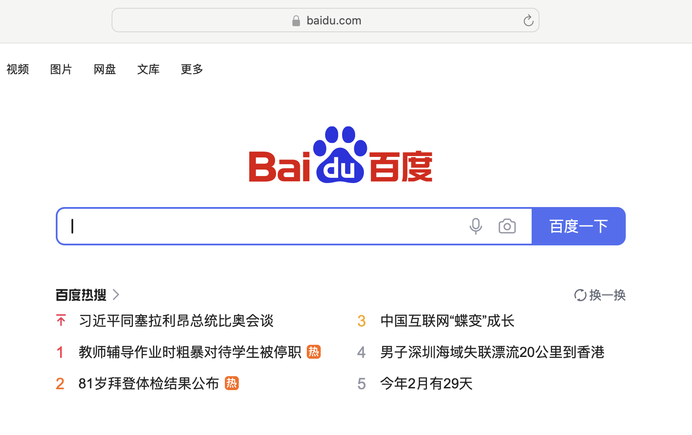

> 网络/TCP/HTTP

> 之前在一次面试过程中被问到关于网络相关的问题，自己答得不是很好，这里写一篇博客记录下。

# 在浏览器中输入一个网址到网页被加载到浏览器中，期间的过程是什么样的

当你在浏览器中输入一个网址并按下回车键时，以下是发生的一系列过程：

1. **域名解析**：浏览器将你输入的网址发送到 DNS（域名系统）服务器，请求将域名解析为对应的 IP 地址。DNS 服务器查找并返回该网址的 IP 地址。
2. **TCP 连接建立**：浏览器使用获取到的 IP 地址与服务器建立 TCP（传输控制协议）连接。这是通过三次握手过程完成的，确保客户端和服务器之间可以可靠地传输数据。
3. **HTTP 请求发送**：一旦建立了 TCP 连接，浏览器会通过 HTTP（超文本传输协议）向服务器发送请求。请求中包含了要访问的网页的 URL、请求方法（通常是 GET）、用户代理信息以及其他可能的头部信息。
4. **服务器响应**：服务器接收到 HTTP 请求后，会根据请求的内容生成相应的响应。响应包括状态码、头部信息和网页的内容（如 HTML、CSS、JavaScript 等）。
5. **内容传输**：服务器将响应的内容通过 TCP 连接发送回浏览器。浏览器接收到数据后，会逐步解析和渲染网页内容，包括构建 DOM 树、加载样式表和执行 JavaScript 代码。
6. **网页呈现**：浏览器根据解析后的内容，将网页呈现在用户界面上。你可以在浏览器中看到网页的布局、图像、文本等。
7. **断开连接**：一旦网页完全加载，浏览器可能会与服务器断开 TCP 连接。不过，在某些情况下，如长连接或 HTTP/2，连接可能会保持一段时间以供后续请求使用。

这个过程中还涉及到其他的技术和协议，如 HTTPS（安全超文本传输协议）用于安全连接、CDN（内容分发网络）用于加速内容传输等。