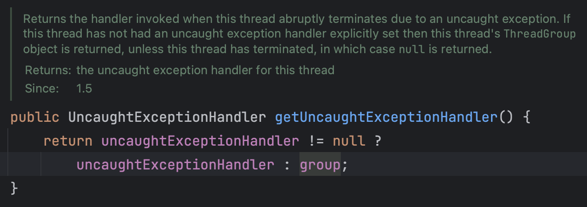

> 并发编程/Log4j2/日志/线程池

> 最近在项目中使用线程池去异步执行耗时操作，生产上出现问题去排查日志，但是日志中却没有记录日志。下面通过这篇文件来讨论下这个问题。

# 问题还原

1. 首先看下我们的日志配置文件

    ```xml
    <?xml version="1.0" encoding="UTF-8"?>
    <!--Log4j2的内部日志级别设置为warn，-->
    <Configuration status="WARN" monitorInterval="30">
        <Properties>
            <Property name="LOG_PATTERN">[%date{yyyy-MM-dd HH:mm:ss.SSS}][%thread][%level{length=5}][%logger{36}.%M(%line)]-%msg %n</Property>
        </Properties>
    
        <Appenders>
            <Console name="console" target="SYSTEM_OUT" follow="true">
                <PatternLayout pattern="${LOG_PATTERN}"/>
            </Console>
    
            <RollingFile name="LogToRollingFile" fileName="logs/app.log"
                         filePattern="logs/$${date:yyyy-MM}/app-%d{MM-dd-yyyy}-%i.log.gz">
                <PatternLayout pattern="${LOG_PATTERN}"/>
                <Policies>
                    <TimeBasedTriggeringPolicy interval="1" modulate="true"/>
                    <SizeBasedTriggeringPolicy size="50MB"/>
                </Policies>
            </RollingFile>
        </Appenders>
    
        <Loggers>
            <Root level="info">
                <AppenderRef ref="console"/>
                <AppenderRef ref="LogToRollingFile"/>
            </Root>
        </Loggers>
    </Configuration>
    ```

2. 接下来我们看下我们利用线程池执行的代码逻辑

    ```java
    @Slf4j
    public class CustomThreadPool extends ThreadPoolExecutor {
    
        public CustomThreadPool(int corePoolSize, int maximumPoolSize, long keepAliveTime, TimeUnit unit, BlockingQueue<Runnable> workQueue, ThreadFactory threadFactory, RejectedExecutionHandler handler) {
            super(corePoolSize, maximumPoolSize, keepAliveTime, unit, workQueue, threadFactory, handler);
        }
    
        public static void main(String[] args) {
            CustomThreadPool example = new CustomThreadPool(5, 5,
                    0L, TimeUnit.MILLISECONDS,
                    new LinkedBlockingQueue<Runnable>(), new CustomThreadFactory("custom"), new AbortPolicy());
            example.execute(CustomThreadPool::operate);
            example.shutdown();
        }
    
        private static void operate() {
            log.info("开始执行");
            int i = 1 / 0;
            log.info("执行结束");
        }
    
    }
    ```

3. 控制台和文件中记录的日志比较

    从下面的图中我们可以看到**控制台日志**中打印了两行，第一行和日志文件中的第一行内容是一致的，第二行是在程序执行的过程中遇到了除0异常，但是奇怪的是**日志文件**中却没有记录这这行异常日志。

    

# 问题原因

下面我们来跟踪下这个异常抛出的原因，在`Thread`类中有一个`dispatchUncaughtException(Throwable e)`方法，该方法是由JVM调用的，这个方法的定义如下：


接着看`getUncaughtExceptionHandler()`方法：



这个方法中首先会判断Thread对象本身的`uncaughtExceptionHandler`是否为空，如果有的话使用自己的hander，如果没有的话使用`ThreadGroup`的handler。

接着我们看下`UncaughtExceptionHandler`接口的定义，这个接口只有一个方法声明：


实现这个接口的类并不多，这里我们看下ThreadGroup的实现逻辑：


这段代码的逻辑有三个分支逻辑：

1. 如果该线程组的父线程组不为`null`，就使用父类的`uncaughtException()`方法捕获异常。
2. 获取线程的默认异常捕获处理器，如果默认处理器不为`null`，则使用默认处理器捕获异常。
3. **如果默认处理器为`null`，则将异常输出到控制台。正是这段代码导致了上面异常信息输出到了控制台，没有正常被捕获。**

所以综合上面的逻辑来看，**未捕获异常处理首先由线程控制，然后由线程的`ThreadGroup`对象控制，最后由默认的未捕获异常处理程序控制**。

# 解决办法

## 第一种 手动捕获

手动捕获也就是说在使用线程池异步执行的代码块外面添加捕获逻辑，具体代码如下：

```java
private static void operate() {
  	try {
      log.info("开始执行");
    	int i = 1 / 0;
    	log.info("执行结束");
    } catch(Throwable e) {
      log.error("执行异常", e);
    }
}
```

## 第二种 设置 UncaughtExceptionHandler

在上面分析的逻辑中提到，可以分别在三个地方设置异常捕获处理器，分别是当前线程、线程组或者线程默认的异常处理器，这里我们选择第一种为当前线程设置异常捕获处理器。具体代码如下：

*1.自定义线程工厂：*

```java
@Slf4j
public class CustomThreadFactory implements ThreadFactory {

    private String namePrefix;
    private LongAdder threadNum = new LongAdder();

    public CustomThreadFactory(String namePrefix) {
        this.namePrefix = namePrefix;
    }

    @Override
    public Thread newThread(Runnable r) {
        Thread t = new Thread(r);
        t.setName(this.namePrefix + "-" + this.threadNum);
        // 处理线程执行逻辑抛出异常不输出日志到文件的问题
        t.setUncaughtExceptionHandler(new Thread.UncaughtExceptionHandler() {
            @Override
            public void uncaughtException(Thread t, Throwable e) {
                log.error("线程池线程执行出现异常", e);
            }
        });
        this.threadNum.increment();
        return t;
    }
}
```

*2.自定义线程池：*

```java
@Slf4j
public class CustomThreadPool extends ThreadPoolExecutor {


    private final ThreadLocal<Map<String, Object>> threadLocal = new ThreadLocal<>();

    public CustomThreadPool(int corePoolSize, int maximumPoolSize, long keepAliveTime, TimeUnit unit, BlockingQueue<Runnable> workQueue, ThreadFactory threadFactory, RejectedExecutionHandler handler) {
        super(corePoolSize, maximumPoolSize, keepAliveTime, unit, workQueue, threadFactory, handler);
    }

    public static void main(String[] args) {
        CustomThreadPool example = new CustomThreadPool(5, 5,
                0L, TimeUnit.MILLISECONDS,
                new LinkedBlockingQueue<Runnable>(), new CustomThreadFactory("custom"), new AbortPolicy());

        example.execute(CustomThreadPool::operate);

        example.shutdown();
    }

    private static void operate() {
        log.info("开始执行");
        int i = 1 / 0;
        log.info("执行结束");
    }
}
```

运行上面的代码，下面我们可以看到日志文件和控制台上都正确的输出了日志。


# 参考文章

* [Java 并发编程——线程池的异常处理机制](https://jitwxs.cn/aa970b7c.html)