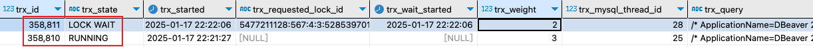

| title       | tags          | background                                                   | auther | isSlow |
| ----------- | ------------- | ------------------------------------------------------------ | ------ | ------ |
| MySQL锁探究 | MySQL/锁/事务 | 最近在研究基于数据库实现分布式序列号生成方案时发现，自己对MySQL这块锁的理解还停留在理论和简单使用的层面，并没与在实践中充分的掌握这块知识点，所以这里专门开一篇文章来讨论这块内容。 | depers | true   |

# 全局锁

1. 使用

    给数据库添加全局锁：

    ```sql
    flush tables with read lock
    ```

    解除全局锁：

    ```sql
    unlock tables
    ```

2. 作用：使整个数据库处于只读状态。

3. 使用场景：做**全库逻辑备份**，这样在备份数据库期间，不会因为数据或表结构的更新，而出现备份文件的数据与预期的不一样。

4. 全局锁的缺点：如果为整个数据库添加了全局锁，所有业务的数据库操作都会被阻塞，影响生产环境的正常运转。

5. 数据备份的最佳实践：

    在**可重复读的隔离级别下**，在**备份数据库之前先开启事务**，会先创建 Read View，然后整个事务执行期间都在用这个 Read View，而且由于 MVCC 的支持，备份期间业务依然可以对数据进行更新操作。

# 表级锁

# 表锁

* **共享锁**
    * 加锁命令：`LOCK TABLES t READ`
* **排他锁**
    * 加锁命令：`LOCK TABLES t WRITE`

## 意向锁

* **意向共享锁**
* **意向排他锁**

## 元数据锁

## AUTO-INC锁


# 行级锁

## 记录锁

* **别名**：也叫**Record Lock**，是**排他锁**。
* **加锁场景**：仅仅是将一条记录锁上，所以记录锁是**查询条件是添加了唯一非空索引或是主键索引的列**，同时**查询语句必须为精准匹配**（`=`）。
* **作用**：只会将当前一行数据锁定，对该锁的正常读操作没有影响，会阻塞其他事务对这条记录的写操作。

### 通过加排他锁的获取记录锁                                                                                                                                                                             

创建表`user`

```sql
CREATE TABLE `user` (
  `id` int NOT NULL AUTO_INCREMENT COMMENT '主键',
  `name` varchar(20) NOT NULL DEFAULT '' COMMENT '姓名',
  PRIMARY KEY (`id`),
  UNIQUE KEY `uni_name` (`name`)
) ENGINE=InnoDB COMMENT='用户表';

-- 预埋两行数据
insert `user` (`name`)values('a'),('b');
```

`user`表有两个字段，一个是`id`，添加了**主键索引**。一个是`name`，添加了**非空唯一索引**。值得注意的是如果一个列添加了唯一索引，但是这个列可以为null，这种情况下这个列首先可以插入多个null值，其次针对这个列的是不会添加记录锁的。

为了方便观察，我们将`innodb_status_output_locks`参数设置为`ON`，这个参数用于控制是否在 `SHOW ENGINE INNODB STATUS` 命令的输出中包含详细的锁定信息。

首先我们来看下`innodb_status_output_locks`参数的设置情况，如果为`NO`那就是合适的：

```sql
show variables like 'innodb_status_output_locks';
```

如果不是，使用下面的语句开启该设置：

```sql
set global innodb_status_output_locks = ON;
```

执行下面的sql，观察记录锁的情况：

```sql
-- 开启一个事务
begin;

-- name为非空唯一索引列
select * from `user` where name = 'a' for update;

-- 查看锁的情况
show engine innodb status;
```

这里我把`show engine innodb status;`的执行情况贴出来：

```sql
------------
TRANSACTIONS
------------
---TRANSACTION 358802, ACTIVE 6 sec
3 lock struct(s), heap size 1128, 2 row lock(s)
MySQL thread id 13, OS thread handle 6158036992, query id 145 localhost 127.0.0.1 root starting
/* ApplicationName=DBeaver 22.3.3 - SQLEditor <Script-2.sql> */ show engine innodb status
TABLE LOCK table `mysql-lock`.`user` trx id 358709 lock mode IX
RECORD LOCKS space id 566 page no 5 n bits 72 index uni_name of table `mysql-lock`.`user` trx id 358709 lock_mode X locks rec but not gap
Record lock, heap no 2 PHYSICAL RECORD: n_fields 2; compact format; info bits 0
 0: len 1; hex 61; asc a;;
 1: len 4; hex 80000001; asc     ;;

RECORD LOCKS space id 566 page no 4 n bits 72 index PRIMARY of table `mysql-lock`.`user` trx id 358709 lock_mode X locks rec but not gap
Record lock, heap no 2 PHYSICAL RECORD: n_fields 4; compact format; info bits 0
 0: len 4; hex 80000001; asc     ;;
 1: len 6; hex 000000057930; asc     y0;;
 2: len 7; hex 810000008b0110; asc        ;;
 3: len 1; hex 61; asc a;;
```

上面的事务id为358802，因为我们开启了手动事务，所以这个事务id可以通过`select * from information_schema.innodb_trx;`这句sql查询到。

接着我们再执行下面的一条sql，这句sql的意思就是获取该行的共享锁，因为记录锁是排他锁，所以会阻塞共享锁。所以执行完这句sql之后我们的查询框就会一直等待，直到锁等待超时：

```Java
select * from `user` where name = 'a' LOCK IN SHARE MODE;
```

接着再执行`select * from information_schema.innodb_trx;`这句sql：


在上面我们可以清晰的看到一条表锁，两条记录锁的记录。下面我们一条一条来分析。

* 表锁-意向排他锁

    ```sql
    TABLE LOCK table `mysql-lock`.`user` trx id 358709 lock mode IX
    ```

    * **table mysql-lock.user**：表示该锁所在的表是 `mysql-lock` 数据库中的 `user` 表。

    - **trx id 358709**：表示持有该锁的事务ID为358709。
    - **lock mode IX**：表示锁的模式为意向排他锁（Intention Exclusive Lock，简称IX锁）。

* 记录锁（非空唯一索引）

    ```sql
    RECORD LOCKS space id 566 page no 5 n bits 72 index uni_name of table `mysql-lock`.`user` trx id 358709 lock_mode X locks rec but not gap
    ```

    - **index uni_name**：表示该锁是针对表 `mysql-lock`.`user` 中名为 `uni_name` 的索引。`uni_name` 是一个唯一索引（UNIQUE INDEX）。
    - **of table mysql-lock.user**：表示该锁所在的表是 `mysql-lock` 数据库中的 `user` 表。
    - **trx id 358709**：表示持有该锁的事务ID为358709。
    - **lock_mode X**：表示锁的模式为排他锁（X锁）。排他锁用于写操作，确保在事务释放锁之前，其他事务不能读取或写入该记录。
    - **locks rec but not gap**：表示该锁是记录锁，而不是间隙锁。记录锁锁定的是具体的记录，而间隙锁锁定的是记录之间的间隙，用于防止其他事务在该间隙中插入新记录。

* 记录锁（主键索引）

    ```sql
    RECORD LOCKS space id 566 page no 4 n bits 72 index PRIMARY of table `mysql-lock`.`user` trx id 358709 lock_mode X locks rec but not gap
    ```

    - **index PRIMARY**：表示该锁是针对表 `mysql-lock`.`user` 中的主键索引（PRIMARY KEY）。
    - **of table mysql-lock.user**：表示该锁所在的表是 `mysql-lock` 数据库中的 `user` 表。
    - **trx id 358709**：表示持有该锁的事务ID为358709。
    - **lock_mode X**：表示锁的模式为排他锁（X锁）。排他锁用于写操作，确保在事务释放锁之前，其他事务不能读取或写入该记录。
    - **locks rec but not gap**：表示该锁是记录锁，而不是间隙锁。记录锁锁定的是具体的记录，而间隙锁锁定的是记录之间的间隙，用于防止其他事务在该间隙中插入新记录。

**总结：在对非空唯一索引的列或是主键id进行精准查询，并使用排他锁的方式查询，会在那一条记录上面添加记录锁。**

### 通过更新操作获取记录锁

执行如下sql：

```sql
-- 开启一个事务
begin;

-- id是主键
update `user` set name = 'aaa' where id = 1;

-- 查看锁的情况
show engine innodb status;
```

把`show engine innodb status;`的执行情况贴出来：

```sql
---TRANSACTION 358803, ACTIVE 3 sec
2 lock struct(s), heap size 1128, 1 row lock(s)
MySQL thread id 13, OS thread handle 6158036992, query id 273 localhost 127.0.0.1 root starting
/* ApplicationName=DBeaver 22.3.3 - SQLEditor <Script-2.sql> */ show engine innodb status
TABLE LOCK table `mysql-lock`.`user` trx id 358720 lock mode IX
RECORD LOCKS space id 566 page no 4 n bits 72 index PRIMARY of table `mysql-lock`.`user` trx id 358720 lock_mode X locks rec but not gap
Record lock, heap no 4 PHYSICAL RECORD: n_fields 4; compact format; info bits 0
 0: len 4; hex 80000001; asc     ;;
 1: len 6; hex 00000005793e; asc     y>;;
 2: len 7; hex 0200000150161c; asc     P  ;;
 3: len 3; hex 616161; asc aaa;;
```

从上面的描述中我们可以看到`update`操作触发了记录锁的逻辑。

接着我们再执行下面的一条sql，这句sql的意思就是获取该行的共享锁，因为记录锁是排他锁，所以会阻塞共享锁。所以执行完这句sql之后我们的查询框就会一直等待，直到锁等待超时：

```Java
select * from `user` where name = 'a' LOCK IN SHARE MODE;
```

接着再执行`select * from information_schema.innodb_trx;`这句sql：


**总结：在对非空唯一索引的列或是主键id进行精准更新，会在那一条记录上面添加记录锁。**

### 加了记录锁的效果

* 阻塞的情况
    * `select * from user where name = 'a' LOCK IN SHARE MODE;`
    * `UPDATE user SET name = 'Alice Smith' WHERE id = 1;`
* 不阻塞的情况
    * `select * from user where name = 'a';`
    * `INSERT INTO user (id, name) VALUES (3, 'David');`

## 间隙锁

* 排他锁的一种，也叫**Gap Lock**。
* **不允许其他事务往这条记录前面的间隙插入新记录，锁定一个范围但是不包含记录本身**。
* 仅在可重复读（Repeatable Read）隔离级别下有效。
* 作用：解决幻读问题。
* 基于**非唯一索引，也就是说主键索引也是可以**。

### 实践

创建表结构

```sql
CREATE TABLE `student` (
  `id` bigint NOT NULL AUTO_INCREMENT COMMENT '主键',
  `name` varchar(20) NOT NULL DEFAULT '' COMMENT '姓名',
  PRIMARY KEY (`id`)
) ENGINE=InnoDB COMMENT='学生表';

-- 预铺数据
insert into student(`id`, `name`) values (1, 'a'),(5, 'b');
```

接着我们执行如下sql：

```sql
-- 开启一个事务358810
begin;

-- id是主键，进行范围查询，在id区间为（1,5）直接添加间隙锁
SELECT * FROM `student` WHERE id BETWEEN 1 AND 5 FOR UPDATE;
```

接着我们再继续执行下面的sql，当前事务会被阻塞：

```sql
-- 在id区间为（1,5）中插入记录，事务358811
insert into `student` (`id`, `name`) value(3, 'e')
```

接着再执行`select * from information_schema.innodb_trx;`这句sql：



接着执行`show engine innodb status;`查看锁的情况：

```Java
---TRANSACTION 358811, ACTIVE 17 sec inserting
mysql tables in use 1, locked 1
LOCK WAIT 2 lock struct(s), heap size 1128, 1 row lock(s)
MySQL thread id 28, OS thread handle 6162493440, query id 834 localhost 127.0.0.1 root update
/* ApplicationName=DBeaver 22.3.3 - SQLEditor <Script-6.sql> */ insert into `student` (`id`, `name`) value(3, 'e')
------- TRX HAS BEEN WAITING 17 SEC FOR THIS LOCK TO BE GRANTED:
RECORD LOCKS space id 567 page no 4 n bits 72 index PRIMARY of table `mysql-lock`.`student` trx id 358811 lock_mode X locks gap before rec insert intention waiting
Record lock, heap no 3 PHYSICAL RECORD: n_fields 4; compact format; info bits 0
 0: len 8; hex 8000000000000005; asc         ;;
 1: len 6; hex 000000057978; asc     yx;;
 2: len 7; hex 810000009e0121; asc       !;;
 3: len 1; hex 62; asc b;;

------------------
TABLE LOCK table `mysql-lock`.`student` trx id 358811 lock mode IX
RECORD LOCKS space id 567 page no 4 n bits 72 index PRIMARY of table `mysql-lock`.`student` trx id 358811 lock_mode X locks gap before rec insert intention waiting
Record lock, heap no 3 PHYSICAL RECORD: n_fields 4; compact format; info bits 0
 0: len 8; hex 8000000000000005; asc         ;;
 1: len 6; hex 000000057978; asc     yx;;
 2: len 7; hex 810000009e0121; asc       !;;
 3: len 1; hex 62; asc b;;

---TRANSACTION 358810, ACTIVE 56 sec
3 lock struct(s), heap size 1128, 3 row lock(s)
MySQL thread id 25, OS thread handle 6158036992, query id 838 localhost 127.0.0.1 root starting
/* ApplicationName=DBeaver 22.3.3 - SQLEditor <Script-2.sql> */ show engine innodb status
TABLE LOCK table `mysql-lock`.`student` trx id 358810 lock mode IX
RECORD LOCKS space id 567 page no 4 n bits 72 index PRIMARY of table `mysql-lock`.`student` trx id 358810 lock_mode X locks rec but not gap
Record lock, heap no 2 PHYSICAL RECORD: n_fields 4; compact format; info bits 0
 0: len 8; hex 8000000000000001; asc         ;;
 1: len 6; hex 000000057978; asc     yx;;
 2: len 7; hex 810000009e0110; asc        ;;
 3: len 1; hex 61; asc a;;

RECORD LOCKS space id 567 page no 4 n bits 72 index PRIMARY of table `mysql-lock`.`student` trx id 358810 lock_mode X
Record lock, heap no 1 PHYSICAL RECORD: n_fields 1; compact format; info bits 0
 0: len 8; hex 73757072656d756d; asc supremum;;

Record lock, heap no 3 PHYSICAL RECORD: n_fields 4; compact format; info bits 0
 0: len 8; hex 8000000000000005; asc         ;;
 1: len 6; hex 000000057978; asc     yx;;
 2: len 7; hex 810000009e0121; asc       !;;
 3: len 1; hex 62; asc b;;
```

其中：

```Java
RECORD LOCKS space id 567 page no 4 n bits 72 index PRIMARY of table `mysql-lock`.`student` trx id 358784 lock_mode X locks gap before rec insert intention waiting
```

- **index PRIMARY**：表示该记录锁是在表的主索引（PRIMARY）上。在InnoDB中，主索引是表的聚簇索引，表的数据记录按照主索引的顺序存储。
- **table mysql-lock.student**：表示该记录锁所在的表是`mysql-lock`数据库中的`student`表。
- **trx id 358784**：表示该记录锁所属的事务ID为358784。每个事务在数据库中都有一个唯一的事务ID。
- **lock_mode X**：表示锁定模式为X（排他锁）。排他锁是指一个事务对数据加锁后，其他事务不能对该数据加任何类型的锁，直到第一个事务释放锁。
- **locks gap before rec**：表示该锁不仅锁定了记录本身，还锁定了记录之前的间隙。在InnoDB中，除了锁定记录本身，还可以锁定记录之间的间隙，以防止其他事务在该间隙中插入新记录。
- **insert intention waiting**：表示该事务正在等待插入意图锁。插入意图锁是一种特殊的锁，当一个事务打算在两个记录之间插入一条新记录时，会先获取插入意图锁。如果多个事务同时想要在同一个间隙中插入记录，它们会先获取插入意图锁，然后等待对方释放锁。‘

看完上面的描述我们可以看出，**在可重复读的事务隔离级别下，当进行范围查询时，会产生间隙锁，从而阻塞其他事务的插入操作，从而避免幻读。**

除了间隙锁，我还发现了一个现象，比如我在一个事务中执行这句sql：

```sql
-- 开启一个事务358812
begin;

-- id是主键，进行范围查询，在id区间为（1,5）直接添加间隙锁
SELECT * FROM `student` WHERE id BETWEEN 1 AND 5 FOR UPDATE;

-- 查看锁的情况
show engine innodb status;
```

执行了上面的命令之后，我发现：

```Java
---TRANSACTION 358812, ACTIVE 12 sec
3 lock struct(s), heap size 1128, 3 row lock(s)
MySQL thread id 25, OS thread handle 6158036992, query id 851 localhost 127.0.0.1 root starting
/* ApplicationName=DBeaver 22.3.3 - SQLEditor <Script-2.sql> */ show engine innodb status
TABLE LOCK table `mysql-lock`.`student` trx id 358812 lock mode IX
RECORD LOCKS space id 567 page no 4 n bits 72 index PRIMARY of table `mysql-lock`.`student` trx id 358812 lock_mode X locks rec but not gap
Record lock, heap no 2 PHYSICAL RECORD: n_fields 4; compact format; info bits 0
 0: len 8; hex 8000000000000001; asc         ;;
 1: len 6; hex 000000057978; asc     yx;;
 2: len 7; hex 810000009e0110; asc        ;;
 3: len 1; hex 61; asc a;;

RECORD LOCKS space id 567 page no 4 n bits 72 index PRIMARY of table `mysql-lock`.`student` trx id 358812 lock_mode X
Record lock, heap no 1 PHYSICAL RECORD: n_fields 1; compact format; info bits 0
 0: len 8; hex 73757072656d756d; asc supremum;;

Record lock, heap no 3 PHYSICAL RECORD: n_fields 4; compact format; info bits 0
 0: len 8; hex 8000000000000005; asc         ;;
 1: len 6; hex 000000057978; asc     yx;;
 2: len 7; hex 810000009e0121; asc       !;;
 3: len 1; hex 62; asc b;;
```

从上面可以看出，上面分别为id为1和5的记录添加了两把记录锁。此时我们分别执行下面两句sql，我们发现这两个事务都被阻塞了：

```sql
-- 事务281480453920200
select * from `student` where id = 1 LOCK in share mode;
-- 事务281480453920992
select * from `student` where id = 5 LOCK in share mode;
```

接着再执行`select * from information_schema.innodb_trx;`这句sql：


**在添加间隙锁的同时，也为左右边界的记录添加了记录锁。**

## 临键锁

* 也叫**Next-Key Lock**。
* 结合了记录锁（Record Lock）和间隙锁（Gap Lock）的一种锁机制。**锁定的也是一个范围，包含记录本身**。
* 作用是解决幻读问题。
* 临键锁只与**非唯一索引列**有关，**在唯一索引列（包括主键列）上不存在**临键锁。
* 案例说明：`SELECT * FROM users WHERE age = 25 FOR UPDATE;`

## 插入意向锁

# 参考文章

* [小林code-锁](https://xiaolincoding.com/mysql/lock/mysql_lock.html#%E5%85%A8%E5%B1%80%E9%94%81)