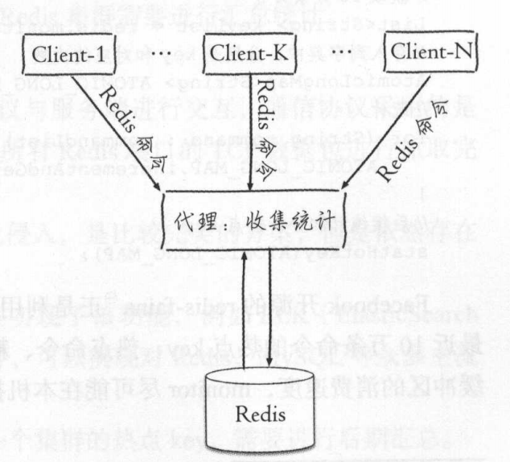
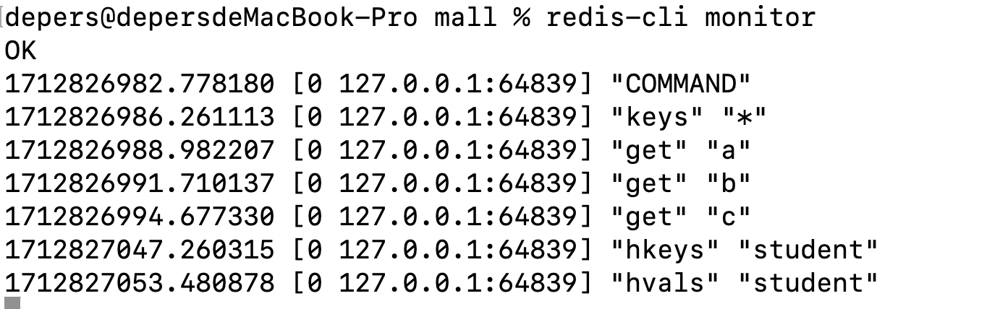

> Redis/缓存

> 之前在日常开发工作中对Redis热key的关注不是很多，这里通过这篇文章对Redis热key的问题做一个反思和总结。

# 热Key的定义

Redis中热键(Hot Key)是指在Redis数据库中被领繁访问的键。比如热门的新闻事件或者是爆款的商品信息都可能会成为热点数据，我们经常为了减轻数据库的压力会将这部分数据缓存到Redis中，极端情况下对热点Key访问可能会超过Redis本身能够承受的OPS（Operations Per Second，每秒执行的操作数量，用于衡量 Redis 系统的性能。），因此热Key监测和解决对于开发和运维人员来说是十分重要的。

# 热key造成的问题

1. Redis 服务器上的负载增加：如果频繁访问热键，它们可能会给 Redis 服务器带来大量负载，因为它必须处理大量请求来检索与这些键关联的值。这可能会导致访问时间变慢并降低性能。
2. 内存使用量增加：如果热键存储较大的值或使用低效的数据结构，它们可能会消耗 Redis 服务器上的大量内存。这可能会导致内存使用量增加和性能下降。
3. 网络流量增加：如果客户端通过网络频繁访问热键，可能会导致网络流量增加并降低性能。

# 如何判断某个Key是热Key呢

解决热Key文件之前，我们首先得监测哪些Key是热Key，在热Key的检测我们可以从以下四个方面来着手：

1. 客户端

    最先想到的方案就是通过客户端工具进行统一的计数统计，这个目前没有找到很好的切入方案，比如我使用Jedis或是spring Data Redis，这两个客户端都没有提供执行命令的拦制器，所以在基础工具上进行统一的封装这个方案不太可行。所以我们只能对这些客户端的每一种命令执行的方法都进行一次封装，也就是在每种操作的代码中都植入我们统计热Key的代码。

    基于固定时间窗口的热Key统计算法：

    ```Java
    public class FixedWindowsHotKeyCounter {
    
        private static final AtomicLongMap<String> HOT_KEY_COUNT_MAP = AtomicLongMap.create(); // 记录统计数据的map
        private long fixedTime; // 固定的时间段，单位毫秒
        private long threshold; // 统计阈值
        private long lastTime;  // 某个key上一次的操作时间
    
        public FixedWindowsHotKeyCounter(long fixedTime, long threshold) {
            this.fixedTime = fixedTime;
            this.threshold = threshold;
        }
        
        public void countKey(String key) {
            if (System.currentTimeMillis() - lastTime > fixedTime) {
                HOT_KEY_COUNT_MAP.clear();
                lastTime = System.currentTimeMillis();
            }
            
            if (HOT_KEY_COUNT_MAP.get(key) > threshold) {
                // 记录到数据库或是发送请求到别的系统
            } else {
                HOT_KEY_COUNT_MAP.incrementAndGet(key);
            }
        }
    }
    ```

    基于滑动时间窗口的热Key统计算法：

    ```Java
    public class SlidingWindowsKeyCounter {
    
        // 记录所有Key统计信息的Map
        private static final ConcurrentHashMap<String, Queue<Long>> HOT_KEY_MAP = new ConcurrentHashMap<String, Queue<Long>>();
        private long windowsDuration; // 统计的时间窗口，单位毫秒
        private long threshold; // 统计阈值
    
        public SlidingWindowsKeyCounter(long windowsDuration, long threshold) {
            this.windowsDuration = windowsDuration;
            this.threshold = threshold;
        }
    
        public void countKey(String key) {
            long currentTime = System.currentTimeMillis();
            Queue<Long> timeStamps = HOT_KEY_MAP.get(key);
    
            while (!timeStamps.isEmpty() && currentTime - timeStamps.peek() > windowsDuration) {
                timeStamps.poll();
            }
    
            if (timeStamps.size() > threshold) {
                // 记录到数据库或是发送交易到别的系统
            } else {
                timeStamps.offer(System.currentTimeMillis());
            }
        }
    }
    ```

    具体结合Redis客户端的使用，这里以Spring Data Redis为例：

    ```Java
    @Component
    public class RedisTemplateOperator {
    
    
        @Autowired
        private RedisTemplate<String, Object> redisTemplate;
    
        @Autowired
        private SlidingWindowsKeyCounter slidingWindowsKeyCounter;
    
    
        /**
         * 字符串set操作
         * @param key
         * @param value
         */
        public void set(String key, String value) {
            redisTemplate.opsForValue().set(key, value);
            slidingWindowsKeyCounter.countKey(key);
        }
    }
    ```

    这里参考限流算法，我这边分别设计了固定时间窗口的热Key统计方案和滑动时间窗口的热Key统计方案，他们之前的区别和这两种算法的区别其实一致的，固定时间窗口算法无法对突发的流量进行控制，而滑动窗口算法则细化了时间窗口，可以对突发流量进行控制。切换到热Key统计这里，滑动窗口算法可以很好的对一小段时间范围内频繁访问的Key进行准确的统计。

    对客户端进行热点Key的统计，优缺点也很明显:

    * **优点**：实现简单
    * **缺点**：
        1. 无法预知Key的个数，存在内存泄漏的风险。
        2. 对客户端的代码有侵入，需要针对不同的客户端工具进行二次开发
        3. 只能了解当前客户端的热Key情况，无法实现规模化的统计运维。

2. 代理端

    说到代理端，就想到了Redis的集群化方案。Redis为什么要进行集群化呢？因为单个节点是无法承受大量的读写请求的，即便是主从读写分离架构在面对大量的写请求时，也无法满足对性能的要求，所以需要集群化提升Redis服务的性能。目前Redis的集群化方案一共有四种，分别是：

    * 客户端分片
    * Codis
    * Twemproxy
    * Redis Cluster

    目前我们主流使用的都是Redis Cluster的解决方案，这是一种去中心化的集群方案，而Codis和Twemproxy则是中心化的解决方案。在解决热Key问题上，我们可以通过中心化的代理去做一些统计计数的工作，如下图所示：

    

    这种方案和Redis的部署架构有关，所以关于这块的代码演示这里先不做演示了，后面用到的话再来补充。

3. 服务端

    在Redis服务端我们可以通过`monitor`命令对Redis的所有操作进行监控，下图是我们使用`monitor`后控制台的部分输出：

    

    我们可以对`monitor`命令的输出数据进行分析，从而可以得到一段时间内热Key的统计数据。由Facebook开源的[redis-faina](https://github.com/facebookarchive/redis-faina)就是解析`monitor`命令的数据，针对Redis操作和Key进行计数和计时的统计，从而我们可以很方便的找出热Key。

    值得注意的是`monitor`命令的使用是有成本和危害的，`monitor`命令会将Redis服务器执行的命名全部进行输出，由于Redis服务器的QPS是很高的，所有就会有大量的数据被积攒到Redis服务器的输出缓存区，占用了大量的Redis内存。官方文档中也提到了这一点，在运行单个 `MONITOR` 客户端时可能会导致Redis服务端的吞吐量降低 50% 以上。运行更多的 `MONITOR` 客户端将进一步降低吞吐量。

4. 服务器

    Redis的客户端和服务端是通过建立TCP连接进行交互的，通讯协议使用的是RESP。从机器的角度来看Redis的通信，我们可以通过抓取Redis通信的TCP包，解析报文内容，从而得到Redis热Key的统计。

    这种方式真正上做到了对Redis客户端和服务器的透明和无干扰，但是这需要我们进行额外的开发工作，目前开源的解决方案是ELK提供的Packetbeat插件，该插件实现了对MySQL、Redis等服务的数据包的抓包、分析、统计和展示。

    由于是以机器为单位进行的统计，要了解整个集群服务的热Key还需要进行后期汇总。

5. redis-cli的`--hotkeys`参数

    `Redis` 在 `4.0.3` 版本中添加了 [hotkeys](https://github.com/redis/redis/pull/4392) 查找特性，可以直接利用 `redis-cli --hotkeys` 获取当前 `keyspace` 的热点 `key`，实现上是通过 `scan + object freq` 完成的，该命令在 `maxmemory-policy` 配置指令设置为 LFU 策略之一时，该命令才可用。在`redis.conf`文件中的配置如下：

    ```conf
    maxmemory-policy noeviction
    ```

    该配置的主要作用是当我们使用`maxmemory 100mb`配置了Redis存储数据的内存后，如果数量量过大超过了配置的内存限制，Redis就会在添加新数据的时候按照配置的策略自动将旧数据进行清理，从而保证Redis的正常使用。

    可以配置的参数主要分为两大类：LRU表示最近最少使用，LFU表示最少使用。

    1. `volatile-lru`：最近最少使用算法，从设置了过期时间的键key中选择空转时间最长的键值对清除掉。
    2. `allkeys-lru`：最近最少使用算法，从所有的键中选择空转时间最长的键值对清除。
    3. `volatile-lfu`：最近最不经常使用算法，从设置了过期时间的键中选择某段时间之内使用频次最小的键值对清除掉。
    4. `allkeys-lfu`：最近最不经常使用算法，从所有的键中选择某段时间之内使用频次最少的键值对清除。
    5. `volatile-random`：从设置了过期时间的键中，随机选择键进行清除。
    6. `allkeys-random`：所有的键中，随机选择键进行删除。
    7. `volatile-ttl`：从设置了过期时间的键中选择过期时间最早的键值对清除。
    8. `noeviction`： 不做任何的清理工作，在redis的内存超过限制之后，所有的写入操作都会返回错误；但是读操作都能正常的进行**（默认）。**

## 总结

结合上述五种方案，我们来总结下五种方案的优缺点：

| 方案            | 优点                                                      | 缺点                                                         |
| --------------- | --------------------------------------------------------- | ------------------------------------------------------------ |
| 客户端          | 实现简单                                                  | 1. 存在内存泄露的风险<br/>2. 维护成本高<br/>3. 只能统计单个客户端 |
| 代理端          | 对客户端是透明的，能够解决客户端SDK语言异构和版本升级问题 | 1. 开发成本会比客户端高些<br/>2. 并不是所有的Redis集群架构中都有Proxy代理 |
| 服务端          | 实现简单，无需进行二次开发，能够直接利用现成的工具        | 1. `monitor`命令使用的成本和危害，只能短时间使用<br/>2. 只能统计单个Redis节点 |
| 机器            | 对客户端、代理和服务端都是透明的                          | 1. 需要专业的运维团队进行开发，并且增加了Redis扩容的成本<br/>2. 热Key节点的网络流量和系统负载已经比较高了，抓包可能会导致情况进一步恶化 |
| `--hotkeys`参数 | 实现简单，无需进行二次开发，能够直接利用现成的工具        | 1. 由于需要扫描整个 `keyspace`，实时性上比较差<br/>2. 扫描时间与 `key` 的数量正相关，如果 `key` 的数量比较多，耗时可能会非常长 |

# 热Key的解决方案

# 热Key的重建优化


# 参考资料

* [《Redis开发与运维》付磊/张益军](https://book.douban.com/subject/26971561/)
* [Understanding and Solving HotKey and BigKey issues in Redis](https://abhivendrasingh.medium.com/understanding-and-solving-hotkey-and-bigkey-and-issues-in-redis-1198f98b17a5)
* [7 REDIS WORST PRACTICES](https://redis.io/blog/7-redis-worst-practices/)
* [Redis集群化方案对比：Codis、Twemproxy、Redis Cluster](http://kaito-kidd.com/2020/07/07/redis-cluster-codis-twemproxy/)
* [Redis 使用monitor造成的内存飙升](https://blog.csdn.net/qq_34556414/article/details/106201506)
* [Redis官方文档-MONITOR](https://redis.io/docs/latest/commands/monitor/)
* [redis的访问监控](https://www.cnblogs.com/heroinss/p/17674743.html)
* [理解 Redis 的 RESP 协议](https://moelove.info/2017/03/05/%E7%90%86%E8%A7%A3-Redis-%E7%9A%84-RESP-%E5%8D%8F%E8%AE%AE/)
* [Redis缓存热key问题常用解决方案](https://juejin.cn/post/7061568468537049124)
* [发现并处理Redis的大Key和热Key](https://help.aliyun.com/zh/redis/user-guide/identify-and-handle-large-keys-and-hotkeys)
* [Redis 热 Key 发现以及解决办法](https://dongzl.github.io/2021/01/14/03-Redis-Hot-Key/index.html)
* [Redis性能之巅：延迟问题排障指南](https://kevinello.ltd/2023/03/05/Redis%E6%80%A7%E8%83%BD%E4%B9%8B%E5%B7%85%EF%BC%9A%E5%BB%B6%E8%BF%9F%E9%97%AE%E9%A2%98%E6%8E%92%E9%9A%9C%E6%8C%87%E5%8D%97/)
