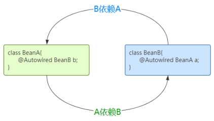
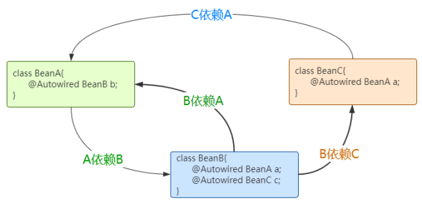
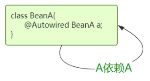

> Spring/面试

> 最近在面试的过程中，面试官问了几个关于Spring的问题，我这边答得不是很好，这里记录一下。

1. Spring中AOP无法增强的情况有哪些？该怎么解决？

    **失效的情况： ** 如果在同一个类中在两个方法上同时都加了`@Transactional`注解，并且方法一嵌套调用方法二，此时方法二的`@Transactional`注解将会失效。这是因为Spring的AOP是通过动态代理实现的，代理类针对添加了注解的方法进行了调用增强，如果嵌套调用的话，在方法一中调用的其实是this.方法二，并不是代理类的方法二。

    **解决办法：**

    * 方法一：直接将自己的实例对象注入到当前类中，但是这样做又会导致循环依赖。
    * 方法二：自己封装一个插件，在Bean初始化的过程中通过`BeanPostProcessor`后置处理器，将这个容器将实例对象赋值到原有的类的属性上，这样就能在调用方法的时候通过这个属性使用Spring调用增强过的方法了。

2. Spring中什么情况下会出现循环依赖？该如何解决？

    **出现循环依赖的三种情况：**

    1. BeanA和BeanB相互循环依赖，如下图所示：

        

    2. BeanA和BeanC直接或间接循环依赖，如下如所示：

        

    3. 自己和自己形成循环依赖，如下图所示：

        

    **Spring是如何解决循环依赖问题的？**

    Spring是通过三级缓存机制解决的循环依赖问题，一级缓存存储的是完整的Bean实例，这些实例是可以直接使用的；二级缓存存储的是实例化以后但是还没有设置属性值的Bean实例，也就是Bean里面的依赖注入还没有做；三级缓存存储的是Bean工厂用来生产原始Bean实例并且放到第二个缓存中。

    三级缓存机制会**将Bean的实例化和属性赋值进行分离**。先实例化自己，然后创建Bean工厂，接着进行属性赋值。

    当A、B两个类发生循环引用时，在A完成实例化后，就使用实例化后的对象去创建一个对象工厂，并添加到三级缓存中，**如果A被AOP代理，那么通过这个工厂获取到的就是A代理后的对象，如果A没有被AOP代理，那么这个工厂获取到的就是A实例化的对象**。

    当A进行属性注入时，会去创建B，同时B又依赖了A，所以创建B的同时又会去调用getBean(a)来获取需要的依赖，此时的getBean(a)会从缓存中获取。

    * 第一步，先获取到三级缓存中的工厂；
    * 第二步，调用对象工工厂的getObject方法来获取到对应的A对象（经过AOP代理的A对象，注意这里的A对象是不完整的），得到这个对象后将其注入到B中。
    * 第三步：紧接着B会走完它的生命周期流程，包括初始化、后置处理器等。
    * 第四步：当B创建完后，会将B再注入到A中，此时A再完成它的整个生命周期。至此，循环依赖结束。
    
    **为什么要使用三级缓存呢？二级缓存能解决循环依赖吗？**
    
    如果要使用二级缓存解决循环依赖，意味着所有Bean在实例化后就要完成AOP代理，这样违背了Spring设计的原则，Spring在设计之初就是通过`AnnotationAwareAspectJAutoProxyCreator`这个后置处理器来在Bean生命周期的最后一步来完成AOP代理，而不是在实例化后就立马进行AOP代理。
    
3. Spring Boot是怎样实现自动装配的？