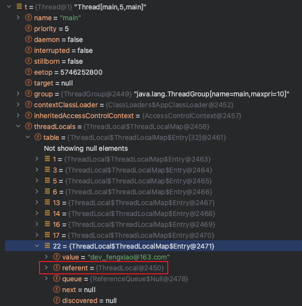
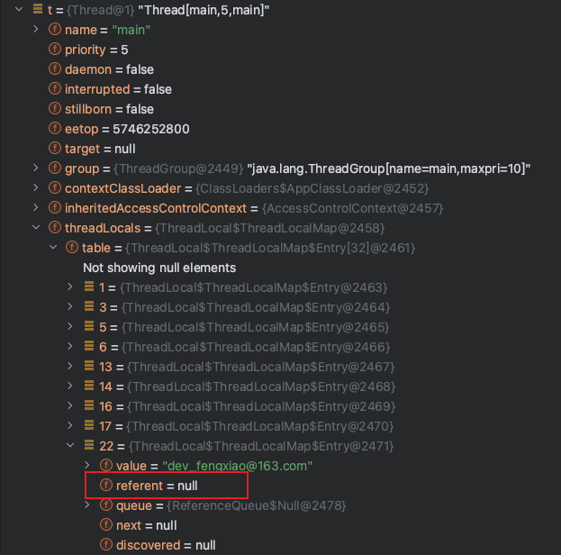

> Java/并发编程

> 最近发现使用ThreadLocal会导致内存泄露，写一篇文章对这个问题进行记录。

# ThreadLocal的结构

`ThreadLocal`中有一个`ThreadLocalMap`的结构，每个线程都会将自己共享变量的副本保存到这个结构中，从而避免出现竞态条件。`ThreadLocalMap`的存储元素的结构是`Entry`，`Entry`继承了`WeakReference`，`Entry`结构的`key`是`ThreadLocal`本身，`value`则是`Thread`对象，这里`ThreadLocal`是真正的弱引用。

ThreadLocal的引用链：**Thread -> ThreadLocal.ThreadLocalMap -> Entry[] -> Entry -> key（ThreadLocal对象）和value**

上面引用链中的Entry继承了WeakReference，而**ThreadLocal对象是弱引用字段**。

# 弱引用WeakReference

**弱引用的定义**：只具有弱引用的对象拥有更短暂的生命周期。在垃圾回收器线程扫描它所管辖的内存区域的过程中，一旦发现了只具有弱引用的对象，不管当前内存空间足够与否，都会回收它的内存。
更简单的理解就是当垃圾回收时，该**对象**只被`WeakReference`对象的**弱引用字段（`T reference`）**所引用，所以**在没有被任何强类型的对象引用**时，该弱引用的对象就会被回收。
**注意：`WeakReference`引用本身是强引用，它内部的（`T reference`）才是真正的弱引用字段，`WeakReference`就是一个装弱引用的容器而已。**

## 1. WeakReference第一种使用方式：WeakReference(T referent)

代码如下：

```java
public class RoleDTO {

    private Long id;
    private String name;

    public RoleDTO(Long id, String name) {
        this.id = id;
        this.name = name;
    }

    public Long getId() {
        return id;
    }

    public void setId(Long id) {
        this.id = id;
    }

    public String getName() {
        return name;
    }

    public void setName(String name) {
        this.name = name;
    }

    @Override
    public String toString() {
        return "RoleDTO{" +
            "id=" + id +
            ", name='" + name + '\'' +
            '}';
    }
}
```

```java
public class WeakReferenceExample {

    public static void main(String[] args) throws InterruptedException {
        RoleDTO roleDTO = new RoleDTO(1l, "CEO");

        WeakReference<RoleDTO> weakReference = new WeakReference<>(new RoleDTO(1l, "CEO"));

        System.gc();
        Thread.sleep(1000);

        if (roleDTO == null) {
            System.out.println("强引用被回收了");
        }

        if (weakReference.get() == null) {
            System.out.println("弱引用指向的对象被回收了");
        }
    }
}
```

控制台输出：

```
弱引用指向的对象被回收了
```

上面演示的代码告诉我们：`WeakReference`引用本身是强引用，它内部的（`T reference`）才是真正的弱引用字段，`WeakReference`就是一个装弱引用的容器而已。

## 2.WeakReference第二种使用方式：WeakReference(T referent, ReferenceQueue<? super T> q)

代码如下：

```java
public class WeakReferenceExample2 {
    public static void main(String[] args) throws InterruptedException {
        // 引用队列
        ReferenceQueue<RoleDTO> referenceQueue = new ReferenceQueue<>();
        WeakReference<RoleDTO> weakReference = new WeakReference<>(new RoleDTO(1l, "CFO"), referenceQueue);

        System.out.println("执行GC之前");
        System.out.println("weakReference是:" + weakReference);
        Reference<? extends RoleDTO> reference;
        // 引用队列时空的
        while ((reference = referenceQueue.poll()) != null) {
            System.out.println("referenceQueue中：" + reference);
        }

        System.gc();
        Thread.sleep(1000);

        System.out.println("执行GC之后");
        if (weakReference.get() == null) {
            System.out.println("弱引用指向的RoleDTO对象 已经被回收");
        }

        Reference<? extends RoleDTO> reference2;
        while ((reference2 = referenceQueue.poll()) != null) {
            // 如果使用继承的方式就可以包含其他信息了
            System.out.println("referenceQueue中：" + reference2);
        }
    }
}
```

执行结果是：

```
执行GC之前
weakReference是:java.lang.ref.WeakReference@45ee12a7
执行GC之后
弱引用指向的RoleDTO对象 已经被回收
referenceQueue中：java.lang.ref.WeakReference@45ee12a7
```

从输出中我们就可以看到，当我们执行完GC之后，`weakReference`中的弱引用`RoleDTO对`象就被回收了，放在引用队列中的`java.lang.ref.WeakReference@45ee12a7`引用容器和我们GC前是一样的。所以我们得出的结论是：**这个构造方法多了个参数，是个引用队列类型；当发生GC后，被弱引用指向的对象被回收，同时这些弱引用将会被添加的这个引用队列当中。**

# ThreadLocal之为什么源码用弱引用

首先我们来看一段代码，在这段代码中我将我的邮箱存储到了ThreadLocal中，并从中获取这个邮箱字符串：

```java
public static void main(String[] args) throws InterruptedException {
    ThreadLocal<String> threadLocal = new ThreadLocal<>();
    threadLocal.set("dev_fengxiao@163.com");
    threadLocal.get();
}
```

通过下面这幅图可以看到`threadLocal`变量在JVM内存中的存储指向关系，从下图中可以看到当`main`方法在执行完之后栈帧销毁，栈帧中`threadLocal`对象引用被销毁，指向堆中`ThreadLocal`的强引用也会被断开。`Thread`对象的`ThreadLocalMap.Entry`对象的`Key`（堆中`TheadLocal`对象）为强引用或者是弱引用会有什么区别呢？

* 若为强引用，会导致`key`指向的`ThreadLocal`对象和value指向的对象不能被GC回收，导致内存泄露。
* 若为弱引用，大概率会被GC回收，减少内存泄露的问题。使用弱引用，可以使`ThreadLocal`对象在方法执行完毕之后顺利被回收，且`Entry`的`key`引用指向为`null`。

<div align=center></div>

为了演示上述的观点，我们通过下面这段代码来实验一下：

```java
public static void main(String[] args) throws InterruptedException {
    func();

    System.gc(); // 手动触发垃圾回收
    Thread.sleep(100);

    Thread t = Thread.currentThread();  // 第二个断点
    Thread.sleep(10000);
}

private static void func() {
    ThreadLocal<String> threadLocal = new ThreadLocal();
    threadLocal.set("dev_fengxiao@163.com");
    log.info("threadLocal参数设置完成");
    Thread t = Thread.currentThread(); // 第一个断点
}
```

我们分别在上述两个注释的地方打上端点，第一个断点执行时t对象`threadLocals`属性的截图：

<div align=center></div>

第二个断点执行后t对象的`threadLocals`属性的截图：

<div align=center></div>

通过上面两张图片的对比，我们就可以看出之所以将`ThreadLocal`作为弱引用，是因为能够利用垃圾回收器能够及时回收弱引用内存空间的特性，达到了节省内存，避免发生内存泄露的目的。

# ThreadLocal使用了弱引用怎么还会内存泄露


# 参考文章

* [弱引用WeakReference作用与使用场景](https://blog.csdn.net/csdn_20150804/article/details/103748869)
* [谈谈ThreadLocal为什么被设计为弱引用](https://zhuanlan.zhihu.com/p/304240519)
* [【尚硅谷】【JUC】109 ThreadLocal之为什么源码用弱引用](https://www.youtube.com/watch?v=ZaHpCpJ8AVA)

