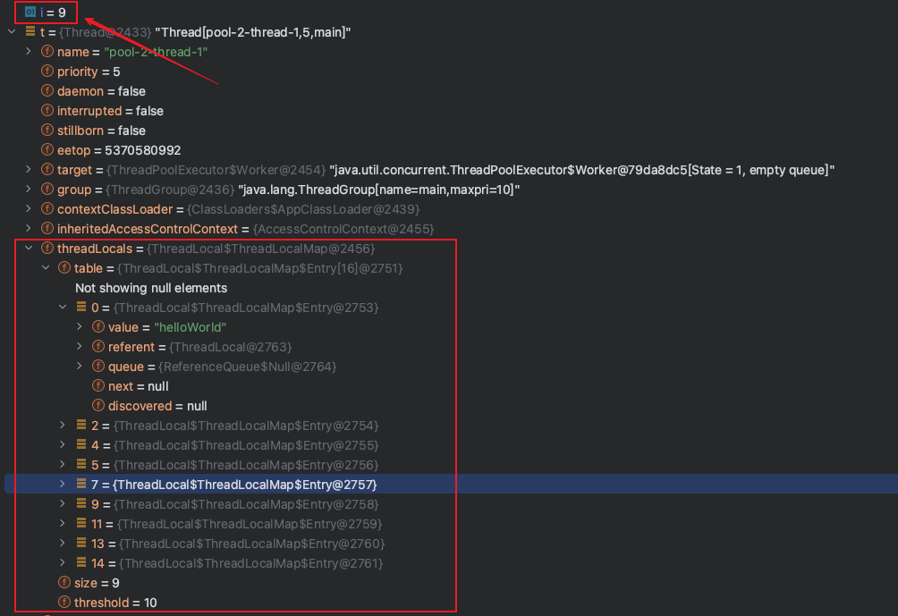
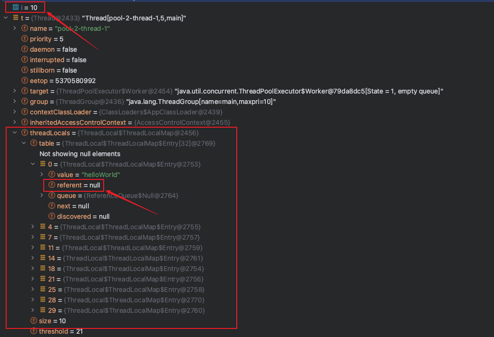

> Java/并发编程

> 最近发现使用ThreadLocal会导致内存泄露，写一篇文章对这个问题进行记录。

# ThreadLocal的结构

`ThreadLocal`中有一个`ThreadLocalMap`的结构，每个线程都会将自己共享变量的副本保存到这个结构中，从而避免出现竞态条件。`ThreadLocalMap`的存储元素的结构是`Entry`，`Entry`继承了`WeakReference`，`Entry`结构的`key`是`ThreadLocal`本身，`value`则是`Thread`对象，这里`ThreadLocal`是真正的弱引用。

ThreadLocal的引用链：**Thread -> ThreadLocal.ThreadLocalMap -> Entry[] -> Entry -> key（ThreadLocal对象）和value**

上面引用链中的Entry继承了WeakReference，而**ThreadLocal对象是弱引用字段**。

# 弱引用WeakReference

**弱引用的定义**：只具有弱引用的对象拥有更短暂的生命周期。在垃圾回收器线程扫描它所管辖的内存区域的过程中，一旦发现了只具有弱引用的对象，不管当前内存空间足够与否，都会回收它的内存。
更简单的理解就是当垃圾回收时，该**对象**只被`WeakReference`对象的**弱引用字段（`T reference`）**所引用，所以**在没有被任何强类型的对象引用**时，该弱引用的对象就会被回收。
**注意：`WeakReference`引用本身是强引用，它内部的（`T reference`）才是真正的弱引用字段，`WeakReference`就是一个装弱引用的容器而已。**

## 1. WeakReference第一种使用方式：WeakReference(T referent)

代码如下：

```java
public class RoleDTO {

    private Long id;
    private String name;

    public RoleDTO(Long id, String name) {
        this.id = id;
        this.name = name;
    }

    public Long getId() {
        return id;
    }

    public void setId(Long id) {
        this.id = id;
    }

    public String getName() {
        return name;
    }

    public void setName(String name) {
        this.name = name;
    }

    @Override
    public String toString() {
        return "RoleDTO{" +
            "id=" + id +
            ", name='" + name + '\'' +
            '}';
    }
}
```

```java
public class WeakReferenceExample {

    public static void main(String[] args) throws InterruptedException {
        RoleDTO roleDTO = new RoleDTO(1l, "CEO");

        WeakReference<RoleDTO> weakReference = new WeakReference<>(new RoleDTO(1l, "CEO"));

        System.gc();
        Thread.sleep(1000);

        if (roleDTO == null) {
            System.out.println("强引用被回收了");
        }

        if (weakReference.get() == null) {
            System.out.println("弱引用指向的对象被回收了");
        }
    }
}
```

控制台输出：

```
弱引用指向的对象被回收了
```

上面演示的代码告诉我们：`WeakReference`引用本身是强引用，它内部的（`T reference`）才是真正的弱引用字段，`WeakReference`就是一个装弱引用的容器而已。

## 2.WeakReference第二种使用方式：WeakReference(T referent, ReferenceQueue<? super T> q)

代码如下：

```java
public class WeakReferenceExample2 {
    public static void main(String[] args) throws InterruptedException {
        // 引用队列
        ReferenceQueue<RoleDTO> referenceQueue = new ReferenceQueue<>();
        WeakReference<RoleDTO> weakReference = new WeakReference<>(new RoleDTO(1l, "CFO"), referenceQueue);

        System.out.println("执行GC之前");
        System.out.println("weakReference是:" + weakReference);
        Reference<? extends RoleDTO> reference;
        // 引用队列时空的
        while ((reference = referenceQueue.poll()) != null) {
            System.out.println("referenceQueue中：" + reference);
        }

        System.gc();
        Thread.sleep(1000);

        System.out.println("执行GC之后");
        if (weakReference.get() == null) {
            System.out.println("弱引用指向的RoleDTO对象 已经被回收");
        }

        Reference<? extends RoleDTO> reference2;
        while ((reference2 = referenceQueue.poll()) != null) {
            // 如果使用继承的方式就可以包含其他信息了
            System.out.println("referenceQueue中：" + reference2);
        }
    }
}
```

执行结果是：

```
执行GC之前
weakReference是:java.lang.ref.WeakReference@45ee12a7
执行GC之后
弱引用指向的RoleDTO对象 已经被回收
referenceQueue中：java.lang.ref.WeakReference@45ee12a7
```

从输出中我们就可以看到，当我们执行完GC之后，`weakReference`中的弱引用`RoleDTO对`象就被回收了，放在引用队列中的`java.lang.ref.WeakReference@45ee12a7`引用容器和我们GC前是一样的。所以我们得出的结论是：**这个构造方法多了个参数，是个引用队列类型；当发生GC后，被弱引用指向的对象被回收，同时这些弱引用将会被添加的这个引用队列当中。**

# ThreadLocal之为什么源码用弱引用

首先我们来看一段代码，在这段代码中我将我的邮箱存储到了ThreadLocal中，并从中获取这个邮箱字符串：

```java
public static void main(String[] args) throws InterruptedException {
    ThreadLocal<String> threadLocal = new ThreadLocal<>();
    threadLocal.set("dev_fengxiao@163.com");
    threadLocal.get();
}
```

通过下面这幅图可以看到`threadLocal`变量在JVM内存中的存储指向关系，从下图中可以看到当`main`方法在执行完之后栈帧销毁，栈帧中`threadLocal`对象引用被销毁，指向堆中`ThreadLocal`的强引用也会被断开。`Thread`对象的`ThreadLocalMap.Entry`对象的`Key`（堆中`TheadLocal`对象）为强引用或者是弱引用会有什么区别呢？

* 若为强引用，会导致`key`指向的`ThreadLocal`对象和value指向的对象不能被GC回收，导致内存泄露。
* 若为弱引用，大概率会被GC回收，减少内存泄露的问题。使用弱引用，可以使`ThreadLocal`对象在方法执行完毕之后顺利被回收，且`Entry`的`key`引用指向为`null`。

<div align=center></div>

为了演示上述的观点，我们通过下面这段代码来实验一下：

```java
public static void main(String[] args) throws InterruptedException {
    func();

    System.gc(); // 手动触发垃圾回收
    Thread.sleep(100);

    Thread t = Thread.currentThread();  // 第二个断点
    Thread.sleep(10000);
}

private static void func() {
    ThreadLocal<String> threadLocal = new ThreadLocal();
    threadLocal.set("dev_fengxiao@163.com");
    log.info("threadLocal参数设置完成");
    Thread t = Thread.currentThread(); // 第一个断点
}
```

我们分别在上述两个注释的地方打上端点，第一个断点执行时t对象`threadLocals`属性的截图：

<div align=center></div>

第二个断点执行后t对象的`threadLocals`属性的截图：

<div align=center></div>

通过上面两张图片的对比，我们就可以看出之所以将`ThreadLocal`作为弱引用，是因为能够利用垃圾回收器能够及时回收弱引用内存空间的特性，达到了节省内存，避免发生内存泄露的目的。

# ThreadLocal使用了弱引用怎么还会内存泄露

这里我们先来看一个例子：

```Java
@Slf4j
public class ThreadLocalExample5 {

    // -Xms200m -Xmx200m
    public static void main(String[] args) {

        Executors.newSingleThreadExecutor().execute(() -> {
            int i = 0;
            while (true) {
                try {
                    func();

                    // 当执行第10次的时候进行GC
                    if (i % 10 == 0) {
                        System.gc();
                    }

                    Thread t = Thread.currentThread();
                    System.out.println(t); // 这里打断点
                } catch (InterruptedException e) {
                    log.error("异常", e);
                }

                i++;
            }
        });
    }
    
    private static void func() throws InterruptedException {
        // threadLocal作为局部变量
        ThreadLocal<String> threadLocal = new ThreadLocal<>();
        // 设置value值
        threadLocal.set("helloWorld");
    }
}
```

上面的代码中我们使用一个线程去反复执行`func()`方法，当我们执行到第九次的时候我们就会发现如下图所示的情况：

<div align="center"></div>

此时我们发现当前线程的`threadLocals`中正好被塞入了9个`ThreadLocal`对象，这个里每一个对象都是我们之前执行`func()`方法保存到当前线程`threadLocals`中的对象。按照程序的逻辑，当执行到第10次的时候会手动进行GC，下图是GC之后的情况：



此时我们发现，经过GC之后原本作为key的`ThreadLocal`对象，由于是弱引用的关系导致内存空间被垃圾回收，置为了`null`。但是这里就浮现出来一个问题，既然`key`所占用的空间被垃圾回收了，那`value`占用的空间该怎么办，**如果我们一直添加数据到当前线程的`threadLocals`中肯定会导致内存泄露的**。

我们接着执行我们刚才的程序，接着我们执行第11次添加`ThreadLocal`对象的操作，下面我们看下`ThreadLoal`的`set()`方法：

```Java
private void set(ThreadLocal<?> key, Object value) {

    // table存储了我们之前添加到threadLocals的ThreadLocal.ThreadLocalMap.Entry对象
    Entry[] tab = table;
    int len = tab.length;
    // 计算数组下标
    int i = key.threadLocalHashCode & (len-1);

    for (
        // 获取该下标的对象
        Entry e = tab[i]; 
        // 对象不为空
        e != null; 
        // 获取数组中的下一个对象
        e = tab[i = nextIndex(i, len)]) {
        // 如果key值相同，也就是使用同一个ThreadLocal对象进行的set操作
        if (e.refersTo(key)) {
            e.value = value;
            return;
        }

        // 如果key值为null
        if (e.refersTo(null)) {
            replaceStaleEntry(key, value, i);
            return;
        }
    }

    // 新放置一个对象到数组中
    tab[i] = new Entry(key, value);
    // 数组大小加1
    int sz = ++size;
    // 去除槽位
    if (!cleanSomeSlots(i, sz) && sz >= threshold)
        rehash();
}
```

接下来我们着重看下cleanSomeSlots()方法的代码：

```Java
private boolean cleanSomeSlots(int i, int n) {
    boolean removed = false;
    Entry[] tab = table;
    int len = tab.length;
    do {
        i = nextIndex(i, len);
        Entry e = tab[i];
        // 如果该位置对象不为null，且该Entry对象的key为null，此时就遇到了我们在第十次GC后referent为null的情况
        if (e != null && e.refersTo(null)) {
            n = len;
            removed = true;
            // 进行清除
            i = expungeStaleEntry(i);
        }
    } while ( (n >>>= 1) != 0);
    return removed;
}
```

接着我们来看最核心的`expungeStaleEntry()`方法的代码，这个方法主要被用来清理`key`为`null`的脏`Entry`对象，这个方法会间接被`get()`、`set()`和`remove()`方法调用：

```Java
private int expungeStaleEntry(int staleSlot) {
    Entry[] tab = table;
    int len = tab.length;

    // expunge entry at staleSlot
    // 看这里就很重要，这里将value值置为了null，在这里剪断了Entry和value之间的引用关系，value的内存空间得以释放
    tab[staleSlot].value = null;
    tab[staleSlot] = null;
    size--;

    // Rehash until we encounter null
    Entry e;
    int i;
    for (i = nextIndex(staleSlot, len);
         (e = tab[i]) != null;
         i = nextIndex(i, len)) {
        ThreadLocal<?> k = e.get();
        // 这里的也是将value置为null的逻辑
        if (k == null) {
            e.value = null;
            tab[i] = null;
            size--;
        } else {
            int h = k.threadLocalHashCode & (len - 1);
            if (h != i) {
                tab[i] = null;

                // Unlike Knuth 6.4 Algorithm R, we must scan until
                // null because multiple entries could have been stale.
                while (tab[h] != null)
                    h = nextIndex(h, len);
                tab[h] = e;
            }
        }
    }
    return i;
}
```

好了，看到这里大家应该就清楚了，`Entry`对象中`key`的内存回收依赖于GC，而`value`的回收则会发生在`ThreadLocal`的`set()`、`get()`和`remove()`等方法中。由于我们不清楚`set()`方法每次放入对象大小，如果如此累计且稍有不慎就会导致内存泄露。

# 最佳实践

1. 使用`ThreadLocal`一定要记得`remove()`。

    ```java
    objectThreadLocal.set(userInfo);
    try {
        // ...
    } finally {
        objectThreadLocal.remove();
    }
    ```

2. 使用`ThreadLocal`一定要进行初始化，不然在`get()`或者`set()`的时候可能会到处空指针异常。

    ```Java
    private final static ThreadLocal<Long> requestHolder = ThreadLocal.withInitial(() -> 0L);
    ```

3. 使用ThreadLocal要用`private static`修饰，节省内存空间。

    这个变量是针对一个线程内所有操作共享的，所以设置为静态变量，所有此类实例共享此静态变量，也就是说在类第一次被使用时装载，只分配一块存储空间，所有此类的对象（只要是这个线程内定义的）都可以操控这个变量。

# 总结

1. `ThreadLocal`并不解决线程间共享数据的问题。
2. `ThreadLocal`适用于变量在线程间隔离且在方法间共享的场景。
3. `ThreadLocal`通过隐式的在不同线程内创建独立的实例副本避免的实例的线程安全问题。
4. 每个线程只有一个只属于自己的专属`Map`，并维护了`ThreadLocal`对象与具体实例的映射，该`Map`由于只被持有它的线程访问，故不存在线程安全及锁的问题。
5. `ThreadLocal`的`Entry`对`ThreadLocal`的引用为弱引用，避免了`ThreadLocal`对象无法被回收的问题。
6. `ThreadLocal`的`expungeStaleEntry()`解决了`Entry`中`value`值内存空间的回收问题。

# 参考文章

* [弱引用WeakReference作用与使用场景](https://blog.csdn.net/csdn_20150804/article/details/103748869)
* [谈谈ThreadLocal为什么被设计为弱引用](https://zhuanlan.zhihu.com/p/304240519)
* [ThreadLocal之为什么源码用弱引用](https://www.youtube.com/watch?v=ZaHpCpJ8AVA)
* [ThreadLocal之清除脏Entry](https://www.youtube.com/watch?v=gTOKqwb1H6A)
* [ThreadLocal之小总结](https://www.youtube.com/watch?v=rtcSg6Bb7GE)
* [阿里Java开发手册](https://developer.aliyun.com/special/tech-java)
