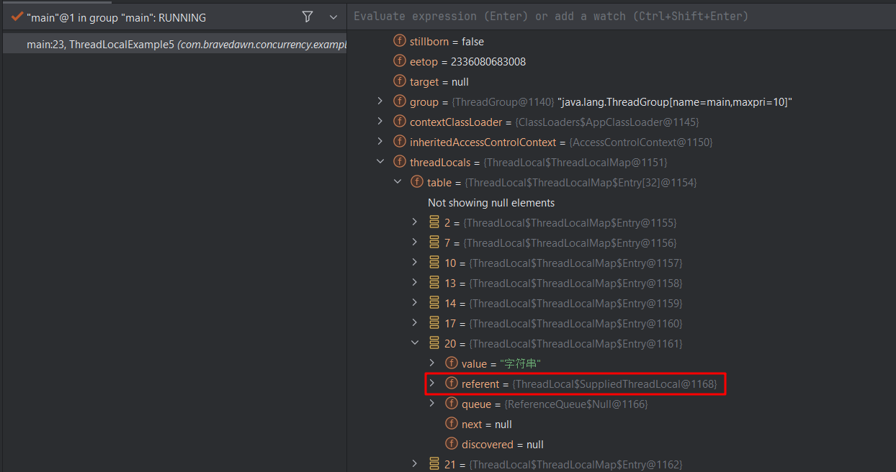
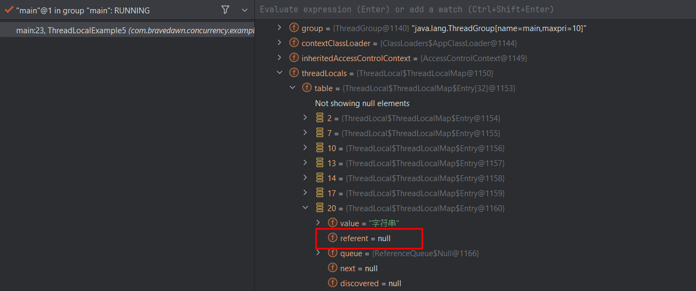

> Java/并发编程

> 最近发现使用ThreadLocal会导致内存泄露，写一篇文章对这个问题进行记录。

# ThreadLocal会自己清除内存吗

## 1. 第一个案例：同一个线程中对象不可达

先看下面这段代码：

```java
public class ThreadLocalExample5 {
    
    public static void main(String[] args) throws InterruptedException {
        Thread main = Thread.currentThread();
		// 第一次执行ThreadLocal被强引用持有，不会回收
        A a = getValue();
        
        // 第二次执行ThreadLocal被弱引用持有，会被回收
        //getValue();

        log.info("执行gc");
        System.gc();
        Thread.sleep(2000);

        // 这一行打断点，查看main线程中threadLocals变量的属性
        System.out.println(main);
    }


    private static A getValue() {
        A a = new A();
        System.out.println("value=" + a.get());
        return a;
    }


    public static class A {
        ThreadLocal<String> threadLocal = ThreadLocal.withInitial(() -> "字符串");
        
        public String get() {
            return threadLocal.get();
        }

        public void set(String str) {
            threadLocal.set(str);
        }
    }

}

```

第一次执行ThreadLocal被强引用持有，不会回收，查看main线程中threadLocals变量的属性，如下图：



第二次执行ThreadLocal被弱引用持有，会被回收，查看main线程中threadLocals变量的属性，如下图：



从上面的例子中我们可以看到上述代码中当对象A不再被使用时，换句话说在main方法中a对象是不可达的，JVM就会回收A，从而间接导致了Thread的ThreadLocalMap属性的key，也就是threalLocal被置为了null。

## 2. 第二个案例：异步线程中自动被清理


# ThreadLocal的结构

ThreadLocal中有一个ThreadLocalMap的结构，每个线程都会将自己共享变量的副本保存到这个结构中，从而避免出现竞态条件。ThreadLocalMap的存储元素的结构是Entry，Entry继承了WeakReference，Entry结构的key是ThreadLocal本身，value则是Thread对象，这里ThreadLocal是真正的弱引用。

ThreadLocal的引用链：**Thread -> ThreadLocal.ThreadLocalMap -> Entry[] -> Entry -> key（threadLocal对象）和value**

## 1. 弱引用WeakReference

**弱引用的定义**：只具有弱引用的对象拥有更短暂的生命周期。在垃圾回收器线程扫描它所管辖的内存区域的过程中，一旦发现了只具有弱引用的对象，不管当前内存空间足够与否，都会回收它的内存。
更简单的理解就是当垃圾回收时，该**对象**只被WeakReference对象的**弱引用字段（T reference）**所引用，所以**在没有被任何强类型的对象引用**时，该弱引用的对象就会被回收。
**注意：WeakReference引用本身是强引用，它内部的（T reference）才是真正的弱引用字段，WeakReference就是一个装弱引用的容器而已。**


# 参考文章

* [弱引用WeakReference作用与使用场景](https://blog.csdn.net/csdn_20150804/article/details/103748869)
* [谈谈ThreadLocal为什么被设计为弱引用](https://zhuanlan.zhihu.com/p/304240519)

