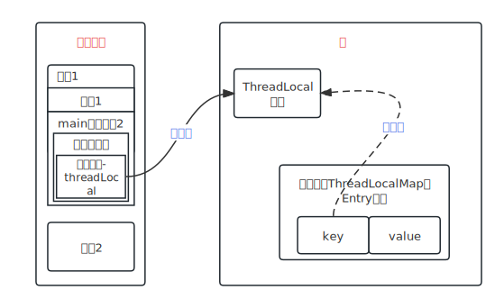

> Java/并发编程

> 最近发现使用ThreadLocal会导致内存泄露，写一篇文章对这个问题进行记录。

# ThreadLocal的结构

`ThreadLocal`中有一个`ThreadLocalMap`的结构，每个线程都会将自己共享变量的副本保存到这个结构中，从而避免出现竞态条件。`ThreadLocalMap`的存储元素的结构是`Entry`，`Entry`继承了`WeakReference`，`Entry`结构的`key`是`ThreadLocal`本身，`value`则是`Thread`对象，这里`ThreadLocal`是真正的弱引用。

ThreadLocal的引用链：**Thread -> ThreadLocal.ThreadLocalMap -> Entry[] -> Entry -> key（threadLocal对象）和value**

# 弱引用WeakReference

**弱引用的定义**：只具有弱引用的对象拥有更短暂的生命周期。在垃圾回收器线程扫描它所管辖的内存区域的过程中，一旦发现了只具有弱引用的对象，不管当前内存空间足够与否，都会回收它的内存。
更简单的理解就是当垃圾回收时，该**对象**只被`WeakReference`对象的**弱引用字段（`T reference`）**所引用，所以**在没有被任何强类型的对象引用**时，该弱引用的对象就会被回收。
**注意：`WeakReference`引用本身是强引用，它内部的（`T reference`）才是真正的弱引用字段，`WeakReference`就是一个装弱引用的容器而已。**

# ThreadLocal之为什么源码用弱引用

首先我们来看一段代码，在这段代码中我将我的邮箱存储到了ThreadLocal中，并从中获取这个邮箱字符串：

```java
public static void main(String[] args) throws InterruptedException {
    ThreadLocal<String> threadLocal = new ThreadLocal<>();
    threadLocal.set("dev_fengxiao@163.com");
    threadLocal.get();
}
```

通过下面这幅图可以看到`threadLocal`变量在JVM内存中的存储指向关系，从下图中可以看到当`main`方法在执行完之后栈帧销毁，栈帧中`threadLocal`对象引用被销毁，指向堆中`ThreadLocal`的强引用也会被断开。`Thread`对象的`ThreadLocalMap.Entry`对象的`Key`（堆中`TheadLocal`对象）为强引用或者是弱引用会有什么区别呢？

* 若为强引用，会导致key指向的ThreadLocal对象和value指向的对象不能被GC回收，导致内存泄露。
* 若为弱引用，大概率会被GC回收，减少内存泄露的问题。使用弱引用，可以使ThreadLocal对象在方法执行完毕之后顺利被回收，且Entry的key引用指向为null。

<div align=center></div>

# 参考文章

* [弱引用WeakReference作用与使用场景](https://blog.csdn.net/csdn_20150804/article/details/103748869)

* [谈谈ThreadLocal为什么被设计为弱引用](https://zhuanlan.zhihu.com/p/304240519)

    *[【尚硅谷】【JUC】109 ThreadLocal之为什么源码用弱引用](https://www.youtube.com/watch?v=ZaHpCpJ8AVA)

