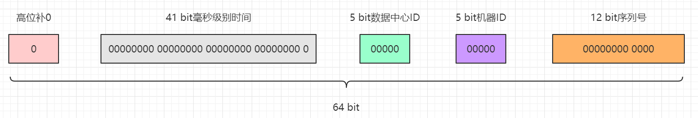
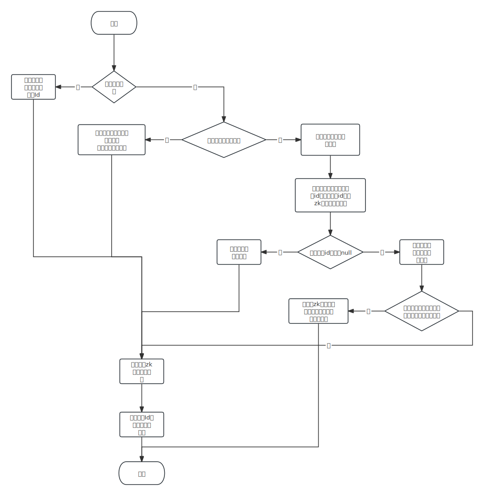
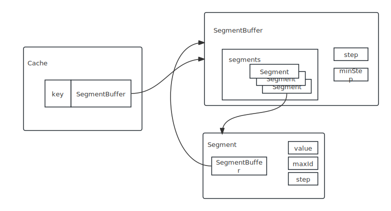

> 分布式系统/系统设计

> 之前在开发中对这块知识的理解不够深入，想通过这篇文章对目前主流的序列号生成的方案做一个总结。

# 一、UUID

## 1.实现方式

使用JDK自带的UUID的实现，具体API：`UUID.randomUUID()`。

## 2.优点

1. **性能非常高**：本地生成，没有网络消耗。

## 3.缺点

1. **不易于存储**：UUID太长，16字节128位，通常以36长度的字符串表示，很多场景不适用。
2. **信息不安全**：基于MAC地址生成UUID的算法可能会造成MAC地址泄露，这个漏洞曾被用于寻找梅丽莎病毒的制作者位置。
3. **对MySQL索引不利**：如果作为数据库主键，在InnoDB引擎下，UUID的无序性可能会引起数据位置频繁变动，严重影响性能。

# 二、数据库生成

## 1.实现方式

这种方式主要是依赖于数据库自身的自增主键ID来进行实现的。

1. 在MySQL中，设置`auto_increment_increment`和`auto_increment_offset`来保证ID自增。

    查看这两个变量的全局配置

    ```sql
    show global variables like '%auto_inc%';
    ```

    `auto_increment_offset`表示自增长字段从那个数开始，他的取值范围是1 .. 65535。

    `auto_increment_increment`表示自增长字段每次递增的量，其默认值是1，取值范围是1 .. 65535。

2. 设计一张序列号的表结构，如下：

    ```sql
    drop table  if exists `sequence`;
    create table `sequence`(
    	`seq_id` bigint(20) auto_increment comment '主键',
        `seq_name` varchar(20) not null default '' comment '序列号名称',
        primary key (`seq_id`),
        unique key `idx_uni_seq_name`(`seq_name`)
    ) engine=InnoDB comment '序列号表';
    ```

3. 在服务器端代码中，每次需要生成序列号的时候，就执行SQL：

    ```sql
    begin;
    replace into `sequence`(`seq_name`) values ('orderNo');
    select LAST_INSERT_ID();
    commit;
    ```

    `replace into` 跟 `insert into`功能类似，不同点在于：`replace into` 首先尝试插入数据到表中， 1. 如果发现表中已经有此行数据（根据主键或者唯一索引判断）则先删除此行数据，然后插入新的数据。 2. 否则，直接插入新数据。

    要注意的是：插入的数据必须有**主键**或者是**唯一索引**！否则的话，`replace into`会直接插入数据，这将导致表中出现重复的数据。

## 2.优点

1. 非常简单，利用现有数据库系统的功能实现，成本小。
2. ID号单调自增，可以实现一些对ID有特殊要求的业务。

## 3.缺点

1. **强依赖DB，当DB异常时整个系统不可用，属于致命问题**。配置主从复制可以尽可能的增加可用性，但是数据一致性在特殊情况下难以保证。主从切换时的不一致可能会导致重复发号。
2. **ID发号性能瓶颈限制在单台MySQL的读写性能**。

## 4.性能优化

针对单台MySQL的性能瓶颈，我们可以进行水平扩展，使用多台MySQL服务器提供序列号生成的功能，只需要修改每台MySQL自增ID的初始值和递增步长。如下所示：

```
IDServer1:
auto-increment-increment = 2
auto-increment-offset = 1

IDServer2:
auto-increment-increment = 2
auto-increment-offset = 2
```

针对IDServer1，他生成的递增序列是1、3、5...，而IDServer2生成的递增序列是2、4、6...。

优点：减轻了MySQL服务的压力，性能有所提升。

缺点：

1. 后面如果在对服务器进行水平扩展困难。因为刚开始服务器的数量和初始值已经设定好了，如果要新增会变得十分困难，比如我们再加一台服务器，他的初始值我们设置为3，步长设置为2，这样就会导致他生成的序列号和第一台重合。我们需要重新划分这几台服务器的初始值和步长，避免他们生成相同的序列号。
2. ID没有了单调递增的特性，只能趋势递增，这个缺点对于一般业务需求不是很重要，可以容忍。
3. 数据库压力还是很大，每次获取ID都得读写一次数据库，只能靠堆机器来提高性能。

# 三、Redis生成

## 1.实现方式

基于Redis的实现就比较简单了，直接利用`String`数据结构，通过`incr key`命令就可以实现计数。

`incr`命令用于对值进行自增操作，返回的结果分为三种情况：

1. 值不是整数，返回错误。比如`set hello world`，接着`incr hello`。
2. 值是整数，返回自增后的结果，返回结果为1。
3. 键不存在，按照值为0自增，返回结果为1。

**使用Redis的进行计数功能的优势**：许多存储系统和编程语言内部使用CAS机制实现计数功能，会有一定的CPU开销，但在Redis中就不会存在这个问题，因为Redis是单线程架构，任何命令到了Redis服务端都要顺序执行。

## 2.优点

* 不依赖于数据库，灵活方便，且性能优于数据库。
* 生成的序列号是自增的，有利于数据库存储。

## 3.缺点

* 增加了复杂度：引入的新的组件，增加了系统的复杂度。
* 单点故障：如果 Redis 节点出现故障，整个序列号生成系统可能会受到影响，需要采取容错机制来避免单点故障。

# 四、Snowflake算法生成

## 1.原理解析

Snowflake是Twitter在2010年开源的序列号生成算法，理论上snowflake方案的QPS约为409.6w/s，这种分配方式可以保证在任何一个IDC的任何一台机器在任意毫秒内生成的ID都是不同的。下面我们来具体看下这个算法的实现。



上图中主要展示了64位长度的Snowflake算法序列号的结构：

* **高位的1bit**不用。
* **41 bit长度**，使用毫秒级别精度，带有一个自定义epoch，41-bit的时间可以表示（1L<<41 / (1000L\* 3600 \* 24 \* 365)=69年的时间。
* **5 bit长度**，用于划分数据中心，可以表示32个IDC。
* **5 bit长度**，用于表示每个数据中心下的机器，可以表示32台机器。
* **12 bit长度**，用于表示自增序列号，可以表示4096个ID，也就是说一毫秒内一台机器可以生成4096个不同的ID。

## 2.具体实现

我是照着Twitter原有的Scala语言的实现做了Java版的一个翻译，具体代码的实现如下：

```java
public class SnowflakeSequence {

    /**
     * Twitter的官方实现
     */

    // 指定初始时间
    private final long epoch = 1711012488360L;

    // 机器ID的最大位长度为5
    private final long workerIdBits = 5L;

    // 数据中心ID的最大长度为5
    private final long dataCenterIdBits = 5L;

    // 序列号的最大长度为12位
    private final long sequenceBits = 12L;

    // 机器ID需要左移的位数为12
    private final long workerIdLeftShift = sequenceBits;

    // 数据中心ID需要左移的位数12+5=17
    private final long dataCenterIdLeftShift = sequenceBits + workerIdBits;

    // 时间戳需要左移的位数 12+5+5=22
    private final long timestampLeftShift = sequenceBits + workerIdBits + dataCenterIdBits;

    // 序列号的掩码，也就是一毫秒内可以生成的序列号的最大值，是4095，也就是2的12次减1
    private final long sequenceMask = -1L ^ (-1L << sequenceBits);

    // 最大的机器ID值，十进制为31
    private final long maxWorkerId = -1L ^ (-1L << workerIdBits);

    // 最大的数据中心ID值，十进制为31
    private final long maxDataCenterId = -1L ^ (-1L << dataCenterIdBits);

    // 初始化上一个时间戳快照值为-1
    private long lastTimestamp = -1L;

    // 初始序列号
    private long sequence = 0L;

    private long workId;
    private long dataCenterId;


    public SnowflakeSequence(long dataCenterId, long workerId) {

        if (workerId > maxWorkerId || workerId < 0) {
            throw new IllegalArgumentException("机器ID不能大于31或者不能小于0");
        }

        if (dataCenterId > maxDataCenterId || dataCenterId < 0) {
            throw new IllegalArgumentException("数据中心ID不能大于31或者不能小于0");
        }

        this.workId = workerId;
        this.dataCenterId = dataCenterId;
    }


    public long getNextNum() {

        // 获取系统时间戳，单位毫秒
        long timestamp = timeGen();

        // 如果当前时间戳下于上次的时间戳，说明发送了时钟回拨，抛出异常，拒绝生成ID
        if (timestamp < lastTimestamp) {
            throw new IllegalStateException("发生了时钟回拨，获取序列号失败");
        }

        // 高并发场景，同一毫秒生成多个ID
        if (timestamp == lastTimestamp) {

            // 确保sequence + 1之后不会溢出，最大值为4095，其实也就是保证1毫秒内最多生成4096个ID值
            sequence = (sequence + 1) & sequenceMask;

            // 如果sequence溢出则变为0，说明1毫秒内并发生成的ID数量超过了4096个，这个时候同1毫秒的第4097个生成的ID必须等待下一毫秒
            if (sequence == 0) {
                // 死循环等待下一个毫秒值，直到比lastTimestamp大
                timestamp = tilNextMillis(lastTimestamp);
            }
        } else {
            // 低并发场景，不同毫秒数的时候生成ID，这里也就是timestamp > lastTimestamp的情况
            sequence = 0;
        }

        lastTimestamp = timestamp;

        return ((timestamp - epoch) << timestampLeftShift) |
            (dataCenterId << dataCenterIdLeftShift) |
            (workId << workerIdLeftShift) |
            sequence;
    }


    private long timeGen() {
        return System.currentTimeMillis();
    }

    private long tilNextMillis(long lastTimestamp) {
        long timestamp = timeGen();
        while (timestamp <= lastTimestamp) {
            timestamp = timeGen();
        }
        return timestamp;
    }


    /**
     * 获取固定长度的字符串
     */
    private String formatRStrZero(String value, int length) {
        StringBuilder sb = new StringBuilder();
        for (int i = 0; i < length / 20 + 1; i++) {
            sb.append("00000000000000000000");
        }
        sb.append(value);
        return sb.substring(sb.length() - length);
    }

    public String getNexSeq(int length) {
        return formatRStrZero(String.valueOf(getNextNum()), length);
    }

    public static void main(String[] args) {
        SnowflakeSequence snowflakeSequence = new SnowflakeSequence(0, 0);
        System.out.println(snowflakeSequence.getNextNum());
        System.out.println(snowflakeSequence.getNexSeq(18));
    }
}
```

## 3.位运算技巧解析

这段代码的逻辑还是十分清晰的。不知道大家和我一样不，看到上面的位运算就觉得很头大，下面我们就对上面几个位运算的技巧做一个阐述：

1. 带符号左移

    `M << n`意味着：

    - `M`的二进制数（补码）向左移动`n`位。
    - 左边（高位）移出部分直接舍弃，右边（低位）移入部分全部补`0`。
    - 移位结果：相当于`M`的值乘以`2`的`n`次方，并且0、正、负数通用。
    - 移动的位数超过了该类型的最大位数，那么编译器会对移动的位数取模，例如`int`移位`33`位，实际上只移动了`33 % 2 = 1`位。

    **在Snowflake算法中将特定区域位置的数进行左移，正好将低位用0补齐，为后续序列号结构的组合做好位置铺垫。**

2. 按位或

    在Snowflake代码中：

    ```java
    return ((timestamp - epoch) << timestampLeftShift) |
                    (dataCenterId << dataCenterIdLeftShift) |
                    (workId << workerIdLeftShift) |
                    sequence;
    ```

    按位与的运算规则是：`0|0=0`，`0|1=1`，`1|0=1` ，`1|1=1`，只要有其中一个位存在1则计算结果是1，只有两个位同时为0的情况下计算结果才是0。主要作用是：**对一个数的部分位赋值为1，只需要和对应位全为0的数做按位或操作就行**，例如`1011 0000`如果低4位想全部赋值为1，那么`10110000 | 00001111`即可得到`1011 1111`。

    **在Snowflake代码先是将不同区域的bit进行按位或操作，从而实现各个区域的拼凑逻辑，完成序列号结构的组合。**

3. 计算n个bit能表示的最大数值

    在Snowflake代码中：

    ```java
    // 机器ID的位长度
    private long workerIdBits = 5L;
    // 最大机器ID -> 31
    private long maxWorkerId = -1L ^ (-1L << workerIdBits);
    ```

    这里的算子是`-1L ^ (-1L << 5L)`，整理运算符的顺序，再使用64 bit的二进制数推演计算过程如下：

    ```shell
    [-1] 的补码         11111111 11111111 11111111 11111111 11111111 11111111 11111111 11111111
    左移5位             11111111 11111111 11111111 11111111 11111111 11111111 11111111 11100000
    [-1] 的补码         11111111 11111111 11111111 11111111 11111111 11111111 11111111 11111111
    异或                ----------------------------------------------------------------------- ^ 
    结果的补码           00000000 00000000 00000000 00000000 00000000 00000000 00000000 00011111  （十进制数 2^0 + 2^1 + 2^2 + 2^3 + 2^4 = 31）
    ```

    这样就能计算出5 bit能表示的最大数值n，n为整数并且`0 <= n <= 31`，即0、1、2、3...31。Worker ID和Data Center ID部分的最大值就是使用这种组合运算得出的。

4. 用固定位的最大值作为Mask避免溢出

    在Snowflake代码中：

    ```Java
    // 序列号的最大长度为12位
    private final long sequenceBits = 12L;
    // 序列号的掩码，也就是一毫秒内可以生成的序列号的最大值，是4095，也就是2的12次减1
    private final long sequenceMask = -1L ^ (-1L << sequenceBits);
    // 初始序列号
    private long sequence = 0L;
    ...
    sequence = (sequence + 1) & sequenceMask;
    ```

    从上面的变量声明中我们可以看到，序列号区域12位bit能够生成的最大数是4095，**我们要保证每一毫秒生成的序列号不能大于4095，如果大于了那12个bit位就办法存储这个数字了。**

    假设`sequence`当前值为`4095`，推演一下计算过程：

    ```shell
    [4095] 的补码                 00000000 00000000 00000000 00000000 00000000 00000000 00000111 11111111
    [sequence + 1] 的补码         00000000 00000000 00000000 00000000 00000000 00000000 00001000 00000000
    按位与                        ----------------------------------------------------------------------- &
    计算结果                      00000000 00000000 00000000 00000000 00000000 00000000 00000000 00000000（十进制数：0）
    ```

    这里你就看到效果了吧，也就是**超过4095的数字通过按位与会被重置为0，没有超过4095的数经过按位与还是它本身。**

## 4.优点

- 毫秒数在高位，自增序列在低位，整个ID都是趋势递增的。
- 不依赖数据库等第三方系统，以服务的方式部署，稳定性更高，生成ID的性能也是非常高的。
- 可以根据自身业务特性分配bit位，非常灵活。

## 5.缺点

* 强依赖机器时钟，如果机器上时钟回拨，会导致发号重复或者服务会处于不可用状态。

## 6.优化版Snowflake算法

Snowflake算法有几个比较大的问题：

1. 低并发场景会产生连续偶数，原因是低并发场景系统时钟总是走到下一个毫秒值，导致序列号重置为`0`。

    这个问题比较好解决，直接使用随机数进行解决就行，直接看代码：

    原来的版本：

    ```java
    // 高并发场景，同一毫秒生成多个ID
    if (timestamp == lastTimestamp) {
    
        // 确保sequence + 1之后不会溢出，最大值为4095，其实也就是保证1毫秒内最多生成4096个ID值
        sequence = (sequence + 1) & sequenceMask;
    
        // 如果sequence溢出则变为0，说明1毫秒内并发生成的ID数量超过了4096个，这个时候同1毫秒的第4097个生成的ID必须等待下一毫秒
        if (sequence == 0) {
            // 死循环等待下一个毫秒值，直到比lastTimestamp大
            timestamp = tilNextMillis(lastTimestamp);
        }
    } else {
        // 低并发场景，不同毫秒数的时候生成ID，这里也就是timestamp > lastTimestamp的情况
        sequence = 0;
    }
    ```

    更新后的版本（美团Leaf的代码）：

    ```java
    if (lastTimestamp == timestamp) {
        sequence = (sequence + 1) & sequenceMask;
        if (sequence == 0) {
            //seq 为0的时候表示是下一毫秒时间开始对seq做随机
            sequence = RANDOM.nextInt(100);
            timestamp = tilNextMillis(lastTimestamp);
        }
    } else {
        //如果是新的ms开始
        sequence = RANDOM.nextInt(100);
    }
    ```

    采用这种方案之后会稍微减少同一个毫秒内能产生的最大ID数量。

2. 依赖系统时钟，时钟回拨会拒绝生成新的ID（直接抛出异常）。

    这里采取的方案就是对时钟回拨进行一定时间的等待。

    原来的版本：

    ```java
     // 如果当前时间戳小于上次的时间戳，说明发送了时钟回拨，抛出异常，拒绝生成ID
    if (timestamp < lastTimestamp) {
        throw new IllegalStateException("发生了时钟回拨，获取序列号失败");
    }
    ```

    更新后的版本（美团Leaf的代码）：

    ```java
    if (timestamp < lastTimestamp) {
        long offset = lastTimestamp - timestamp;
        if (offset <= 5) {
            try {
                wait(offset << 1);
                timestamp = timeGen();
                if (timestamp < lastTimestamp) {
                    return new Result(-1, Status.EXCEPTION);
                }
            } catch (InterruptedException e) {
                LOGGER.error("wait interrupted");
                return new Result(-2, Status.EXCEPTION);
            }
        } else {
            return new Result(-3, Status.EXCEPTION);
        }
    }
    ```

    按照上面代码的逻辑，如果时钟回拨的范围小于等于5毫秒，就等待10毫秒，重新获取当前时间。

3. Woker ID和Data Center ID的管理比较麻烦，特别是同一个服务的不同集群节点需要保证每个节点的Woker ID和Data Center ID组合唯一。

    这个问题在小型项目中我们可以通过数据字段配置或是配置文件进行固定设置。如果在大规模项目中可以借鉴美团leaf-snowflake的实现，下面一节就会介绍这部分内容。

# 五、美团leaf的实现分析

## leaf-snowflake

### 1. 解决的问题

1. 采用数据库、Redis生成的序列号是自增可计算的，如果我们在订单号场景使用这个序列号，那么其他人就可以通过订单号统计我们一段时间的订单量，这个是不能接受的。
2. 针对第一问题，我们其实可以采用Snowflake算法来生成，它的序列号不具备自增可计算的的特性，如果采用Snowflake算法，在大规模项目中，手动配置工作机器Id和数据中心Id成本太高了，而且会出错。

### 2.解决方案

使用**Zookeeper持久顺序节点的特性**自动对snowflake节点配置wokerID，在leaf中美团将工作机器Id和数据中心Id合并成了workID，一共10个bit位。

### 3.源代码分析

leaf中生成workID的代码在[com.sankuai.inf.leaf.snowflake.SnowflakeZookeeperHolder#init](https://github.com/Meituan-Dianping/Leaf/blob/master/leaf-core/src/main/java/com/sankuai/inf/leaf/snowflake/SnowflakeZookeeperHolder.java)方法上，大家可以点开看下。代码的大体逻辑如下图：



### 3.zk持久顺序节点

zookeeper 中的所有存储的数据是由 znode 组成的，节点也称为 znode，并以 key/value 形式存储数据。整体结构类似于 linux 文件系统的模式以树形结构存储。其中根路径以 `/`开头。

看下这段代码：

```Java
/**
 * 创建持久顺序节点 ,并把节点数据放入 value
 *
 * @param curator
 * @return
 * @throws Exception
 */
private String createNode(CuratorFramework curator) throws Exception {
    try {
        return curator.create().creatingParentsIfNeeded().withMode(CreateMode.PERSISTENT_SEQUENTIAL).forPath(PATH_FOREVER + "/" + listenAddress + "-", buildData().getBytes());
    } catch (Exception e) {
        LOGGER.error("create node error msg {} ", e.getMessage());
        throw e;
    }
}
```

上面这段代码中`CreateMode.PERSISTENT_SEQUENTIAL`表示我们创建了一个持久化的顺序节点，这个顺序节点的全路径大概长这样：`/snowflake/leaf/forever/127.0.0.1:8080-0000000001`，值得注意的是我们在代码中传入的节点path是`/snowflake/leaf/forever/127.0.0.1:8080-`，节点创建之后真实的节点名称后面会被拼接10位长度的有序数值，也就是例子中的`0000000001`，这个就是zk帮忙我们生成的唯一有序的workID。

## leaf-segment

### 1.解决的问题

采用数据库生成方式时，每次获取ID都得读写一次数据库，造成数据库压力大。

### 2.解决方案

采用双号段的设计，第一个序列号段用来满足正常的使用，另一个序列号段用来做预备号段。当第一个号段的使用率超过了当前号段的10%，就会提前生成下一个号段的数据。通过这种方式第一避免了每次读取数据库造成数据库压力过大，第二通过双号段实现了非阻塞获取号段，避免了实时获取号段造成的阻塞。

### 3.号段的结构



# 参考文档

* [冷饭新炒：理解Snowflake算法的实现原理](https://juejin.cn/post/6859155994061373448)
* [Leaf——美团点评分布式ID生成系统](https://tech.meituan.com/2017/04/21/mt-leaf.html)
* [Leaf：美团分布式ID生成服务开源](https://tech.meituan.com/2019/03/07/open-source-project-leaf.html)