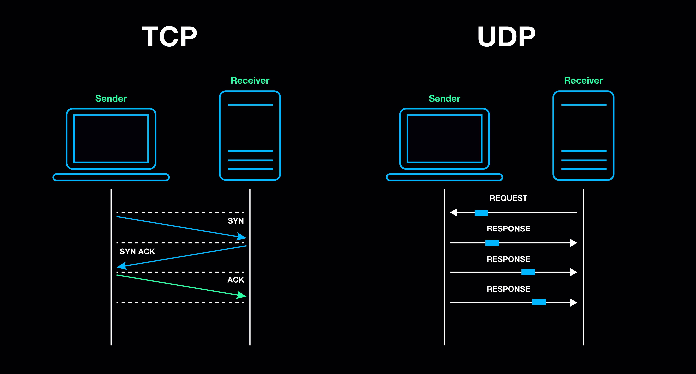

> 面试/计算机网络

> 对计算机网络中常问考点的总结。

# 计算机网络

## 7/4网络模型

网络的 7 层模型也称为 OSI 参考模型（OSI 是 Open System Interconnection 的缩写），是一个标准化的网络通信模型，用于描述计算机网络通信的不同层次。该模型将网络通信分为以下 7 层：

1. 物理层：负责处理物理媒介上的比特流传输，如电缆、光纤等。
2. 数据链路层：负责将比特流组织成数据帧，并进行错误检测和纠正。
3. 网络层：负责将数据帧从源主机传输到目标主机，包括寻址和路由选择。
4. 传输层：负责端到端的可靠数据传输，包括分段、排序和错误恢复。
5. 会话层：负责建立、维护和终止会话，包括会话管理和同步。
6. 表示层：负责数据格式转换和编码，以确保不同系统之间能够相互理解。
7. 应用层：负责为应用程序提供网络服务，如文件传输、电子邮件等。

网络的 4 层模型通常指的是 TCP/IP 模型，它是互联网协议套件（TCP/IP）的层次结构。该模型将网络通信分为以下 4 层：

1. 网络接口层：负责处理物理网络的连接和数据传输。
2. 网络层：负责将数据从源主机传输到目标主机，包括寻址和路由选择。
3. 传输层：负责端到端的可靠数据传输，包括 TCP（传输控制协议）和 UDP（用户数据报协议）。
4. 应用层：负责为应用程序提供网络服务，如 HTTP（超文本传输协议）、FTP（文件传输协议）等。

## TCP协议

1. TCP协议的三次握手

    TCP（Transmission Control Protocol）协议是一种面向连接的可靠传输协议，用于在网络中传输数据。在 TCP 协议建立连接时，会进行三次握手，以确保通信双方都准备好进行数据传输。

    三次握手的过程如下：

    1. 客户端发送一个 SYN（Synchronization）包给服务器，表示**希望建立连接**。这个包中包含了客户端的初始序列号（ISN）。
    2. 服务器收到 SYN 包后，会回复一个 SYN+ACK（Synchronization Acknowledgment）包给客户端，表示**同意建立连接**，并确认收到了客户端的 SYN 包。这个包中包含了服务器的初始序列号（ISN）和确认号（ACK），确认号的值为客户端的 ISN+1。
    3. 客户端收到 SYN+ACK 包后，会回复一个 ACK（Acknowledgment）包给服务器，表示**确认收到了服务器的 SYN+ACK 包**。这个包中的确认号为服务器的 ISN+1。

    通过这三次握手，客户端和服务器之间建立了一个可靠的连接，可以开始进行数据传输。

    需要注意的是，在三次握手中，如果任何一方没有收到对方的响应包，都会重发 SYN 包或 SYN+ACK 包，直到收到对方的响应为止。如果重发次数超过了一定的阈值，就会认为连接建立失败。

2. 为什么要三次握手，两次不行吗

    在 TCP 协议中，三次握手是为了确保通信双方都能够正确地建立连接，并确认对方已经准备好进行数据传输。

    如果只有两次握手，客户端发送SYN 包给服务器后，服务器回复 SYN+ACK 包给客户端，然后客户端就可以开始发送数据了。但是，此时服务器并**不能确定客户端是否已经收到了自己的 SYN+ACK 包**，如果客户端没有收到，就会导致数据传输失败。而通过第三次握手，客户端回复一个 ACK 包给服务器，表示确认收到了服务器的 SYN+ACK 包，这样服务器就可以确认客户端已经准备好进行数据传输了。

    因此，三次握手是为了确保连接的可靠性和稳定性，避免出现数据传输失败的情况。

3. TCP关闭连接的四次挥手

    TCP（Transmission Control Protocol）协议是一种面向连接的可靠传输协议，用于在网络中传输数据。在 TCP 协议关闭连接时，会进行四次挥手，以确保通信双方都能够正确地关闭连接。
    四次挥手的过程如下：

    1. 客户端发送一个 FIN（Finish）包给服务器，表示**希望关闭连接**。这个包中包含了客户端的序列号。
    2. 服务器收到 FIN 包后，会回复一个 ACK（Acknowledgment）包给客户端，表示**确认收到了客户端的 FIN 包**。这个包中的确认号为客户端的序列号+1。
    3. 服务器发送一个 FIN 包给客户端，表示**希望关闭连接**。这个包中的序列号为服务器的序列号。
    4. 客户端收到 FIN 包后，会回复一个 ACK 包给服务器，表示**确认收到了服务器的 FIN 包**。这个包中的确认号为服务器的序列号+1。

    通过这四次挥手，客户端和服务器之间的连接被关闭，双方都可以释放相关的资源。

    需要注意的是，在四次挥手中，如果任何一方没有收到对方的响应包，都会重发 FIN 包或 ACK 包，直到收到对方的响应为止。如果重发次数超过了一定的阈值，就会认为连接关闭失败。

4. keepalive机制

    在 TCP 协议中，Keepalive 是一种用于**检测连接是否仍然有效的机制**。

    当客户端和服务器之间建立了 TCP 连接后，如果长时间没有数据传输，双方都可能认为连接已经失效。为了避免这种情况，TCP 协议提供了 Keepalive 机制，即在连接空闲一段时间后，客户端或服务器会向对方发送一个 Keepalive 包，以检测连接是否仍然有效。
    Keepalive 包是一个特殊的 TCP 包，它的头部中没有数据，只有一个序列号。如果对方收到了 Keepalive 包，会回复一个ACK 包，表示连接仍然有效。如果对方没有收到 Keepalive 包，或者收到的 Keepalive 包的序列号不正确，就会认为连接已经失效，并关闭连接。

    默认情况下，TCP 协议的 Keepalive 机制是禁用的。如果需要启用 Keepalive，可以在客户端或服务器的配置中设置 Keepalive 时间间隔、Keepalive 包的数量等参数。需要注意的是，启用 Keepalive 可能会增加网络流量和 CPU 负担，因此需要根据实际情况进行权衡。

    TCP KeepAlive机制主要涉及3个参数：

    - *tcp_keepalive_time*

        在TCP保活打开的情况下，最后一次数据交换到TCP发送第一个保活探测包（keepalive包）的间隔，即允许的持续空闲时长，或者说每次正常发送心跳的周期，默认值为7200s（2h）。

    - *tcp_keepalive_probes*

        在tcp_keepalive_time之后，最大允许发送保活探测包的次数，到达此次数后直接放弃尝试，并关闭连接，默认值为9（次）。

    - *tcp_keepalive_intvl*

        在tcp_keepalive_time之后，没有接收到对方确认，继续发送保活探测包的发送频率，默认值为75s。

5. TCP协议中的滑动窗口和流量控制

    TCP（Transmission Control Protocol）协议中的滑动窗口和流量控制机制是用于确保可靠的数据传输和避免网络拥塞的重要手段。
    滑动窗口是一种**用于管理数据发送和接收的机制**。在 TCP 协议中，发送方维护一个发送窗口，该窗口表示发送方可以发送的数据量。接收方也维护一个接收窗口，该窗口表示接收方可以接收的数据量。发送方只能发送接收方接收窗口内的数据，这样可以避免发送过多的数据导致接收方无法及时处理。

    流量控制是一种**用于调整数据发送速率的机制**。在 TCP 协议中，接收方可以通过发送窗口大小字段来告诉发送方自己的接收窗口大小。发送方根据接收方的接收窗口大小来调整自己的发送速率，以避免发送过多的数据导致接收方无法及时处理。

    滑动窗口和流量控制机制可以确保数据传输的可靠性和稳定性。如果接收方的接收窗口变小，发送方会减少发送速率，以避免数据丢失。如果接收方的接收窗口变大，发送方会增加发送速率，以提高数据传输效率。

6. TCP是如何保障可靠性传输的

    1. **确认机制**：TCP 使用确认机制来确保数据传输的可靠性。发送方发送数据后，接收方会发送一个确认（ACK）消息给发送方，表示已经收到数据。如果发送方没有收到确认消息，它将重新发送数据。
    1. **超时重传**：如果发送方在一定时间内没有收到确认消息，它将认为数据已经丢失，并重新发送数据。超时重传机制可以确保数据能够可靠地传输到接收方。
    1. **序列号**：TCP 为每个数据字节分配一个序列号，接收方可以通过序列号检查数据的完整性和顺序性。如果接收方收到的数据序列号不连续或缺失，它将通知发送方重新发送缺失的数据。
    1. **流量控制**：TCP 采用滑动窗口机制来控制数据的发送速率，以避免发送方发送过多的数据导致接收方缓冲区溢出。接收方可以通过发送窗口大小字段来限制发送方发送的数据量。
    1. **拥塞控制**：TCP 采用拥塞控制机制来避免网络拥塞导致的数据丢失。发送方根据网络拥塞情况调整发送速率，以避免拥塞发生。

