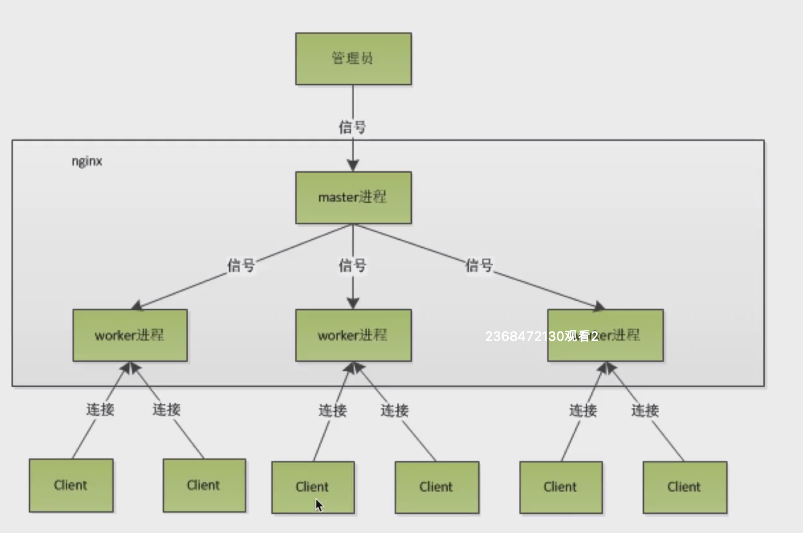
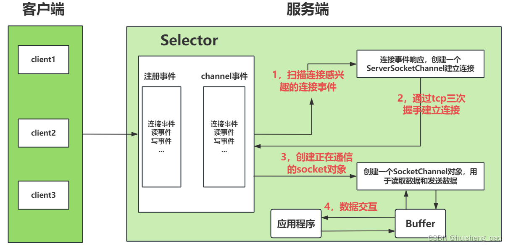

| title                              | tags            | background                                                   | auther | isSlow |
| ---------------------------------- | --------------- | ------------------------------------------------------------ | ------ | ------ |
| 秒杀系统设计的要点（二）分布式扩展 | Spring Boot/Web | 这篇文章是”秒杀系统设计的要点（一）性能压测“第二篇文章，这里主要讨论服务器端的水平扩展和其带来的分布式会话的解决方案。 | depers | true   |

# 背景

在上一节”[秒杀系统设计的要点（一）性能压测](http://www.bravedawn.cn/details.html?aid=8507)“中，我们对现有的实现进行了性能压测，并通过修改Tomcat配置对应用进行了优化，但是单机部署的应用由于受系统资源限制、网络带宽增加和数据库性能瓶颈的影响，无法进一步提升系统的性能。在本节中我们准备通过分布式扩展的方式来解决这个问题。

# 使用Nginx反向代理进行负载均衡

## 1. 使用OpenResty

**Nginx (engine x)** 是一款轻量级的 Web 服务器 、反向代理服务器及电子邮件（IMAP/POP3）代理服务器。

**OpenResty** 是一个基于 Nginx 的 Web 服务器平台，它在 Nginx 的基础上添加了许多扩展和功能。OpenResty 提供了一个灵活和强大的环境，可以用于构建高性能的 Web 应用和服务。默认集成了Lua开发环境，使得Nginx可以作为一个Web server来使用。OpenResty提供了对MySQL、Memcached和Redis等组件使用支持。

关于OpenResty安装教程大家可以参考官网。

## 2. 配置Nginx反向代理

```nginx
upstream miaosha {
	server 192.168.1.173:8080;
	server 192.168.1.174:8080;
	server 192.168.1.175:8080;
}

server {
	listen 80;
	server_name www.miaosha.com;

	location / {
		proxy_pass http://miaosha;
	}
}
```

## 3. Nginx高性能的原因

* master-worker的进程模型

    平滑重启、平滑加载配置而不会与客户端断开连接。

    Nginx 有一个主线程（ master process）和几个工作线程（worker process），下图中我们可以看到主线程13088有两个工作线程，是父子进程的关系，也就是父进程可以管理子进程的。这台机器的CPU是两核的。

    

    master进程主要负责信号处理以及work进程的管理，包括接收外界信号、向worker进程发送信号，监控worker进程的运行状态等，不直接对外提供web服务。

    worker进程才是执行所有实际任务的进程，处理网络连接、读取和写入内容到磁盘，与上游服务器通信等工作。

    

    多数情况下，Nginx建议每个CPU核心都运行1个工作进程，使硬件资源得到最有效的利用。你可以在配置中设置如下指令：`worker_processes auto`，当Nginx服务器在运行时，只有工作进程在忙碌。

    一个master父进程，多个worker子进程，每个子进程只有一个线程。单个线程在没有阻塞操作时，单个的子线程的执行效率是远远高于多个线程的执行效率的。

    

    master 监听了 80 端口，并且 fork 出 3 个 wokrer 进程，当 client 一个请求过来时，worker是需要去 **抢占一个互斥锁**（图中的 accept_mutex） ，抢占成功的 worker 进行处理。当一个 worker 进程在 accept 这个连接之后，就开始读取请求，解析请求，处理请求，产生数据后，再返回给客户端，最后断开连接，完成一个完整的请求。

    除了上面讲到的这些，**Nginx的平滑重启功能**也是借助master-worker进程模型去做的。当我们执行`./nginx -s reload`命令重启Nginx加载配置文件的时候，master进程会发送一个信号给worker进程，将worker进程管理的socker句柄交给master去管理，接着master进程重新加载配置文件，新建worker进程，将原来worker进程的socker交给新的worker进程去管理。因为这些操作都是基于内存进行了，所以很快。对于客户端的来讲是无感的，不会出现重新发起连接或是连接失败的情况。

* IO多路复用的性能优势

    基于BIO的通信，Socket服务端会发生阻塞，即在监听过程中每次accept到一个客户端的Socket连接，就要处理这个请求，而此时其他连接过来的客户端只能阻塞等待。可见，这种模式下Socket服务端的处理能力是非常有限的，客户端也只能等待，直到服务端空闲时进行请求的处理。

    因此BIO的阻塞就两个地方：

    - **服务端没有接收到客户端请求时会阻塞**
    - **已有客户端再进行连接未释放时，新来的客户端连接也会被阻塞**

    为了BIO串行处理请求的问题，我们可以采用多线程的模型，即一个连接新建一个线程去做处理，一般在Java编程中我们会采用线程池的方式去封装和组织线程。这种情况下，线程池的最大线程数和阻塞队列的长度之和就代表了能够处理连接的最大数量，此时线程池的瓶颈就成了服务器的瓶颈。并且如果是IO密集型的传输，如涉及大文件的IO传输这种，那么整体效率就会底下，严重影响客户端的体验。由于BIO会存在着阻塞的缺陷以及并发量小的缺陷，因此随着网络编程的不断发展，BIO这种阻塞的方式使用的频率逐渐变小。

    下图是Java NIO客户端和服务器端的Socket交互图，在下面这个流程中服务器端有两部分组成，一部分是操作系统对于多路复用封装，一部分是我们自己编写的应用程序的逻辑，下面的操作系统我们可以理解为下面提到的内核态程序的逻辑。

    * 从下图中我们可以看到，客户端先向服务端发送一个请求，然后服务端在接收到这个请求之后，服务端首先会通过这个Selector先向本地注册一个连接事件，**操作系统**然后再扫描Channel事件列表，查看是否有感兴趣的Channel事件。
    * **操作系统**在Channel中找到这个对连接感兴趣的事件之后，随后通知这个感兴趣的事件，创建一个ServerSocketChannel对象，用于服务端和客户端通过三次握手建立可靠的连接。
    * 完成建立连接之后，**操作系统**又会去Selector中扫描是否有对读数据感兴趣的事件，如果找到有服务端对读数据感兴趣的事件，又会通知对这个事件感兴趣的具体事件，用于实例化SocketChannel对象，这里的SocketChannel就是建立好连接的Socket对象，用于真正的去读取数据以及发送数据。
    * 在服务器端SocketChannel读取的数据并不是客户端直接发送给服务端应用程序的数据，而是**操作系统**会将这部分数据先存入到Buffer中，让应用程序去读取buffer里面的数据，从而提高整个架构的吞吐量和效率。

    

    对应到IO多路复用模型上来，**主要思想是通过一个线程或进程来管理多个网络连接，而不是为每个连接创建一个单独的线程或进程。用户可以在一个线程内同时处理多个socket的IO请求**（我们后面将称为fd文件描述符，linux系统把所有网络请求以一个fd来标识），这样就可以只需要一个或几个线程就可以完成数据状态询问的操作，当有数据准备就绪之后再分配对应的线程去读取数据，这么做就可以节省出大量的线程资源出来，这个就是IO复用模型的思路。

    对应到编程模型上来，在获取事件时，先把所有连接（文件描述符）传给内核，再由内核返回产生了事件的连接，然后在用户态中再处理这些连接对应的请求即可。
    

    这里以select调用来说明IO复用的具体逻辑，用户调用 select 函数将文件描述符集合**拷贝**到内核里，让内核来检查是否有网络事件产生，检查的方式很粗暴，就是通过**遍历**文件描述符集合的方式，当检查到有事件产生后，将此 Socket 标记为可读或可写， 接着再把整个文件描述符集合**拷贝**回用户态里，然后用户态还需要再通过**遍历**的方法找到可读或可写的 Socket，然后再对其处理。

    所以，对于 select 这种方式，需要进行 **2 次「遍历」文件描述符集合**，一次是在内核态里，一个次是在用户态里 ，而且还会发生 **2 次「拷贝」文件描述符集合**，先从用户空间传入内核空间，由内核修改后，再传出到用户空间中。

    在Linux系统中对IO多路复用的实现主要有以下三种。

    * **select**

        select采用固定长度的**BitsMap来保存文件描述符集合**，而且所支持的文件描述符的个数是有限制的，在 Linux 系统中，由内核中的 FD_SETSIZE 限制， 默认最大值为 `1024`，只能监听 0~1023 的文件描述符。

    * **poll**

      poll 不再用 BitsMap 来存储所关注的文件描述符，取而代之用**动态数组，以链表形式来组织，突破了 select 的文件描述符个数限制**，当然还会受到系统文件描述符限制。

      但是 poll 和 select 并没有太大的本质区别，这两种方式随着并发数上来，性能的损耗会呈指数级增长。：

      1. **都是使用「线性结构」存储进程关注的 Socket 集合，因此都需要遍历文件描述符集合来找到可读或可写的 Socket，时间复杂度为 O(n)。**
      2. **也需要在用户态与内核态之间拷贝文件描述符集合。**

    * **epoll**

      相比于select，epoll最大的好处在于它不会随着监听fd数目的增长而降低效率，JDK在Lunix内核2.6以上版本中就会采用epoll实现进行IO的多路复用。epoll 通过两个方面，很好解决了 select/poll 的问题：

      * 一epoll在内核里使用**红黑树来跟踪进程所有待检测的文件描述字**。`epoll_create()`函数创建一个`epoll`句柄，把需要监控的 socket 通过 `epoll_ctl()` 函数加入内核中的红黑树里。红黑树是个高效的数据结构，增删改一般时间复杂度是 `O(logn)`。而 `select/poll` 内核里没有类似 `epoll` 红黑树这种保存所有待检测的 socket 的数据结构，所以 `select/poll` 每次操作时都传入整个 socket 集合给内核，而 `epoll`因为在内核维护了红黑树，可以保存所有待检测的 socket ，所以只需要传入一个待检测的 socket，**减少了内核和用户空间大量的数据拷贝和内存分配**。

      * 二epoll 使用**事件驱动**的机制，**epoll将文件描述符添加和检测分离，减少了文件描述符拷贝的消耗**。内核里**维护了一个链表来记录就绪事件**，当某个 socket 有事件发生时，通过**回调函数**内核会将其加入到这个就绪事件列表中，当用户调用 `epoll_wait()` 函数时，只会返回有事件发生的文件描述符的个数，用户态就可以直接读取数据了。不需要像`select/poll`那样轮询扫描整个 socket 集合，大大提高了检测的效率。

      <div align="center">
          <video id="video" controls="" preload="none" poster="封面">
      		<source id="mp4" src="../../assert/epoll的流程.mp4" type="video/mp4">
      	</videos>
      </div>

* 协程机制

  在Nginx的每个worker进程中只有一个线程，由于我们采用了epoll多路复用的IO模型，像socket的读和写等阻塞操作并不会在work的线程上造成阻塞。所以就没有多线程线程切换导致的性能损耗。
  
  当Nginx接收到成千上万的请求之后，worker进程中的线程会将每个连接交给协程去做处理。
  
  协程是依附于线程的内存模型，协程之间的切换开销较小，协程仍然是在一个线程上去执行的。**当一个协程在执行过程中遇到阻塞，当前协程的执行权限将会被剥夺**，当前线程会调出另一个不阻塞的协程去执行。例如我们在协程中调用了epoll模型去做IO操作，执行socket.read方法，此时当前协程的执行权限就会被剥夺，无需在socket.read方法上进行阻塞，等socket.read方法就绪时epoll模型通过事件驱动机制通知我们的时候，当前协程的后续代码就会被继续执行。所以我们所有协程代码的开发都是顺序执行的代码，**不需要去做加锁**操作。

# 分布式会话

## 1. 分布式会话的解决方案

会话认证的方式有很多种，常见的实现方案有以下五种：

* cookie：一种记录服务器和客户端会话状态的机制，存储在客户端。

* session，另一种记录服务器和客户端会话状态的机制，**是基于 cookie 实现的**，存储在服务器端。
* token：是服务器端和客户端会话状态的标识，是访问资源接口（API）时所需要的资源凭证。Token 使服务端无状态化，不会存储会话信息。
* JWT，JSON Web Token（简称 JWT）是目前最流行的跨域认证解决方案，是一种认证**授权机制。**
* OAuth：开放授权，是一种用于授权第三方应用访问用户资源的开放标准协议。

## 2. 使用Redis实现分布式会话的存储

在分布式环境下，该项目原有基于session的单机登录机制无法继续适用了，原因是session的会话信息是存储在服务器端的，在分布式环境中会有多台后台服务，会话信息如果没有进行集中化的存储，会造成用户需要不断重复登录的BUG。

在分布时环境中，会话信息存储和访问的的方案主流的有两种：

1. 采用Session的解决方案

    * 采用nginx ip hash policy

        这种方式就是将一个用户的所有请求固定的发送到一台服务器上。

        **优点：**可以不改变现有技术架构，直接实现横向扩展（省事）

        **缺点**：1.导致服务器请求（负载）不平均，完全依赖ip hash 的结果。2.在IP变化的环境下无法服务。

    * 采用Spring Session解决方案

        Spring Session 的目标很简单，就是将会话管理从存储在服务器中的 HTTP 会话的限制中解放出来，可以轻松地在多个服务之间共享会话数据，而无需绑定到单个容器（即 Tomcat）

        优点：实现简单，可以采用MySQL、Redis来做会话数据的持久化。

        缺点：spring-session支持redis cluster模式，但是不支持分片redis。

2. 采用token的解决方案

    由于我们的服务端提供的API可能会供App、浏览器或者其他程序使用，除浏览器外并不是其他平台都支持Http Session机制，所以采用token能够解决跨平台的问题。在具体的实现中，在登录接口我们会生成token返回给前端，并将用户的会话信息保存到redis中。

# 参考文章

* [聚焦Java性能优化 打造亿级流量秒杀系统](https://coding.imooc.com/class/338.html)
* [26丨负载均衡：怎样提升系统的横向扩展能力？](https://zq99299.github.io/note-architect/hc/05/06.html#%E8%B4%9F%E8%BD%BD%E5%9D%87%E8%A1%A1%E6%9C%8D%E5%8A%A1%E5%99%A8%E7%9A%84%E7%A7%8D%E7%B1%BB)
* [服务端高并发分布式架构演进之路](https://segmentfault.com/a/1190000018626163)
* [Nginx 工作模式和进程模型](https://learnku.com/articles/38414)
* [Nginx 的进程模型](https://zq99299.github.io/note-architect/ztc/06/05.html)
* [Nginx高性能原因](https://www.cnblogs.com/WJQ2017/p/17719006.html)
* [9.2 I/O 多路复用：select/poll/epoll](https://www.xiaolincoding.com/os/8_network_system/selete_poll_epoll.html)
* [IO多路复用——深入浅出理解select、poll、epoll的实现](https://zhuanlan.zhihu.com/p/367591714)
* [IO多路复用与epoll原理探究](https://wendeng.github.io/2019/06/09/%E6%9C%8D%E5%8A%A1%E7%AB%AF%E7%BC%96%E7%A8%8B/IO%E5%A4%9A%E8%B7%AF%E5%A4%8D%E7%94%A8%E4%B8%8Eepoll%E5%8E%9F%E7%90%86%E6%8E%A2%E7%A9%B6/)
* [token、jwt、oauth2、session](https://www.yuque.com/pig4cloud/pig/egcx5x#AdY7Q)
* [深入理解socket本质和BIO底层实现](https://zhenghuisheng.blog.csdn.net/article/details/136549478)
* [深入理解NIO的基本原理和底层实现(详解)](https://zhenghuisheng.blog.csdn.net/article/details/138451491)
* [Guide to Spring Session](https://www.baeldung.com/spring-session)