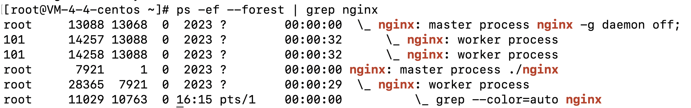
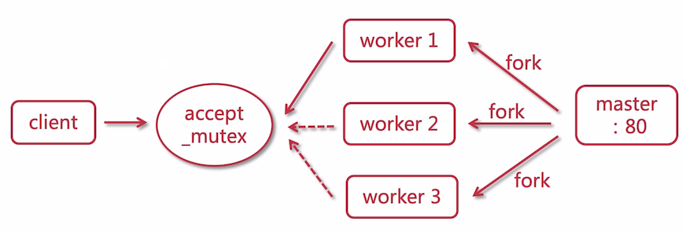
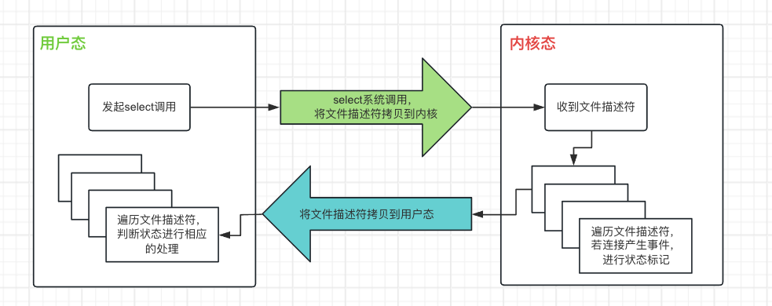

| title                              | tags            | background                                                   | auther | isSlow |
| ---------------------------------- | --------------- | ------------------------------------------------------------ | ------ | ------ |
| 秒杀系统设计的要点（二）分布式扩展 | Spring Boot/Web | 这篇文章是”秒杀系统设计的要点（一）性能压测“第二篇文章，这里主要讨论服务器端的水平扩展和其带来的分布式会话的解决方案。 | depers | true   |

# 背景

在上一节”[秒杀系统设计的要点（一）性能压测](http://www.bravedawn.cn/details.html?aid=8507)“中，我们对现有的实现进行了性能压测，并通过修改Tomcat配置对应用进行了优化，但是单机部署的应用由于受系统资源限制、网络带宽增加和数据库性能瓶颈的影响，无法进一步提升系统的性能。在本节中我们准备通过分布式扩展的方式来解决这个问题。

# 使用Nginx反向代理进行负载均衡

## 1. 使用OpenResty

**Nginx (engine x)** 是一款轻量级的 Web 服务器 、反向代理服务器及电子邮件（IMAP/POP3）代理服务器。

**OpenResty** 是一个基于 Nginx 的 Web 服务器平台，它在 Nginx 的基础上添加了许多扩展和功能。OpenResty 提供了一个灵活和强大的环境，可以用于构建高性能的 Web 应用和服务。默认集成了Lua开发环境，使得Nginx可以作为一个Web server来使用。OpenResty提供了对MySQL、Memcached和Redis等组件使用支持。

关于OpenResty安装教程大家可以参考官网。

## 2. 配置Nginx反向代理

```nginx
upstream miaosha {
	server 192.168.1.173:8080;
	server 192.168.1.174:8080;
	server 192.168.1.175:8080;
}

server {
	listen 80;
	server_name www.miaosha.com;

	location / {
		proxy_pass http://miaosha;
	}
}
```

## 3. Nginx高性能的原因

* master worker的进程模型

    Nginx 有一个主线程（ master process）和几个工作线程（worker process），下图中我们可以看到主线程13088有两个工作线程，这台机器的CPU是两核的。

    

    master进程主要负责信号处理以及work进程的管理，包括接收外界信号、向worker进程发送信号，监控worker进程的运行状态等，不直接对外提供web服务。worker进程才是执行所有实际任务的进程，处理网络连接、读取和写入内容到磁盘，与上游服务器通信等。

    多数情况下，Nginx建议每个CPU核心都运行1个工作进程，使硬件资源得到最有效的利用。你可以在配置中设置如下指令：`worker_processes auto`，当Nginx服务器在运行时，只有工作进程在忙碌。

    一个master父进程，多个worker子进程，每个子进程只有一个线程。单个线程在没有阻塞操作时，单个的子线程的执行效率是远远高于多个线程的执行效率的。

    

    master 监听了 80 端口，并且 fork 出 3 个 wokrer 进程，当 client 一个请求过来时，work 是需要去 **抢占一个互斥锁**（图中的 accept_mutex） ，抢占成功的 worker 进行处理。当一个 worker 进程在 accept 这个连接之后，就开始读取请求，解析请求，处理请求，产生数据后，再返回给客户端，最后断开连接，完成一个完整的请求。

* IO多路复用的性能优势

    按照上面的说法，客户端每发起一次请求，服务器端就要创建一个work进程来处理这个请求，如果一次来10000个请求呢，意味着操作系统要维护10000个连接，这样机器的内存和CPU是吃不下的。一个进程虽然任一时刻只能处理一个请求，但是处理每个请求的事件时，耗时控制在 1 毫秒以内，这样 1 秒内就可以处理上千个请求，把时间拉长来看，多个请求复用了一个进程，这就是多路复用。

    对应到IO多路复用模型上来，为了避免来一个请求就新建一个线程，为了减少线程的数量。**用户可以在一个线程内同时处理多个socket的IO请求**（我们后面将称为fd文件描述符，linux系统把所有网络请求以一个fd来标识），这样就可以只需要一个或几个线程就可以完成数据状态询问的操作，当有数据准备就绪之后再分配对应的线程去读取数据，这么做就可以节省出大量的线程资源出来，这个就是IO复用模型的思路。

    对应到编程模型上来，在获取事件时，先把所有连接（文件描述符）传给内核，再由内核返回产生了事件的连接，然后在用户态中再处理这些连接对应的请求即可。
    

    这里以select调用来说明IO复用的具体逻辑，用户调用 select 函数将文件描述符集合**拷贝**到内核里，让内核来检查是否有网络事件产生，检查的方式很粗暴，就是通过**遍历**文件描述符集合的方式，当检查到有事件产生后，将此 Socket 标记为可读或可写， 接着再把整个文件描述符集合**拷贝**回用户态里，然后用户态还需要再通过**遍历**的方法找到可读或可写的 Socket，然后再对其处理。

    所以，对于 select 这种方式，需要进行 **2 次「遍历」文件描述符集合**，一次是在内核态里，一个次是在用户态里 ，而且还会发生 **2 次「拷贝」文件描述符集合**，先从用户空间传入内核空间，由内核修改后，再传出到用户空间中。

    在Linux系统中对IO多路复用的实现主要有以下三种。

    * **select**

        select采用固定长度的**BitsMap来保存文件描述符集合**，而且所支持的文件描述符的个数是有限制的，在 Linux 系统中，由内核中的 FD_SETSIZE 限制， 默认最大值为 `1024`，只能监听 0~1023 的文件描述符。

    * **poll**

      poll 不再用 BitsMap 来存储所关注的文件描述符，取而代之用**动态数组，以链表形式来组织，突破了 select 的文件描述符个数限制**，当然还会受到系统文件描述符限制。

      但是 poll 和 select 并没有太大的本质区别，这两种方式随着并发数上来，性能的损耗会呈指数级增长。：

      1. **都是使用「线性结构」存储进程关注的 Socket 集合，因此都需要遍历文件描述符集合来找到可读或可写的 Socket，时间复杂度为 O(n)。**
      2. **也需要在用户态与内核态之间拷贝文件描述符集合。**

    * **epoll**

      相比于select，epoll最大的好处在于它不会随着监听fd数目的增长而降低效率。epoll 通过两个方面，很好解决了 select/poll 的问题：

      * 一epoll在内核里使用**红黑树来跟踪进程所有待检测的文件描述字**。`epoll_create`函数创建一个`epoll`句柄，把需要监控的 socket 通过 `epoll_ctl()` 函数加入内核中的红黑树里。红黑树是个高效的数据结构，增删改一般时间复杂度是 `O(logn)`。而 `select/poll` 内核里没有类似 `epoll` 红黑树这种保存所有待检测的 socket 的数据结构，所以 `select/poll` 每次操作时都传入整个 socket 集合给内核，而 `epoll`因为在内核维护了红黑树，可以保存所有待检测的 socket ，所以只需要传入一个待检测的 socket，**减少了内核和用户空间大量的数据拷贝和内存分配**。

      * 二epoll 使用**事件驱动**的机制，**epoll将文件描述符添加和检测分离，减少了文件描述符拷贝的消耗**。内核里**维护了一个链表来记录就绪事件**，当某个 socket 有事件发生时，通过**回调函数**内核会将其加入到这个就绪事件列表中，当用户调用 `epoll_wait()` 函数时，只会返回有事件发生的文件描述符的个数，不需要像`select/poll`那样轮询扫描整个 socket 集合，大大提高了检测的效率。

      <div align="center">
          <video id="video" controls="" preload="none" poster="封面">
      		<source id="mp4" src="../../assert/epoll的流程.mp4" type="video/mp4">
      	</videos>
      </div>

* 事件驱动模型

    

# 分布式会话

## 1. 分布式会话的解决方案


## 2. 使用Redis实现分布式会话的存储


# 数据库水平扩展

## 1.MySQL的性能优化


## 2. MySQL的分布式架构


多级缓存
页面静态化
缓存库存
事务型消息保证最终一致性
流量削峰
防刷限流

# 参考文章

* [聚焦Java性能优化 打造亿级流量秒杀系统](https://coding.imooc.com/class/338.html)
* [26丨负载均衡：怎样提升系统的横向扩展能力？](https://zq99299.github.io/note-architect/hc/05/06.html#%E8%B4%9F%E8%BD%BD%E5%9D%87%E8%A1%A1%E6%9C%8D%E5%8A%A1%E5%99%A8%E7%9A%84%E7%A7%8D%E7%B1%BB)
* [服务端高并发分布式架构演进之路](https://segmentfault.com/a/1190000018626163)
* [Nginx 工作模式和进程模型](https://learnku.com/articles/38414)
* [Nginx 的进程模型](https://zq99299.github.io/note-architect/ztc/06/05.html)
* [Nginx高性能原因](https://www.cnblogs.com/WJQ2017/p/17719006.html)
* [9.2 I/O 多路复用：select/poll/epoll](https://www.xiaolincoding.com/os/8_network_system/selete_poll_epoll.html)
* [IO多路复用——深入浅出理解select、poll、epoll的实现](https://zhuanlan.zhihu.com/p/367591714)
* [IO多路复用与epoll原理探究](https://wendeng.github.io/2019/06/09/%E6%9C%8D%E5%8A%A1%E7%AB%AF%E7%BC%96%E7%A8%8B/IO%E5%A4%9A%E8%B7%AF%E5%A4%8D%E7%94%A8%E4%B8%8Eepoll%E5%8E%9F%E7%90%86%E6%8E%A2%E7%A9%B6/)