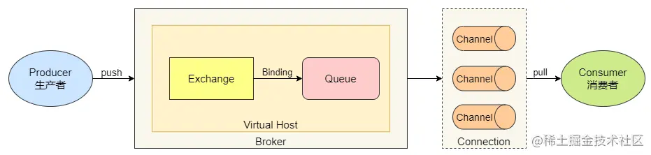

| title              | tags                     | background                                                   | auther | isSlow |
| ------------------ | ------------------------ | ------------------------------------------------------------ | ------ | ------ |
| RabbitMQ的最佳实践 | 消息队列/RabbitMQ/Spring | 最近在项目开发中用到了RabbitMQ，其中涉及到的知识点还是比较多的，想通过这篇文章对RabbitMQ开发中涉及到的点进行一个梳理，方便后续工作中借鉴和扩展。 | depers | true   |

# 如何保证消息的可靠性投递



上面这幅图是RabbitMQ中消息流转的指向图，从图中我们可以看到一个消息从生产到被消费主要经历了以下三步：

1. 生产者发送消息到Broker的Exchange
2. 接着，Broker中消息根据绑定规则由Exchange传递给Queue
3. 最后，Broker和消费者建立连接后，将消息推送给消费者Consumer进行消费

一条消息完整的走完上面三步，我们才认为这条消息是被可靠投递了。这三步中哪个环节出现问题才会导致消息的丢失呢？消息可能丢失的场景主要有以下四个地方：

1. **生产者将消息发送到 RabbitMQ Server 异常**：可能因为网络问题造成 RabbitMQ 服务端无法收到消息，造成生产者发送消息丢失场景。
2. **RabbitMQ Server 中消息在****交换机****中无法路由到指定队列**：可能由于代码层面或配置层面错误导致消息路由到指定队列失败，造成生产者发送消息丢失场景。
3. **RabbitMQ Server 中存储的消息丢失**：可能因为 RabbitMQ Server 宕机导致消息未完全持久化或队列丢失导致消息丢失等持久化问题，造成 RabbitMQ Server 存储的消息丢失场景。
4. **消费者消费消息异常**：可能在消费者接收到消息后，还没来得及消费消息，消费者宕机或故障等问题，造成消费者无法消费消息导致消息丢失的场景。

按照上述描述的四个场景，让我们一起来看看如何避免上述情况的发生，从而保证消息的可靠性投递，让我们逐个对其进行攻破。

## 1. 如何保证生产者将消息百分百投递给**RabbitMQ Server**

在这个环节，为了保证消息能够百分百投递到RabbitMQ Server，主要有两种方法：

### 事务机制

1. 配置类中配置事务管理器
2. 配置RabbitTemplate时开启事务实现事务机制
3. 在业务代码中使用添加事务注解

通过上面的配置即可实现事务机制，执行流程为：在生产者发送消息之前，开启事务，而后发送消息，如果消息发送至 RabbitMQ Server 失败后，进行事务回滚，重新发送。如果 RabbitMQ Server 接收到消息，则提交事务。

可以发现事务机制其实是**同步操作**，存在阻塞生产者的情况直到 RabbitMQ Server 应答，这样其实会很大程度上**降低发送消息的性能**，所以**一般不会使用事务机制来保证生产者的消息可靠性**，而是使用发送方确认机制。

这块内容的具体代码演示可以参考depers/rabbitmq-spring-reliable-delivery中transaction包下的内容。

### confirm机制

1. 首先需要在application.yml添加配置：

   ```yml
    spring:
      rabbitmq:
        publisher-confirm-type: correlated  # 开启发送方确认机制
   ```

2. 在RabbitTemplate中设置异步确认的回调逻辑

   从日志输出中我们可以看到，http请求、生产者、broker的异步回调和消费者分别是4个线程在执行逻辑：

   上面我们提到采用事务来保证生产者发送消息到broker这段链路的可靠性，是同步的，所以性能一般。而采用confirm机制后，确保了消息从生产者可以成功送达RabbitMQ服务器。当生产者发送消息到RabbitMQ后，如果服务器成功接收消息，它会发送一个确认响应给生产者。这样，生产者就知道消息已经安全到达，就会执行确认的回调方法。**在项目的实际开发中推荐使用confirm机制**。

## 2. 如何在Broker中保证消息能够从交换机投递到队列

 为了保证将消息从交换机顺利地投递到队列中，RabbitMQ提供了mandatory机制，用于控制一个消息到达交换机器时，**交换器****根据自身类型和路由键找不到一个符合条件的队列**，若该参数设置为`true`就将该消息返回给生产者，如果为`false`，就将消息丢弃。我们来看具体代码：

1. 先看配置：

    ```yml
    spring:
        rabbitmq:
            # 开启消息返回
            publisher-returns: true
            template:
                # 消息投递失败返回客户端，该参数与publisher-returns同时配合使用
                mandatory: true
    ```

2. 设置RabbitTemplate的`setReturnCallback()`方法设置路由失败后的回调方法：

    使用建议：**消息发送时没有必要设置mandotory**，因为Spring Boot和RabbitMQ的集成后，我发现即便是exchage找不到对应的queue后，生产端不仅在`rabbitTemplate`的`ReturnsCallback`中做了返回，而且还在`ConfirmCallback`中也做了`ack`的确认，两个地方同时做了返回，所以我们并不能区分到底成功与否，所以这里其实作用不大，这就需要我们在项目启动的时候做好`exchange`、`queue`和`binding`的创建。

## 3. 如何保证消息在 RabbitMQ Server 中不丢失

 对于消息在Broker的持久化主要有三个要点：

1. 交换机持久化
    1.   在声明交换机时将durable置为`true`实现。
    2.   丢失的信息：保存交换机元数据不会丢失，对于一个长期使用的交换机建议设置为true。
2. 队列持久化
    1.   在声明队列时将durable置为`true`实现。
    2.   丢失的信息：保存队列的元数据和存储在队列中的消息。
    3.   值得注意的是队列的持久化并不能保证消息的持久化。
3. 消息持久化
   
    在通过RabbitTemplate发送消息时，在`convertAndSend()`方法参数`MessagePostProcessor`中设置消息的持久化即可，代码如下：

通过确保消息、交换机、队列的持久化操作可以保证消息的在 RabbitMQ Server 中不丢失，从而保证可靠性。将所有消息设置持久化，需要将消息写入磁盘，会降低吞吐量。对于可靠性不高的消息，可以不做持久化。其实除了持久化之外还需要保证 RabbitMQ 的高可用性，否则 MQ 都宕机或磁盘受损都无法确保消息的可靠性，关键业务队列要设置为镜像队列

## 4. 如何保证消费者消费的消息不丢失

首先我们来看下消息消费的关键配置

# 参考项目

- depers/rabbitmq-spring-reliable-delivery

# 参考文章

* [如何保证 RabbitMQ 的消息可靠性](https://juejin.cn/post/7228864364744507450)
* [为什么使用消息队列？引入MQ会为我们带来哪些优势？](https://juejin.cn/post/6966041461863219236)
* [RabbitMQ 可靠性、重复消费、顺序性、消息积压解决方案](https://juejin.cn/post/6977981645475282958)
* [一篇文搞定消息队列选型](https://mp.weixin.qq.com/s/hn6VWEmuTiDvxHQ9EmbjlA)
* [消息队列知识点汇总](http://www.bravedawn.cn/details.html?aid=8495)