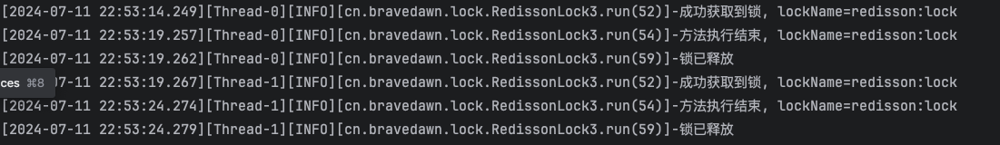
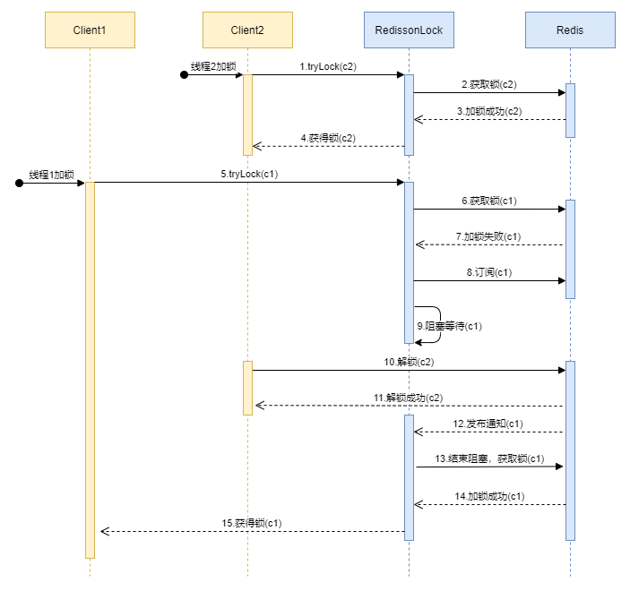
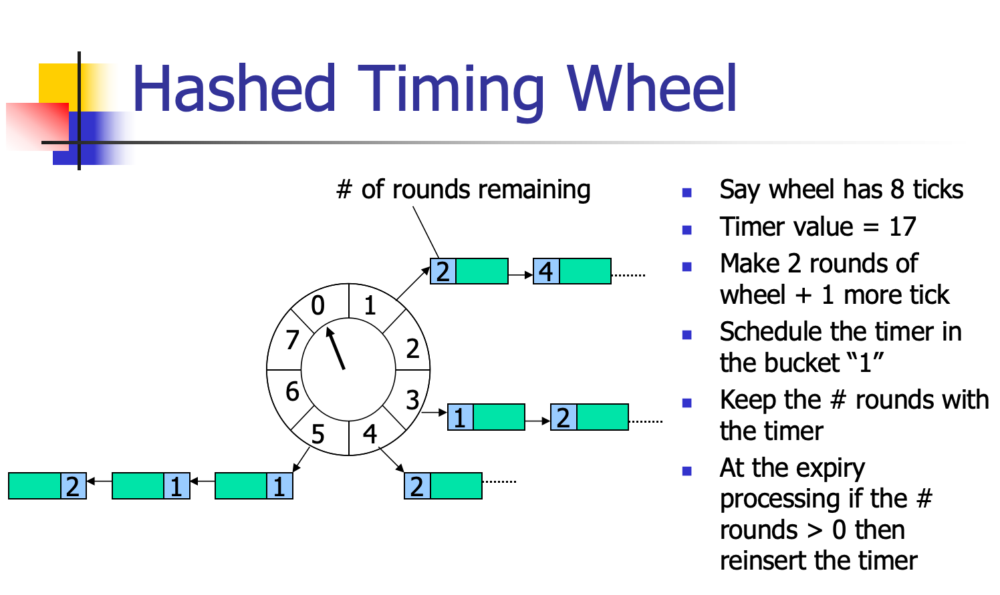

| title                      | tags                    | background                                                   | auther | isSlow |
| -------------------------- | ----------------------- | ------------------------------------------------------------ | ------ | ------ |
| Redisson看门狗的原理与实践 | 分布式锁/Redisson/Redis | 今天看到一篇博客，博客上讲了关于使用Redisson分布式锁的一些技巧，这里我发现了一个在日常开发中一直没有解决的问题，那就是分布式锁的有效期该如何设置，之前我们都是测试这个方法大概有多长时间，然后根据这个时间再尽量将这个分布式锁的有效时间设置长一些，生产上好像也没出啥问题，其实这样设置是有问题的。 | depers | true   |

# 三个使用锁的实验

## 实验一：如果不设置锁的有效时间且不释放锁会怎么样

这里我们写一段程序验证下上面的这个问题，下面是我的代码：

```Java
@Slf4j
public class RedissonLock {

    private static RedissonClient redissonClient;
    private static final String LOCK_NAME = "redisson:lock";

    static {
        Config config = new Config();
        config.setCodec(new JsonJacksonCodec());
        config.useSingleServer().setAddress("redis://127.0.0.1:6379");
        redissonClient = Redisson.create(config);
    }


    public static void main(String[] args) throws InterruptedException {
        // 在没有释放锁的情况下，测试看门狗
        log.info("启动异步线程");
        Runnable watchDog = testLockWatchDog();
        Thread t = new Thread(watchDog);
        t.start();
        log.info("异步线程执行结束");
        
        // 因为redisson的看门狗线程还在执行，程序并未退出
    }


    private static Runnable testLockWatchDog() throws InterruptedException {
        return new Runnable() {
            @Override
            public void run() {
                RLock lock = redissonClient.getLock(LOCK_NAME);
                boolean res = lock.tryLock();
                if (res) {
                    try {
                        log.info("成功获取到锁, lockName={}", lock.getName());
                        Thread.sleep(40000L);
                        log.info("方法执行结束, lockName={}", lock.getName());
                    } catch (InterruptedException e) {
                        e.printStackTrace();
                    }
                }
            }
        };
    }
}
```

在上面这段代码中，在`testLockWatchDog()`方法中，新建了一个线程申请了`redisson:lock`，接着线程睡眠40s（假设在执行逻辑），**这里比较重要的是我即没有设置有效时间也没有显式的释放锁，所以得到的效果就是看门狗线程会不断的给这个锁进行延时，按照默认的配置，看门狗每次延时30s，每10s进行一次延时操作，锁在Redis中一直存在，后续的线程就无法再获取到这个锁。所以在开发过程中一定要手动的释放锁，否则会出生产问题。**样例代码如下：

```Java
// 这里第一个参数等待时间，第二个参数时间单位
boolean res = lock.tryLock(100, TimeUnit.MILLISECONDS);
if (res) {
   try {
     ...
   } finally {
       lock.unlock();
   }
}
```

## 实验二：设置锁的有效时间短于被锁逻辑的执行时间

下面我来演示另一种情况，我按照上面的模板去加锁释放锁，但是这里我加了一个锁的有效时间，而且这个锁的有效时间短于加锁逻辑的执行时间，这里让我们一起看看Redisson会怎么处理，代码如下：

```Java
@Slf4j
public class RedissonLock2 {

    private static RedissonClient redissonClient;
    private static final String LOCK_NAME = "redisson:lock";

    static {
        Config config = new Config();
        config.setCodec(new JsonJacksonCodec());
        config.useSingleServer().setAddress("redis://127.0.0.1:6379");
        redissonClient = Redisson.create(config);
    }


    public static void main(String[] args) throws InterruptedException {
        Runnable watchDog = testLockWatchDog();

        // 启动两个线程
        new Thread(watchDog).start();
        new Thread(watchDog).start();
    }


    private static Runnable testLockWatchDog() throws InterruptedException {
        return new Runnable() {
            @Override
            public void run() {
                RLock lock = redissonClient.getLock(LOCK_NAME);
                boolean res = false;
                try {
                    res = lock.tryLock(10000, 3000, TimeUnit.MILLISECONDS);
                    if (res) {
                        try {
                            log.info("成功获取到锁, lockName={}", lock.getName());
                            Thread.sleep(5000L);
                            log.info("方法执行结束, lockName={}", lock.getName());
                        } catch (InterruptedException e) {
                            e.printStackTrace();
                        } finally {
                            lock.unlock();
                            log.info("锁已释放");
                        }
                    } else {
                        log.info("获取锁失败");
                    }
                } catch (InterruptedException e) {
                    throw new RuntimeException(e);
                }
            }

        };
    }
}
```

从上面可以看到，我们使用的加锁方法是`boolean tryLock(long waitTime, long leaseTime, TimeUnit unit) throws InterruptedException;`，第二个参数的含义是锁的有效时间，这里锁的有效时间我们设置为了3s，但是被锁逻辑的执行时间是5s，也就是说，我们的加锁代码还没有执行完，锁就被释放了。


从控制台的输出我们可以看到：

* 线程1在17:02:30获取到了锁：持有锁的时间是3s
* 线程2在17:03:33获取到了锁：持有锁的时间是3s
* 线程1在17:02:35执行完去释放锁，报错：程序执行时间是5s
* 线程2在17:02:38执行完去释放锁，报错：程序执行时间是5s

接着我们看下这个报错：这里我们跟一下源码：

1. 第一步先看释放锁的主逻辑，这个方法是：`org.redisson.RedissonBaseLock#unlockAsync(long)`：

    ```Java
    @Override
    public RFuture<Void> unlockAsync(long threadId) {
        // 执行lua脚本
        RFuture<Boolean> future = unlockInnerAsync(threadId);
    
        CompletionStage<Void> f = future.handle((opStatus, e) -> {
            cancelExpirationRenewal(threadId);
    
            if (e != null) {
                throw new CompletionException(e);
            }
            if (opStatus == null) {
                IllegalMonitorStateException cause = new IllegalMonitorStateException("attempt to unlock lock, not locked by current thread by node id: "
                        + id + " thread-id: " + threadId);
                throw new CompletionException(cause);
            }
    
            return null;
        });
    
        return new CompletableFutureWrapper<>(f);
    }
    ```

2. 接着我们看下`unlockInnerAsync()`方法的实现，具体的实现是：`org.redisson.RedissonLock#unlockInnerAsync`：

    ```Java
    protected RFuture<Boolean> unlockInnerAsync(long threadId) {
        return evalWriteAsync(getRawName(), LongCodec.INSTANCE, RedisCommands.EVAL_BOOLEAN,
              "if (redis.call('hexists', KEYS[1], ARGV[3]) == 0) then " +
                        "return nil;" +
                    "end; " +
                    "local counter = redis.call('hincrby', KEYS[1], ARGV[3], -1); " +
                    "if (counter > 0) then " +
                        "redis.call('pexpire', KEYS[1], ARGV[2]); " +
                        "return 0; " +
                    "else " +
                        "redis.call('del', KEYS[1]); " +
                        "redis.call('publish', KEYS[2], ARGV[1]); " +
                        "return 1; " +
                    "end; " +
                    "return nil;",
                Arrays.asList(getRawName(), getChannelName()), LockPubSub.UNLOCK_MESSAGE, internalLockLeaseTime, getLockName(threadId));
    }
    ```

    * 传入的参数`threadId`，线程id

    * `getRawName()`：锁的名称，也就是`redisson:lock`

    * `LongCodec.INSTANCE`：Long类型的编解码器

    * `RedisCommands.EVAL_BOOLEAN`：脚本执行的结果装换器、

    * 脚本内容解析

        * 变量
            * `KEYS[1]`：`getRawName()`，锁的名称，，也就是`redisson:lock`，也就是Hash结构的key
            * `KEYS[2]`：`getChannelName()`，连接的名称
            * `ARGV[1]`：`LockPubSub.UNLOCK_MESSAGE`，Long类型的变量，值为0
            * `ARGV[2]`：`internalLockLeaseTime`，锁的有效时间，
            * `ARGV[3]`：`getLockName(threadId)`，锁在redis Hash结构中的field字段，例如：`56f3b6f6-74ae-4990-9628-95d505cc1d06:53`，其实就是UUID+线程ID
        * 语句解析：
            * `'hexists', KEYS[1], ARGV[3]) == 0`：在redis中这个key的field存在吗，如果不存在，则返回nil
            * `'hincrby', KEYS[1], ARGV[3], -1`：将这个key的field的值减一
        * 算法描述
            * 先判断这个锁在redis中是否存在，如果不存在直接返回`nil`
            * 接着将锁的值减一（值得注意的是在获取到锁之后，这个锁的值是1）
            * 如果执行成功了，就给锁延期，而且返回0，最后返回false
            * 如果执行失败了，就删除这个锁的key，并向频道KEYS[2]发布消息，最后返回1，最后返回true

    * 这段程序在目前这种情况的的执行结果

        目前Redis中存储这两个相同key的锁，按照上面代码的执行”先判断这个锁在redis中是否存在，如果不存在直接返回nil“，也就是说这个锁已经过期了。

3. 后续的代码这里就不再跟踪了，这里说下结论，**如果设置的锁的有效时间小于被锁包含的逻辑的执行时间，那么设置锁的意义就不存在了。因为一旦锁过期，其他的线程就会立马获取到锁，从而导致数据的一致性遭到破坏。**

## 实验三：完全依赖看门狗来对锁进行延时，正确的获取和关闭锁

通过上面的两个实验，我们发现要想正确的使用Redisson提供的分布式锁功能，一是要正确的获取和释放锁，二是不要设置锁的有效时间，应该依赖看门狗机制帮我们去锁的延时。

为了完善实验，这里我们也写一段程序来演示这个结论。

```Java
@Slf4j
public class RedissonLock3 {

    private static RedissonClient redissonClient;
    private static final String LOCK_NAME = "redisson:lock";

    static {
        Config config = new Config();
        config.setCodec(new JsonJacksonCodec());
        config.useSingleServer().setAddress("redis://127.0.0.1:6379");
        redissonClient = Redisson.create(config);
    }


    public static void main(String[] args) throws InterruptedException {
        Runnable watchDog = testLockWatchDog();

        new Thread(watchDog).start();
        new Thread(watchDog).start();
    }


    private static Runnable testLockWatchDog() throws InterruptedException {
        return new Runnable() {
            @Override
            public void run() {
                RLock lock = redissonClient.getLock(LOCK_NAME);
                boolean res = false;
                try {
                    // 这里设置了等待时间，也可以不设置
                    res = lock.tryLock(6, TimeUnit.SECONDS);
                    if (res) {
                        try {
                            log.info("成功获取到锁, lockName={}", lock.getName());
                            Thread.sleep(5000L);
                            log.info("方法执行结束, lockName={}", lock.getName());
                        } catch (InterruptedException e) {
                            e.printStackTrace();
                        } finally {
                            lock.unlock();
                            log.info("锁已释放");
                        }
                    } else {
                        log.info("获取锁失败");
                    }
                } catch (InterruptedException e) {
                    e.printStackTrace();
                }
            }

        };
    }
}
```

看下控制台的输出：



# Redisson分布式锁的源码解析

针对这块内容，对应到我们使用锁的几个步骤：第一个是获取锁，第二个是释放锁，第三个是看门狗。下面我们通过五个步骤分析代码逻辑和大家讨论下这三个点：

## 第一步：尝试获取锁

```Java
@Override
public boolean tryLock(long waitTime, long leaseTime, TimeUnit unit) throws InterruptedException {
    long time = unit.toMillis(waitTime);
    long current = System.currentTimeMillis();
    long threadId = Thread.currentThread().getId();
    Long ttl = tryAcquire(waitTime, leaseTime, unit, threadId);
    // 加锁成功
    if (ttl == null) {
        return true;
    }

    // 判断是否超时，如果超时则返回加锁失败
    time -= System.currentTimeMillis() - current;
    if (time <= 0) {
        acquireFailed(waitTime, unit, threadId);
        return false;
    }

    current = System.currentTimeMillis();
    // 订阅加锁事件
    CompletableFuture<RedissonLockEntry> subscribeFuture = subscribe(threadId);
    try {
        // 订阅等待
        subscribeFuture.get(time, TimeUnit.MILLISECONDS);
    } catch (TimeoutException e) {
        if (!subscribeFuture.completeExceptionally(new RedisTimeoutException(
                "Unable to acquire subscription lock after " + time + "ms. " +
                        "Try to increase 'subscriptionsPerConnection' and/or 'subscriptionConnectionPoolSize' parameters."))) {
            subscribeFuture.whenComplete((res, ex) -> {
                if (ex == null) {
                    unsubscribe(res, threadId);
                }
            });
        }
        acquireFailed(waitTime, unit, threadId);
        return false;
    } catch (ExecutionException e) {
        acquireFailed(waitTime, unit, threadId);
        return false;
    }

    try {
        // 计算是否超时
        time -= System.currentTimeMillis() - current;
        if (time <= 0) {
            acquireFailed(waitTime, unit, threadId);
            return false;
        }

        // 阻塞线程进行等待
        while (true) {
            long currentTime = System.currentTimeMillis();
            // 再次尝试获取锁
            ttl = tryAcquire(waitTime, leaseTime, unit, threadId);
            // 获取锁成功
            if (ttl == null) {
                return true;
            }

            time -= System.currentTimeMillis() - currentTime;
            if (time <= 0) {
                acquireFailed(waitTime, unit, threadId);
                return false;
            }

            // 此时上一个锁的有效时间还是大于0且小于等待时间，
            currentTime = System.currentTimeMillis();
            if (ttl >= 0 && ttl < time) {
                // 等待ttl时间获取订阅的消息
                commandExecutor.getNow(subscribeFuture).getLatch().tryAcquire(ttl, TimeUnit.MILLISECONDS);
            } else {
                // 等待time时间获取订阅的消息
                commandExecutor.getNow(subscribeFuture).getLatch().tryAcquire(time, TimeUnit.MILLISECONDS);
            }

            // 计算是否超时
            time -= System.currentTimeMillis() - currentTime;
            if (time <= 0) {
                acquireFailed(waitTime, unit, threadId);
                return false;
            }
        }
    } finally {
        // 解除订阅
        unsubscribe(commandExecutor.getNow(subscribeFuture), threadId);
    }
}
```

这里关键的三部分代码：

1. 第一次尝试获取锁
2. 订阅锁消息
3. 阻塞并等待获取订阅的消息，再次尝试获取锁

这里我用网上找的一张图来串下这个流程



## 第二步：获取锁

```Java
private <T> RFuture<Long> tryAcquireAsync(long waitTime, long leaseTime, TimeUnit unit, long threadId) {
    RFuture<Long> ttlRemainingFuture;
    // 判断锁是否有有效时间
    if (leaseTime > 0) {
        // 按有效时间进行加锁
        ttlRemainingFuture = tryLockInnerAsync(waitTime, leaseTime, unit, threadId, RedisCommands.EVAL_LONG);
    } else {
        // 按看门狗时间进行加锁，默认看门狗时间是30秒
        ttlRemainingFuture = tryLockInnerAsync(waitTime, internalLockLeaseTime,
                                               TimeUnit.MILLISECONDS, threadId, RedisCommands.EVAL_LONG);
    }
    CompletionStage<Long> f = ttlRemainingFuture.thenApply(ttlRemaining -> {
        // 返回为null表示加锁成功
        if (ttlRemaining == null) {
            // 有效时间存在
            if (leaseTime > 0) {
                internalLockLeaseTime = unit.toMillis(leaseTime);
            } else {
                // 如果没有有效时间，启动看门狗，定时给锁续期，防止业务逻辑未执行完成锁就过期了
                scheduleExpirationRenewal(threadId);
            }
        }
        return ttlRemaining;
    });
    return new CompletableFutureWrapper<>(f);
}
```

首先，我们来看下获取锁的逻辑：

```Java
<T> RFuture<T> tryLockInnerAsync(long waitTime, long leaseTime, TimeUnit unit, long threadId, RedisStrictCommand<T> command) {
    return evalWriteAsync(getRawName(), LongCodec.INSTANCE, command,
                          "if ((redis.call('exists', KEYS[1]) == 0) " +
                          "or (redis.call('hexists', KEYS[1], ARGV[2]) == 1)) then " +
                          "redis.call('hincrby', KEYS[1], ARGV[2], 1); " +
                          "redis.call('pexpire', KEYS[1], ARGV[1]); " +
                          "return nil; " +
                          "end; " +
                          "return redis.call('pttl', KEYS[1]);",
                          Collections.singletonList(getRawName()), unit.toMillis(leaseTime), getLockName(threadId));
}
```

脚本变量解析：

* `KEYS[1]`：`getRawName()`，锁的名称，，也就是`redisson:lock`，也就是Hash结构的key
* `ARGV[1]`：锁的有效时间
* `ARGV[2]`：`getLockName(threadId)`，锁在redis Hash结构中的field字段，例如：`56f3b6f6-74ae-4990-9628-95d505cc1d06:53`，其实就是UUID+线程ID

从上面的代码中，我们可以看到几个关键的点：

1. **在锁不存在的情况下**：如果**锁的key不存在**或者**锁的key+field的hash结构的value是1**的话，此时将key+field的值增加1并且设置有效时间，返回null。
2. **在锁存在的情况下**：返回锁的剩余有效时间。

## 第三步：订阅

这里我们来看之前在”第一步：尝试获取锁“中的这行代码：

```Java
CompletableFuture<RedissonLockEntry> subscribeFuture = subscribe(threadId);
```

我们走到具体的逻辑方法中看下做了些什么，这个方法在`org.redisson.pubsub.PublishSubscribe#subscribe`：

```java
public CompletableFuture<E> subscribe(String entryName, String channelName) {
    // 获取信号量，这个信号量是Redisson自己封装的，默认只有一个许可
    AsyncSemaphore semaphore = service.getSemaphore(new ChannelName(channelName));
    // 创建执行订阅的任务
    CompletableFuture<E> newPromise = new CompletableFuture<>();

    // 信号量获取一个许可后的操作
    semaphore.acquire().thenAccept(c -> {
        // 任务执行完之后，释放信号量许可
        if (newPromise.isDone()) {
            semaphore.release();
            return;
        }

        // 这里的泛型E的实际类型是org.redisson.RedissonLockEntry
        // 根据entryName获取缓存的entry
        E entry = entries.get(entryName);
        // 第一次获取锁的时候不会走下面
        if (entry != null) {
            entry.acquire();
            semaphore.release();
            entry.getPromise().whenComplete((r, e) -> {
                if (e != null) {
                    newPromise.completeExceptionally(e);
                    return;
                }
                newPromise.complete(r);
            });
            return;
        }

        // 第一次获取锁会创建
        E value = createEntry(newPromise);
        value.acquire();

        // 将RedissionLockEntry放入entries数组中
        E oldValue = entries.putIfAbsent(entryName, value);
        if (oldValue != null) {
            oldValue.acquire();
            semaphore.release();
            oldValue.getPromise().whenComplete((r, e) -> {
                if (e != null) {
                    newPromise.completeExceptionally(e);
                    return;
                }
                newPromise.complete(r);
            });
            return;
        }

        // 创建监听器，监听发布的消息
        RedisPubSubListener<Object> listener = createListener(channelName, value);
        
        // 订阅消息
        CompletableFuture<PubSubConnectionEntry> s = service.subscribeNoTimeout(LongCodec.INSTANCE, channelName, semaphore, listener);
        // newPromise的get()方法执行超时会触发这个方法
        newPromise.whenComplete((r, e) -> {
            if (e != null) {
                s.completeExceptionally(e);
            }
        });
        // 订阅任务执行完成之后
        s.whenComplete((r, e) -> {
            if (e != null) {
                entries.remove(entryName);
                value.getPromise().completeExceptionally(e);
                return;
            }
            // 如果订阅成功，这里结束任务
            value.getPromise().complete(value);
        });

    });

    return newPromise;
}
```

* 方法的入参

    * `entryName`：其实就是上面锁的`field`中的UUID+锁名

    * `channelName`：消息订阅频道的名称，例如这样：`redisson_lock__channel:{redisson:lock}`

* 关键的局部变量

    * `listener`
        * 类型：`org.redisson.client.RedisPubSubListener`

    * `semaphoore`
        * 类型：`org.redisson.misc.AsyncSemaphore`
    * `newPromise`
        * 类型：`java.util.concurrent.CompletableFuture`
        * 作用：表示该方法`subscribe(String entryName, String channelName)`的执行情况
    * `entry/value`
        * 类型：`org.redisson.RedissonLockEntry`
    * `s`
        * 类型：`CompletableFuture<PubSubConnectionEntry>`
        * 作用：表示实际订阅操作任务的执行情况，也就是`service.subscribeNoTimeout(LongCodec.INSTANCE, channelName, semaphore, listener)`方法的执行情况

上面这块订阅的代码里面有两个很关键的变量`newPromise`和`s`，**一个表示当前任务的执行情况，一个表示实际订阅任务的执行情况，通过两个方法的执行情况来互相控制对方的任务完成情况，是正常结束还是异常结束**。其实这两个方法都是同步执行的。

接下来我们继续回到`org.redisson.RedissonLock#tryLock(long, long, java.util.concurrent.TimeUnit)`方法中，来看下这段代码：

```Java
if (ttl >= 0 && ttl < time) {
    commandExecutor.getNow(subscribeFuture).getLatch().tryAcquire(ttl, TimeUnit.MILLISECONDS);
} else {
    commandExecutor.getNow(subscribeFuture).getLatch().tryAcquire(time, TimeUnit.MILLISECONDS);
}
```

这段代码是级联调用，我们一步一步来分析下：

* `subscribeFuture`：就是上面`subscribe(String entryName, String channelName)`返回的结果

* `commandExecutor.getNow(subscribeFuture)`：就是`CompletableFuture`的`result`，也就是`RedissonLockEntry`

* `getLatch()`：获得的是`Semaphore`信号量对象，这个是JDK内置的对象。

    我们走到`RedissonLockEntry`的源码中我们可以看到，这个变量的初始化代码如下：

    ```Java
    this.latch = new Semaphore(0);
    ```

    初始的的许可是0，需要等待释放许可。从上面的代码中可以看到获取信号量许可分别用了ttl和time两个不同的等待时间，如果上一锁的有效时间小于当前锁的等待时间等待ttl，否则等待time。

这里要想获取到信号量的许可就得有地方释放信号量的许可，这个逻辑的入口在`org.redisson.pubsub.PublishSubscribe#createListener`中，接着会走到这段逻辑`org.redisson.pubsub.LockPubSub#onMessage`：

```Java
@Override
protected void onMessage(RedissonLockEntry value, Long message) {
    // 当收到解锁的消息的时候，这里就会释放信号量的许可
    if (message.equals(UNLOCK_MESSAGE)) {
        Runnable runnableToExecute = value.getListeners().poll();
        if (runnableToExecute != null) {
            runnableToExecute.run();
        }

        // 这里释放的许可就会唤醒getLatch().tryAcquire()方法
        value.getLatch().release();
    } else if (message.equals(READ_UNLOCK_MESSAGE)) {
        while (true) {
            Runnable runnableToExecute = value.getListeners().poll();
            if (runnableToExecute == null) {
                break;
            }
            runnableToExecute.run();
        }

        value.getLatch().release(value.getLatch().getQueueLength());
    }
}
```

这个订阅的消息是何时发布的呢？接下来我们来看解锁。

## 第四步：解锁

解锁的这段代码之前其实就已经说过了，这里我们再详细的看下。解锁的入口方法，位于`org.redisson.RedissonBaseLock#unlockAsync(long)`：

```Java
@Override
public RFuture<Void> unlockAsync(long threadId) {
    // 执行解锁的lua脚本
    RFuture<Boolean> future = unlockInnerAsync(threadId);

    CompletionStage<Void> f = future.handle((opStatus, e) -> {
        // 取消看门狗进行锁延期的操作
        cancelExpirationRenewal(threadId);

        if (e != null) {
            throw new CompletionException(e);
        }
        // 如果锁已经失效，则报错。也就是说释放锁的时候锁应该是没有过期的，否则就会报这个错
        if (opStatus == null) {
            IllegalMonitorStateException cause = new IllegalMonitorStateException("attempt to unlock lock, not locked by current thread by node id: " + id + " thread-id: " + threadId);
            throw new CompletionException(cause);
        }

        return null;
    });

    return new CompletableFutureWrapper<>(f);
}
```

接着我们来看`org.redisson.RedissonBaseLock#unlockInnerAsync`方法：

```Java
protected RFuture<Boolean> unlockInnerAsync(long threadId) {
    return evalWriteAsync(getRawName(), LongCodec.INSTANCE, RedisCommands.EVAL_BOOLEAN,
                          "if (redis.call('hexists', KEYS[1], ARGV[3]) == 0) then " +
                          "return nil;" +
                          "end; " +
                          "local counter = redis.call('hincrby', KEYS[1], ARGV[3], -1); " +
                          "if (counter > 0) then " +
                          "redis.call('pexpire', KEYS[1], ARGV[2]); " +
                          "return 0; " +
                          "else " +
                          "redis.call('del', KEYS[1]); " +
                          "redis.call('publish', KEYS[2], ARGV[1]); " +
                          "return 1; " +
                          "end; " +
                          "return nil;",
                          Arrays.asList(getRawName(), getChannelName()), LockPubSub.UNLOCK_MESSAGE, internalLockLeaseTime, getLockName(threadId));
}
```

脚本变量解析：

* `getRawName()`：也就是`KEYS[1]`，锁的名称，，也就是`redisson:lock`，也就是Hash结构的key
* `getChannelName()`：也就是`KEYS[2]`，消息订阅频道的名称，例如这样：`redisson_lock__channel:{redisson:lock}`
* `LockPubSub.UNLOCK_MESSAGE`：也就是`ARGV[1]`，是一个常量，值为`0L`，代表解锁
* `internalLockLeaseTime`：也就是`ARGV[2]`，内部锁的有效时间，由于我没有显示的设置锁的有效时间，默认是看门狗的时间，为30s
* `getLockName(threadId)`：也就是`ARGV[3]`，锁在redis Hash结构中的field字段，例如：`56f3b6f6-74ae-4990-9628-95d505cc1d06:53`，其实就是UUID+线程ID

上面这段脚本的大体思路是：

1. 锁如果不存在，就返回nil。
2. 如果锁存在就将锁的value值减一，减一后的值如果大于0，就继续给锁延期30s并返回0。
3. 减一后的值如果小于0或等于0，则删除这个key，并且发布消息到锁的频道中，告知订阅消息的人锁被释放了。这里就会触发在【解锁】那节说到的`onMessage()`方法了。

## 第五步：看门狗

在上面逻辑中我们讨论的获取锁到释放锁的整个流程，其中在**获取锁**和**释放锁**这两步中都有看门狗的身影。这里我们继续深入，首先我们来看获取锁时看门狗的逻辑，方法入口在`org.redisson.RedissonLock#tryAcquireAsync()`方法的`scheduleExpirationRenewal(threadId)`中，具体逻辑如下：

```Java
protected void scheduleExpirationRenewal(long threadId) {
    // 构造延时对象
    ExpirationEntry entry = new ExpirationEntry();
    // 将线程id加到这个锁的延迟对象的threadIds Map中，同一个线程可能会多次获取相同的锁
    entry.addThreadId(threadId);
    ExpirationEntry oldEntry = EXPIRATION_RENEWAL_MAP.putIfAbsent(getEntryName(), entry);
    if (oldEntry != null) {
        oldEntry.addThreadId(threadId);
    } else {
        try {
            renewExpiration();
        } finally {
            if (Thread.currentThread().isInterrupted()) {
                cancelExpirationRenewal(threadId, null);
            }
        }
    }
}
```

关键参数：

* `getEntryName`：就是锁的UUID+锁名，例如这样：`627649aa-47ea-4f83-80a1-93a98b7a01e8:redisson:lock`

接着往里走，就是方法`org.redisson.RedissonBaseLock#renewExpiration`：

```Java
private void renewExpiration() {
    ExpirationEntry ee = EXPIRATION_RENEWAL_MAP.get(getEntryName());
    if (ee == null) {
        return;
    }

    // 创建延时任务，延时（internalLockLeaseTime / 3）秒执行一次
    // 这里的newTimeout()里面其实是用的Netty的HashedWheelTimer来做的
    Timeout task = commandExecutor.getConnectionManager().newTimeout(new TimerTask() {
        @Override
        public void run(Timeout timeout) throws Exception {
            ExpirationEntry ent = EXPIRATION_RENEWAL_MAP.get(getEntryName());
            if (ent == null) {
                return;
            }
            // 获取线程id
            Long threadId = ent.getFirstThreadId();
            if (threadId == null) {
                return;
            }

            // 对锁进行延时
            CompletionStage<Boolean> future = renewExpirationAsync(threadId);
            future.whenComplete((res, e) -> {
                if (e != null) {
                    log.error("Can't update lock {} expiration", getRawName(), e);
                    EXPIRATION_RENEWAL_MAP.remove(getEntryName());
                    return;
                }

            	// 如果延时成功，再次制定定时任务
                if (res) {
                    // reschedule itself
                    renewExpiration();
                } else {
                    // 延迟失败，取消看门狗延时
                    cancelExpirationRenewal(null);
                }
            });
        }
    }, internalLockLeaseTime / 3, TimeUnit.MILLISECONDS);

    ee.setTimeout(task);
}
```

看下延时的代码：

```Java
protected CompletionStage<Boolean> renewExpirationAsync(long threadId) {
    return evalWriteAsync(getRawName(), LongCodec.INSTANCE, RedisCommands.EVAL_BOOLEAN,
                          "if (redis.call('hexists', KEYS[1], ARGV[2]) == 1) then " +
                          "redis.call('pexpire', KEYS[1], ARGV[1]); " +
                          "return 1; " +
                          "end; " +
                          "return 0;",
                          Collections.singletonList(getRawName()),
                          internalLockLeaseTime, getLockName(threadId));
}
```

延时的代码很简单，延时成功返回`ture`，延时失败返回`false`。

上面说完代码逻辑，这里我们重点介绍下Netty中的`HashedWheelTimer`，是基于时间轮算法实现的一个定时任务工具，该算法主要思路就是将时间拆分成固定份数时间段的环形钟表盘，钟表上的每一格代表一段时间，也称为Tick，这个时间拆分的越小，任务触发的时间就越精确。并用一个链表报错在该格子上的到期任务，同时一个指针随着时间一格一格转动，并执行相应格子中的到期任务。任务通过取摸决定放入那个格子。如下图所示：



按照论文PPT的这张图为例：这里一个轮子包含8个格子（Tick), 每个tick是一秒钟。如果一个任务要在17秒后执行，那么它需要转2圈，最终加到Tick=1位置的链表中。在时钟转2圈到Tick=1的位置，开始执行这个位置指向的链表中的这个任务。

# 总结

由于在日常开发中，Redis作为外部缓存是大部分高性能程序的必备组件，相比于Zookeeper，通过Redis实现分布式锁就更为方便。由于在分布式环境中，基于CAP原理来考量，Redis只满足AP属性，即可用性和容错性，无法满足强一致性，但是其提供的高性能、原子性和易用性，对于大部分的业务场景都是最佳的选择。

最后，在使用Redis分布式锁的时候，**一要正确的获取锁和释放锁，二不要设置有效时间，依赖看门狗机制确保锁持有者的正常运行。**

# 参考文章

* [Redisson的看门狗机制](https://www.jianshu.com/p/1a7636b69e02)
* [HashedWheelTimer 使用及源码分析](https://javadoop.com/post/HashedWheelTimer)
* [SpringBoot定时任务 - Netty HashedWheelTimer方式](https://pdai.tech/md/spring/springboot/springboot-x-task-hashwheeltimer-timer.html)
* [HashedWheelTimer时间轮原理分析](https://albenw.github.io/posts/ec8df8c/)
* [Redisson源码解读-分布式锁](https://www.javaedit.com/archives/164)
* [Redisson 源码解析](https://juejin.cn/post/6901951315962757134)
* [源码解析之Redisson](https://nageoffer.com/sourcecode/redisson/#reentrantlock-%E9%87%8D%E5%85%A5%E9%94%81)
* [Redisson源码解读-分布式锁](https://www.javaedit.com/archives/164)
* [Redis进阶 - 消息传递：发布订阅模式详解](https://pdai.tech/md/db/nosql-redis/db-redis-x-pub-sub.html)