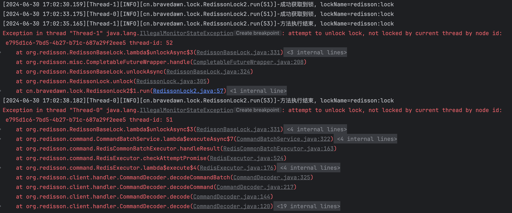

| title                       | tags                    | background                                                   | auther | isSlow |
| --------------------------- | ----------------------- | ------------------------------------------------------------ | ------ | ------ |
| Redission看门狗的原理与实践 | 分布式锁/Redisson/Redis | 今天在晚上看了一篇博客，博客上讲了关于使用Redisson分布式锁的一些技巧，这里我发现了一个在日常开发中一直没有解决的问题，那就是分布式锁的有效期该如何设置，之前我们都是测试这个方法大概有多长时间，然后根据这个时间再尽量将这个分布式锁的有效时间设置长一些，生产上好像也没出啥问题，其实这样设置是有问题的。 | depers | true   |

# 实验一：如果不设置锁的有效时间且不释放锁会怎么样

这里我们写一段程序验证下上面的这个问题，下面是我的代码：

```Java
@Slf4j
public class RedissonLock {

    private static RedissonClient redissonClient;
    private static final String LOCK_NAME = "redisson:lock";

    static {
        Config config = new Config();
        config.setCodec(new JsonJacksonCodec());
        config.useSingleServer().setAddress("redis://127.0.0.1:6379");
        redissonClient = Redisson.create(config);
    }


    public static void main(String[] args) throws InterruptedException {
        // 在没有释放锁的情况下，测试看门狗
        log.info("启动异步线程");
        Runnable watchDog = testLockWatchDog();
        Thread t = new Thread(watchDog);
        t.start();
        log.info("异步线程执行结束");
        
        // 因为redisson的看门狗线程还在执行，程序并未退出
    }


    private static Runnable testLockWatchDog() throws InterruptedException {
        return new Runnable() {
            @Override
            public void run() {
                RLock lock = redissonClient.getLock(LOCK_NAME);
                boolean res = lock.tryLock();
                if (res) {
                    try {
                        log.info("成功获取到锁, lockName={}", lock.getName());
                        Thread.sleep(40000L);
                        log.info("方法执行结束, lockName={}", lock.getName());
                    } catch (InterruptedException e) {
                        e.printStackTrace();
                    }
                }
            }
        };
    }
}
```

在上面这段代码中，在`testLockWatchDog()`方法中，新建了一个线程申请了`redisson:lock`，接着线程睡眠40s（假设在执行逻辑），**这里比较重要的是我即没有设置有效时间也没有显式的释放锁，所以得到的效果就是看门狗线程会不断的给这个锁进行延时，按照默认的配置，看门狗每次延时30s，每10s进行一次延时操作，所以在开发过程中一定要手动的释放锁，否则会出生产问题。**样例代码如下：

```Java
// 这里第一个参数等待时间，第二个参数时间单位
boolean res = lock.tryLock(100, TimeUnit.MILLISECONDS);
if (res) {
   try {
     ...
   } finally {
       lock.unlock();
   }
}
```

# 实验二：设置锁的有效时间短于被锁逻辑的执行时间

下面我来演示另一种情况，我按照上面的模板去加锁释放锁，但是这里我加了一个锁的有效时间，而且这个锁的有效时间短于加锁逻辑的执行时间，这里让我们一起看看Redisson会怎么处理，代码如下：

```Java
@Slf4j
public class RedissonLock2 {

    private static RedissonClient redissonClient;
    private static final String LOCK_NAME = "redisson:lock";

    static {
        Config config = new Config();
        config.setCodec(new JsonJacksonCodec());
        config.useSingleServer().setAddress("redis://127.0.0.1:6379");
        redissonClient = Redisson.create(config);
    }


    public static void main(String[] args) throws InterruptedException {
        Runnable watchDog = testLockWatchDog();

        // 启动两个线程
        new Thread(watchDog).start();
        new Thread(watchDog).start();
    }


    private static Runnable testLockWatchDog() throws InterruptedException {
        return new Runnable() {
            @Override
            public void run() {
                RLock lock = redissonClient.getLock(LOCK_NAME);
                boolean res = false;
                try {
                    res = lock.tryLock(10000, 3000, TimeUnit.MILLISECONDS);
                    if (res) {
                        try {
                            log.info("成功获取到锁, lockName={}", lock.getName());
                            Thread.sleep(5000L);
                            log.info("方法执行结束, lockName={}", lock.getName());
                        } catch (InterruptedException e) {
                            e.printStackTrace();
                        } finally {
                            lock.unlock();
                            log.info("锁已释放");
                        }
                    } else {
                        log.info("获取锁失败");
                    }
                } catch (InterruptedException e) {
                    throw new RuntimeException(e);
                }
            }

        };
    }
}
```

从上面可以看到，我们使用的加锁方法是`boolean tryLock(long waitTime, long leaseTime, TimeUnit unit) throws InterruptedException;`，第二个参数的含义是锁的有效时间，这里锁的有效时间我们设置为了3s，但是被锁逻辑的执行时间是5s，也就是说，我们的加锁代码还没有执行完，锁就被释放了。



从控制台的输出我们可以看到：

* 线程1在17:02:30获取到了锁：持有锁的时间是3s
* 线程2在17:03:33获取到了锁：持有锁的时间是3s
* 线程1在17:02:35执行完去释放锁，报错：程序执行时间是5s
* 线程2在17:02:38执行完去释放锁，报错：程序执行时间是5s

接着我们看下这个报错：这里我们跟一下源码：

1. 第一步先看释放锁的主逻辑，这个方法是：`org.redisson.RedissonBaseLock#unlockAsync(long)`：

    ```Java
    @Override
    public RFuture<Void> unlockAsync(long threadId) {
        // 执行lua脚本
        RFuture<Boolean> future = unlockInnerAsync(threadId);
    
        CompletionStage<Void> f = future.handle((opStatus, e) -> {
            cancelExpirationRenewal(threadId);
    
            if (e != null) {
                throw new CompletionException(e);
            }
            if (opStatus == null) {
                IllegalMonitorStateException cause = new IllegalMonitorStateException("attempt to unlock lock, not locked by current thread by node id: "
                        + id + " thread-id: " + threadId);
                throw new CompletionException(cause);
            }
    
            return null;
        });
    
        return new CompletableFutureWrapper<>(f);
    }
    ```

    

# 参考文章

* [Redisson的看门狗机制](https://www.jianshu.com/p/1a7636b69e02)

* [HashedWheelTimer 使用及源码分析](https://javadoop.com/post/HashedWheelTimer)
* [SpringBoot定时任务 - Netty HashedWheelTimer方式](https://pdai.tech/md/spring/springboot/springboot-x-task-hashwheeltimer-timer.html)
* [HashedWheelTimer时间轮原理分析](https://albenw.github.io/posts/ec8df8c/)