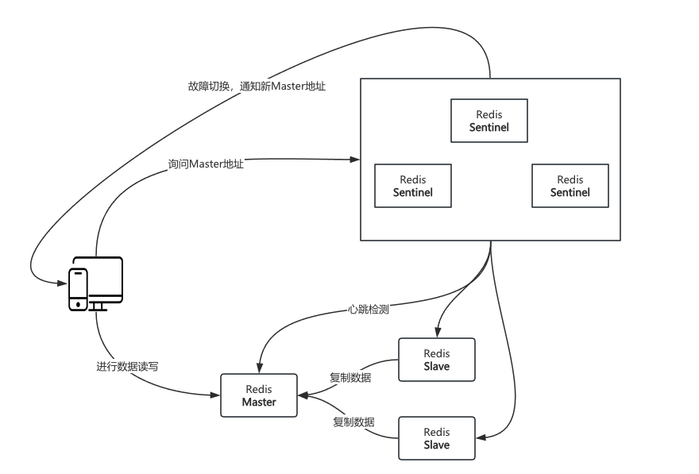

| title                            | tags            | background                                                   | auther | isSlow |
| -------------------------------- | --------------- | ------------------------------------------------------------ | ------ | ------ |
| 秒杀系统设计的要点（三）多级缓存 | Spring Boot/Web | 这篇文章是继”秒杀系统设计的要点（二）分布式扩展“的第三篇文章，这里主要讨论为了进一步提高服务的并发性能，通过在服务端设置多级缓存来减轻对数据库的压力，具体的解决方案都有哪些。 | depers | true   |

# Redis集中式缓存的架构

Redis的部署架构主要有以下四种，分别是单体、主从、哨兵和集群。

## 单体

单体架构就是应用缓存只依赖于一台Redis服务，如果这台服务出现问题，会对应用的正常服务造成很大的影响。所以绝大部分项目都不会使用这种架构。

## 主从

### 1. 解决的问题

- 单个Redis节点出现宕机，无法正常提供服务。
- 单个Redis节点磁盘损坏，造成数据丢失。
- 单个Redis节点的内存是有限的，存在性能瓶颈。

### 2. 架构思路


* 全量复制
    1. 第一步：Slave连接到Master，发送PSYNC命令准备复制数据
    2. 第二步：发送全量RDB文件
        1. 执行BGSAVE命令生成**目前**全量数据的RDB
        2. 创建缓存区记录**此后**Master收到的写命令
        3. 发送RDB文件到Slave
* 增量复制
    1. 第三步：发送增量数据变更命令
        1. Slave保存RDB文件到本地磁盘，加载快照数据到内存中
        2. 开始接收Master缓存区的增量数据变更命令
        3. 执行变更命令，保证Slave与Master的数据一致

## 哨兵（一主多从模式）

### 1. 解决的问题

* 在主从模式下，如果Master节点发生宕机，**需要手动切换Slave节点为Master，需要人工介入费时费力**。
* 在主从模式下，如果Master节点发生宕机，**会造成Redis服务在一段时间内不可用**。

### 2. 架构思路



* **哨兵模式建立在主从模式的基础上**，Redis服务器原来的角色只能是Master或是Slave，现在还可能是Sentinel角色，一个Redis服务可以是Master+Sentinel服务，也可以是Slave+Sentinel服务。
* **监控主从集群**，Sentinel会不断地发送心跳检测，监控Master和Slave节点是否在正常工作。
* **异常通知**，如果受监控的Redis节点出现问题，Sentinel会通过API通知Redis客户端。
* **故障自动转移**，如果主服务器未按预期工作，Sentinel会启动故障转移，其中Slave副本将提升为主服务器，其他附加副本将重新配置为使用新的主服务器，并通知使用 Redis 客户端使用的新地址连接。
* **配置提供者**，在哨兵模式下，Redis客户端会首先访问Sentinel集群获取Redis Master服务器的地址，如果发生故障转移，Sentinels 将通知新地址给客户端。

## 集群

### 1. 解决的问题

无论是主从模式还是哨兵模式，都只有一个Master节点提供服务，就会出现一下问题：

* **单点故障**：Master单点故障造成服务暂时不可用
* **性能瓶颈**：海量请求访问Master节点，存在性能瓶颈。其实在主从模式下，从节点是可以配置只读模式的，也就是说从节点能够分担访问压力。
* **内存不足**：大量的数据需要存储时，单个Master节点的内存空间无法保存全部的数据

### 2. 架构思路

* 集群模式的节点组成
* 槽位计算
* 集群节点的自动变更
* 

# 通过Redis减轻服务端的压力

* redisTemplate序列化的设置
* RedisTemplate对特殊类型的序列化配置
* RedisTemplate获取数据时反序列化失败

# 通过本地缓存进一步减轻服务端的压力

* 使用Guava Cache缓存热点数据

# Nginx proxy cache缓存的实现

来看一段Nginx的配置

```nginx
# 声明一个cache缓存节点
proxy_cache_path /usr/local/openrestry/nginx/tmp_cache levels=1:2 keys_zone=tmp_cache:100m inactive=7d max_size=10g;

server {
    listen 80;
    server_name localhost;
    
    location / {
        # 配置反向代理
        proxy_pass http://backend.com;
        # 配置缓存节点
        proxy_cache tmp_cache;
        # 配置缓存hash的key
        proxy_cache_key $uri;
        # 配置在遇到状态码为200,206,304,302时将响应的body缓存7天
        proxy_cache_valid 200 206 304 302 7d;
    }
}
```

经过压测后发现，请求的tps却比本地缓存的效果差一些。


# 参考文章

* [High availability with Redis Sentinel](https://redis.io/docs/latest/operate/oss_and_stack/management/sentinel/)
* [Redis进阶 - 高可用：哨兵机制（Redis Sentinel）详解](https://pdai.tech/md/db/nosql-redis/db-redis-x-sentinel.html)
* [为什么要有哨兵？](https://xiaolincoding.com/redis/cluster/sentinel.html)
* [Scale with Redis Cluster](https://redis.io/docs/latest/operate/oss_and_stack/management/scaling/)