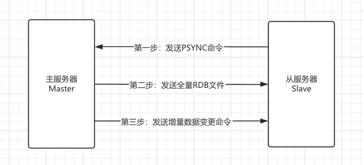

| title                            | tags            | background                                                   | auther | isSlow |
| -------------------------------- | --------------- | ------------------------------------------------------------ | ------ | ------ |
| 秒杀系统设计的要点（三）多级缓存 | Spring Boot/Web | 这篇文章是继”秒杀系统设计的要点（二）分布式扩展“的第三篇文章，这里主要讨论为了进一步提高服务的并发性能，通过在服务端设置多级缓存来减轻对数据库的压力，具体的解决方案都有哪些。 | depers | true   |

# Redis集中式缓存的架构

Redis的部署架构主要有以下四种，分别是单体、主从、哨兵和集群。

## 单体

单体架构就是应用缓存只依赖于一台Redis服务，如果这台服务出现问题，会对应用的正常服务造成很大的影响。所以绝大部分项目都不会使用这种架构。

## 主从

### 1. 解决的问题

- 单个Redis节点出现宕机，无法正常提供服务。
- 单个Redis节点磁盘损坏，造成数据丢失。
- 单个Redis节点的内存是有限的，存在性能瓶颈。

### 2. 架构思路



* 全量复制
    1. 第一步：Slave连接到Master，发送PSYNC命令准备复制数据
    2. 第二步：发送全量RDB文件
        1. 执行BGSAVE命令生成**目前**全量数据的RDB
        2. 创建缓存区记录**此后**Master收到的写命令
        3. 发送RDB文件到Slave
* 增量复制
    1. 第三步：发送增量数据变更命令
        1. Slave保存RDB文件到本地磁盘，加载快照数据到内存中
        2. 开始接收Master缓存区的增量数据变更命令
        3. 执行变更命令，保证Slave与Master的数据一致

## 哨兵


## 集群

# 通过Redis减轻服务端的压力

* redisTemplate序列化的设置
* RedisTemplate对特殊类型的序列化配置
* RedisTemplate获取数据时反序列化失败

# 通过本地缓存进一步减轻服务端的压力

* 使用Guava Cache缓存热点数据

# Nginx proxy cache缓存的实现

来看一段Nginx的配置

```nginx
# 声明一个cache缓存节点
proxy_cache_path /usr/local/openrestry/nginx/tmp_cache levels=1:2 keys_zone=tmp_cache:100m inactive=7d max_size=10g;

server {
    listen 80;
    server_name localhost;
    
    location / {
        # 配置反向代理
        proxy_pass http://backend.com;
        # 配置缓存节点
        proxy_cache tmp_cache;
        # 配置缓存hash的key
        proxy_cache_key $uri;
        # 配置在遇到状态码为200,206,304,302时将响应的body缓存7天
        proxy_cache_valid 200 206 304 302 7d;
    }
}
```

经过压测后发现，请求的tps却比本地缓存的效果差一些。