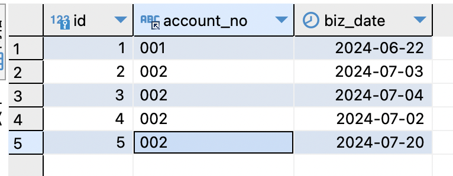
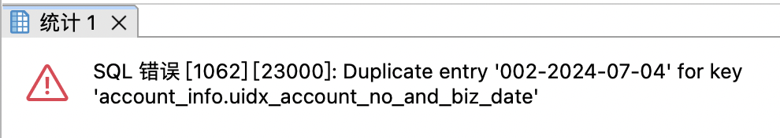
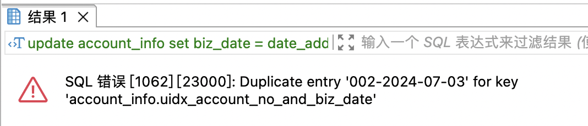
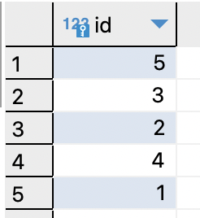

| title          | tags         | background                                                   | auther | isSlow |
| -------------- | ------------ | ------------------------------------------------------------ | ------ | ------ |
| 数据的顺序更新 | 数据库/MySQL | 今天在投产的时候遇到一个问题，就是在更新一批数据的时候如何有序的更新。 | depers | true   |

假设有这样一张表，表结构如下：

```sql
create table `account_info` (
	`id` bigint not null auto_increment comment '主键',
    `account_no` varchar(20) not null default "" comment '账户号',
    `biz_date` date not null default '1970-01-01' comment '业务日期',
    primary key (`id`),
    unique key `uidx_account_no_and_biz_date` (`account_no`, `biz_date`)
) engine=InnoDB comment '账户表'
```

此时我插入四条记录：



此时我需要更新这四条记录的`biz_date`字段，此时我编写的更新sql是：

```sql
update account_info set biz_date = date_add(biz_date, interval 1 day);
```

执行结果是：



此时sql是更新是按照id的顺序执行的，因为id=2的这一行数据先更新为002-2024-07-04，但是由于id=3的这条记录已经存在，所以此时会报”**重复记录**“的错误。

接着我们发现如果顺序执行不行，我们可以倒序执行啊，我把sql改成这样：

```sql
update account_info set biz_date = date_add(biz_date, interval 1 day) order by id desc;
```

执行结果是：



此时sql是按照sql倒序执行的，因为id=4这行数据先更新为002-2024-07-03，但是由于id=2这行数据的已经存在的，所以这里会报”**重复记录**“的错误。

接着，我想我是不是可以自己先把执行时间排序之后的id先查出来然后再去更新这块sql是不是就是合理的呢？

```sql
update account_info set biz_date = date_add(biz_date, interval 1 day) 
where id in (select t.id from (select id from account_info order by biz_date desc)as t);
```

首先我们看下子查询的结果，也就是`select t.id from (select id from account_info order by biz_date desc)as t`的结果：



此时执行结果是：


这是为啥啊，之前不是说是以id为顺序进行更新的吗？这里id的顺序是：5，3，2，4，1。值得注意的是这里我用的是`in`，这句sql的执行是要保证这些id的行都要被更新成功，其实这里还是有顺序的，报错的唯一解释就是这里id的顺序是：1，2，3，4，5。这里我使用子查询的原因还有一个就是我想分批次去更新这批数据（真实情况下我更新的这张表是很大的），所以这里我的真实sql是：

```sql
update account_info set biz_date = date_add(biz_date, interval 1 day) 
where id in (select t.id from (select id from account_info order by biz_date desc limit 0, 1000000)as t);
```

要想让这些id按照biz_date的排序去更新，如何做呢？

```sql
update account_info set biz_date = date_add(biz_date, interval 1 day) 
where id in (select t.id from (select id from account_info order by biz_date desc limit 0, 1000000)as t) order by biz_date;
```

这样我们就完美的解决了这个问题，**直接使用order by来控制更新的顺序**。

如果我的表的数量不是很大，不用使用limit分批次去做的话，其实我们的sql可以直接写成：

```sql
update account_info set biz_date = date_add(biz_date, interval 1 day) order by biz_date desc;
```

如果更新表的数据量很大的话，可能会报`Multi-statement transaction required more than 'max_binlog_cache_size' bytes of storage; increase this mysqld variable and try again`。解决方法有两个：

1. `set global max_binlog_cache_size xxxx`，这个值只能设置`global`维度。
2. 将`update`语句进行拆分，使用`limit`来做。也就是上面我演示的这种。

这个问题让我花了好长的时间，最终完美解决，这里记录一下。