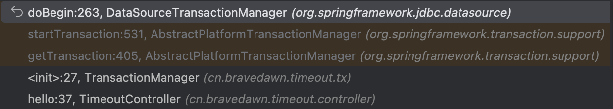

| title                      | tags                    | background                                                   | auther | isSlow |
| -------------------------- | ----------------------- | ------------------------------------------------------------ | ------ | ------ |
| Spring编程式事务的使用思考 | Spring 事务/事务/数据库 | 最近在项目开发中使用编程式事务控制数据库的提交，但是针对某些大事务场景的处理应该怎能来做，事务的超时时间应该怎么设置，需不需要设置，带着这些问题，来看看这篇文章。 | depers | true   |

# 自定义TransactionManager

先来看一段代码：

```Java
public class TransactionManager {

    private TransactionStatus transactionStatus;

    private final DataSourceTransactionManager transactionManager = SpringUtil.getBean("transactionManager", DataSourceTransactionManager.class);


    public TransactionManager() {
        DefaultTransactionDefinition def = new DefaultTransactionDefinition();
        def.setPropagationBehavior(TransactionDefinition.PROPAGATION_REQUIRED);
        def.setTimeout(60);
        // 获取事务
        this.transactionStatus = transactionManager.getTransaction(def);
    }

    public void commit() {
        transactionManager.commit(this.transactionStatus);
    }


    public void rollback() {
        transactionManager.rollback(this.transactionStatus);
    }
}
```

在上面的这段代码中我自定义了一个事务管理器，这里有几个特别的类，我在这里简单介绍下他们的作用：

- `TransactionStatus`：负责事务的定义。

关键参数：

1. 事务隔离的级别，配置事务的隔离级别，和数据库隔离级别是一个东西。它有一个默认的隔离级别，意思是使用底层数据库的默认隔离级别，这个属性一般不设置。
2. 事务传播，配置事务的传播属性，不同的事务传播逻辑，对业务逻辑是有影响的。常用配置：`TransactionDefinition.PROPAGATION_REQUIRED`。
3. 事务超时，配置事务的生命时长，如果超时，事务将会回滚。
4. 只读状态，只读事务不能修改数据，只读事务在某些场景下是十分有用的，有很好的性能。

- `DataSourceTransactionManager`：负责描述事物具体运行的状态，可以间接回滚事务。
- `DefaultTransactionDefinition`：负责管理事务。该类是`PlatformTransactionManager`的子类，我们通过调用它的`commit()`和`rollback()`方法来实现事务的提交和回滚。在使用Spring JDBC或是Mybatis作为ORM框架是使用该事务管理器。

# 超时时间参数的设置

在上面的配置中，如果我使用手动事务时无法估算事务的执行时间，可以将事务超时时间设置为`-1`，这通常意味着事务没有明确的超时限制，即事务可以无限期地运行，直到它完成或遇到错误。

下面我们从源码角度看下这个超时时间在 Spring 中是如何控制的：

1. 这里我们使用上面我们定义的`TransactionManager`来手动管理事务，为当前事务设置超时时间的入口代码是：`org.springframework.jdbc.datasource.DataSourceTransactionManager#doBegin`，下面是这个方法的调用堆栈：

    

    在这个方法中，将事务定义的超时时间通过调用`org.springframework.jdbc.datasource.ConnectionHolder`对象的`setTimeoutInSeconds()`方法，最终这个超时时间会放到`org.springframework.transaction.support.ResourceHolderSupport`的`deadline`属性上：
    ```Java
    int timeout = determineTimeout(definition);
    if (timeout != TransactionDefinition.TIMEOUT_DEFAULT) {
        txObject.getConnectionHolder().setTimeoutInSeconds(timeout);
    }
    ```
2. 在`ResourceHolderSupport`类中定义了两个方法，分别是`getTimeToLiveInSeconds()`和`getTimeToLiveInMills()`这两个方法的主要逻辑都是一样的，就是判断当前时间是否已经超过了上面提到的`daedline`，值得注意的是代码中是`getTimeToLiveInSeconds()`调用了`getTimeToLiveInMills()`，也就是先在毫秒的维度判断是否超时，然后在秒的维度判断超时。如果超过了说明事务已经过期了，会抛出`TransactionTimeOutException`异常。

3. 在spring-jdbc中，在创建`Statement`对象后为其设置`QueryTime`属性时，在`JdbcTemplate的applyStatementSettings()`方法中会调用`DataSourceUtils.applyTimeout()`方法，在这个方法中就会用到上面提到的`getTimeToLiveInSeconds()`方法，校验当前的事务是否超时。值得注意的是在Mybatis中设置`Statement`的`QueryTime`属性是通过调用`DataSourceUtils.applyTimeout()`方法实现的。

    > 在 JDBC 中，`Statement` 接口的 `setQueryTimeout` 方法用于为执行的 SQL 查询设置超时时间。这个方法接受一个整数参数，表示超时时间的秒数。当查询执行时间超过设定的超时时间时，会抛出一个 `SQLException`。这可以防止某些查询因长时间执行而影响应用程序的性能和响应性。

4. 在Mybatis中，在创建`Statement`对象为其设置`QueryTime`属性时，会先调用`SpringManagerTransaction`的`getTimeout()`方法，在这个方法中会调用上面提到的`getTimeToLiveInSeconds()`方法，校验当前的事务是否超时。值得注意的是在Mybatis中设置`Statement`的`QueryTime`属性是通过调用`BaseStatementHandler.setStatementTimeout()`方法来实现的。

说到这里总结下，在第三点和第四点中我们提到了 spring-jdbc 和 Mybatis 针对事务超时代码虽然有所不同，但是最后的效果都是一致的，都是在每次创建`Statement`对象时检查当前事务是否存在超时。如果超时就会抛出异常，如果没有超时就会为 Statement 设置 QueryTime，所以在一个事务当中如果执行多条 `SQL`，所有 `SQL` 语句全部执行成功，即使在最后设置一个耗时操作，也不会出现事务超时的，耗时操作并不会计入事务的超时时间判断。

所以**事务超时的时间=事务的开始时间到最后一个 sql 的 Statement 对象创建的时间 + 最后一个 sql 的执行超时时间（QueryTime）**。

# 自定义TransactionManager的使用范式

在上面我简单介绍了TransactionManager实现细节，下面提供一个编程时的范式代码：

```Java
TransactionManager transactionManager = new TransactionManager();
try {
    log.info("开始执行第一条数据");
    AccountInfo accountInfo = new AccountInfo();
    accountInfo.setAccountNo("110");
    accountInfo.setBizDate(new Date());
    accountInfoMapper.insertSelective(accountInfo);
    log.info("第一条数据已落库");

    log.info("开始执行第二条数据");
    accountInfoMapper.insertSelective(accountInfo);
    log.info("第二条数据已落库");

    transactionManager.commit();
} catch (Throwable e) {
    log.error("入库失败，事务回滚", e);
    transactionManager.rollback();
}
```

# 使用TransactionTemplate

`TransactionTemplate`是Spring提供的事务管理模板类，是线程安全的，可以使用该类实现编程式事务管理。

`TransactionTemplate`的两个重要方法

1. `setTransactionManager()`：设置事务管理器。
2. `execute(TransactionCallBack action)`：在`TransactionCallBack`回调接口中定义需要以事务方式组织的数据访问逻辑，就是就在这个接口中编写需要手工执行事务的逻辑。
    1. 若手工执行事务的逻辑有返回值，使用`TransactionCallBack`。
    2. 若手工执行事务的逻辑没有返回值，使用`TransactionWithoutResult`。
    3. 值得注意的是：在回调接口方法中需要显式访问底层数据连接，必须通过**资源获取工具类**得到绑定的数据连接。在Spring JDBC和Mybatis中资源获取的工具类是`org.springframework.jdbc.datasource.DatasourceUtils`

这里给出一个简单的案例，方便大家参考：

```Java
transactionTemplate.execute(new TransactionCallbackWithoutResult() {
    @Override
    protected void doInTransactionWithoutResult(TransactionStatus status) {
        log.info("开始执行第一条数据");
        AccountInfo accountInfo = new AccountInfo();
        accountInfo.setAccountNo("110");
        accountInfo.setBizDate(new Date());
        accountInfoMapper.insertSelective(accountInfo);
        log.info("第一条数据已落库");

        int i = 1 / 0;

        log.info("开始执行第二条数据");
        accountInfoMapper.insertSelective(accountInfo);
        log.info("第二条数据已落库");
    }
});
```

`TransactionTemplate`是继承自`DefaultTransactionDefinition`，所以它也可以设置隔离级别、事务传播属性、事务超时时间和只读属性。

# 参考文章

* [Spring 事务管理 Timeout 的一点问题研究](https://dongzl.github.io/2020/08/04/33-Spring-Transaction-Timeout/index.html)