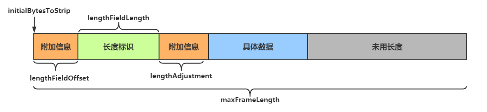

| title                 | tags           | background                                                   | auther | isSlow |
| --------------------- | -------------- | ------------------------------------------------------------ | ------ | ------ |
| 使用Netty封装CMPP协议 | Netty/网络编程 | 最近在项目中有一个短信发送的功能是通过调用中国移动的交易实现的，这篇文章介绍了基于Netty框架实现CMPP协议客户端封装的关键要点，以及Netty的一些使用技巧。 | depers | true   |

# Netty中的异常处理

首先我们聊下Netty基于责任链模式的`ChannelHandler`，作为Netty的主要组件，它充当了所有处理入站和出站数据应用程序逻辑的容器。下面是`ChannelHandler`的类层次结构图，从图中我们可以看到，ChannelHandler接口有两个子接口分别是`ChannelInboundHandler`和`ChannelOutboundHandler`，分别代表的**入站读数据**和**出站写数据**。两者的的异常处理机制并不相同，我们分别来看下这两种Handler该如何进行异常处理。

## 入站Handler的异常处理

为了更好的说明其中的逻辑，这里我写了一个案例，在这个例子中，入站Handler分别有A、B、C三个，因为入站Handler是**顺序执行**的，我们对每一个Handler都复写了其`channelRead()`方法，从下面的日志中，我们可以看到入站逻辑分别执行了A、B、C三个Handler。

看完正常的执行流程，下面我们来看下入站Hander的异常是如何传递和处理的。

- 不进行任何异常捕获

    在这个场景中，我在HandlerA的`channelRead()`方法中抛出异常，但是并没有复写其`exceptionCaught()`方法，在后面的HandlerB和HandlerC中，我们也没有复写其`exceptionCaught()`方法。也就是说在所有入栈Handler中，我们都没有进行异常捕获。可以看到Netty默认情况下是有异常捕获逻辑的，会将异常堆栈记录到Warn日志中。

- 自己的异常自己捕获

    在这个场景中，我依然在HandlerA的`channelRead()`方法中抛出异常，并复写其exceptionCaught()方法，但是针对HandlerB和HandlerC不复写其`exceptionCaught()`方法。从下图中客户端运行日志的结果来看，HandlerA中ChannelRead()抛出的异常被自己的`exceptionCaught()`方法所捕获。

- 前面抛出异常，后面处理

    在这个场景中，我们依然在HandlerA的`channelRead()`方法中抛出异常，但是并没有复写其`exceptionCaught()`方法，为了方便演示入站Handler的异常传播逻辑，我在HandlerC中复写了它的`exceptionCaught()`方法，从如下图中我们可以看出，在HandlerC中捕获了HandlerA的`channelRead()`方法抛出的异常。也就是说对于入站Handler，它的异常是顺序沿着Handler依次传递的。

## 出站Handler的异常处理

为了方便说明问题，这里我也写了一个案例，出站的Handler分别有A、B、C三个，我们对每一个Handler都复写了其`write()`方法。与入站Handler的执行顺序相反，出站Handler是**逆序执行**的，也就是说如果我声明Handler的顺序是A、B、C，那么实际执行的顺序是C、B、A。这里我也分几种情况来说明下出站Handler的异常捕获逻辑。

- 不进行任何异常捕获

    这个例子中，我们在HandlerA的`write()`方法中抛出了异常，但是没有做任何异常捕获，在这种情况下日志的输出如下图所示。可以看到Netty默认情况下是有异常捕获逻辑的，会将异常堆栈记录到Warn日志中。

- 在发送消息时设置监听器

    在我们发送消息的源头，也就是第一个调用`write()`和`writeAndFlush()`的地方，我们可以调用`addLister()`方法为`ChannelFuture`设置`ChannelFutureLister`，在这个监听器中打印异常堆栈信息和关闭连接。具体的代码如下：

运行结果的日志截图如下，从下图中我们可以看到，日志中不仅打印出了Netty默认的Warn日志，还打印出了我们在监听器中的异常日志。

# channel.close()和channel.closeFuture().sync()的区别

- `channel.close()`
    - 作用：是非阻塞的，它启动关闭流程并立即返回。
    - 使用的场景
        - 出站和入站的异常捕获后调用该方法关闭连接。
        - 在客户端请求拿到响应之后关闭连接。
- `channel.closeFuture().sync()`
    - 作用：是阻塞的，在通道关闭完成后才执行。我们可以在这个方法后面调用`addLister()`方法，正这里写一些连接关闭之后的逻辑。
    - 使用场景：在连接关闭之后需要做一些同步逻辑。

# 定长消息解决拆包和粘包

## 拆包和粘包的原因

1. **TCP缓冲区**：TCP使用缓冲区来优化数据的发送和接收。如果发送的数据小于缓冲区大小，TCP可能会将多个数据包合并后发送；如果数据大于缓冲区大小，则会发生拆包（半包）。
2. **Nagle算法**：TCP的Nagle算法会将小的数据包合并后发送，以减少网络拥塞和提高传输效率，这也可能导致粘包。
3. **MSS**和**MTU**：TCP在发送数据时，会根据MSS（最大报文段长度）和MTU（最大传输单元）的大小限制进行拆包，以避免在网络层进行分片。

## 解决粘包和拆包的方法

1. **固定消息长度**：发送方将每个消息填充到固定长度，接收方根据固定长度解析消息。
2. **消息分隔符**：发送方在每个消息的末尾添加特定的分隔符，接收方根据分隔符解析消息。
3. **消息头标识消息长度**：发送方在每个消息的头部添加消息长度信息，接收方根据消息长度解析消息。
4. **自定义应用层协议**：设计应用层协议时，考虑消息的格式和传输规则，避免发送方连续发送大量数据而不考虑接收方的处理能力。

## 使用`LengthFieldBasedFrameDecoder`解决CMPP协议中拆包和粘包问题

`LengthFieldBasedFrameDecoder` 是 Netty 中的一个解码器，用于处理粘包和半包情况。它能根据指定的长度字段解析数据帧，将输入的字节流分割成一系列固定大小的帧 `Frames`，并且每个帧的大小可以根据帧头信息中指定的长度进行动态调整。通过这种方式，`LengthFieldBasedFrameDecoder` 能够自动地识别和处理 TCP 协议中存在的粘包和拆包（半包）。

这里我以CMPP协议的格式来说明`LengthFieldBaseFrameDecoder`的使用。下面分别是CMPP协议**报文结构**：

| 项目           | 说明                       |
| :------------- | :------------------------- |
| Message Header | 消息头（所有消息公共包头） |
| Message Body   | 消息体                     |

这里我们重点看下**消息头格式**：

| 字段名       | 字节数 | 类型    | 描述                                    |
| :----------- | :----- | :------ | :-------------------------------------- |
| Total_Length | 4      | Integer | 消息总长度（含消息头及消息体）          |
| Command_ID   | 4      | Integer | 命令或响应类型                          |
| Sequence_ID  | 4      | Integer | 消息流水号，顺序累加，步长为1，循环使用 |

从这里我们就可以看出CMPP协议是一个在**消息头标识消息长度**的报文协议。

接着我们来看下`LengthFieldBaseFrameDecoder`的构造函数参数：

- `maxFrameLength`：最大允许的帧长度，即字节数组的最大长度，包括附加信息、长度表示等内容。如果帧的长度大于此值，将抛出 `TooLongFrameException` 异常。一般我们将该参数设置为`Integer.MAX_VALUE`。
- `lengthFieldOffset`：长度字段在字节数组中的偏移量。
- `lengthFieldLength`：长度字段的字节数。
- `lengthAdjustment`：长度字段值需要调整的值。例如，如果长度字段表示的是整个字节数组的长度，但是在传输过程中还包含了一些其他的信息，那么就需要将长度字段的值减去这些额外信息的长度。关于这个字段我们下面重点讨论下。
- `initialBytesToStrip`：解码器在返回帧之前应该跳过的字节数。例如，如果帧包含了长度字段本身的字节，那么这些字节就需要被跳过。
- `failFast`：这个参数用于控制解码器在遇到错误时是否立即抛出异常。当`failFast`参数设置为`true`时，如果解码过程中发现数据不符合预期（例如，数据长度不符合指定的固定长度），解码器会立即抛出一个`DecoderException`异常。这种方式可以快速失败，避免处理不完整或错误的数据，但可能会导致数据流中的后续数据被忽略或丢失。相反，当`failFast`参数设置为`false`时，解码器会尝试继续处理数据，即使当前数据块不符合预期。这意味着它会给数据流中的错误更多的容忍空间，尝试从错误中恢复，而不是立即抛出异常。这样做的好处是可以减少因单个错误数据包导致的整个数据流处理的中断，但可能会增加处理错误数据的风险。一般都设置为`true`。

看完上面的参数说明，可能还是一头雾水，我们直接上代码：，我们一个一个来分析下。

- `maxFrameLength=Integer.MAX_VALUE`：最大允许的帧长度为`Integer`类型的最大值，也就是说最大帧长度不做控制。
- `lengthFieldOffset=0`：标识长度字段的偏移量为0。
- `lengthFieldLength=4`：长度字段占4个字节，长度字段表示整个消息（包括消息头）的长度。
- `lengthAdjustment=-4`：这个参数就有意思了，这里设置的是-4。按照直观的理解这个参数应该设置为0，因为按照CMPP报文格式的要求，长度字段之后就是正文了啊。下面分情况进行说明：
    - 如果长度字段仅代表消息正文的长度，也就是说不包含自己本身的长度，这种情况下`lengthAdjustment`参数可以设置为0。
    - 如果长度字段表示整个消息（包括消息头）的长度，也就是说包含自己本身的长度，这种情况下`lengthAdjustment`参数需要做补偿，也就是-4。
    - 如果长度字段表示消息正文的长度，并且存在附加信息，此时`lengthAdjustment`参数的值就应该设置为附加信息的长度。
- `initialBytesToStrip=0`：因为我们的消息正文中包含了长度字段，所以不允许跳过长度字段。
- `failFast=true`：严格控制解码器的异常逻辑。

# 通过LengthFieldPrepender设置响应报文的长度

在Netty中，`LengthFieldPrepender`是一个编码器（Encoder），它的作用是在消息的开始处添加一个固定长度的字段，用于指示随后消息体的长度。

这个类有三个参数：

1. **lengthFieldLength**：指示长度字段的字节数，常见的值有1、2、3、4、8等。
2. **lengthIncludesLengthFieldLength**：一个布尔值，指示长度字段是否包含它自身的大小。
3. **lengthAdjustment**：一个整数，用于调整长度字段的值，通常用于协议中长度字段包含了额外的头部信息时。

# 参考项目

- depers/netty-handler

# 参考文章

- [【Netty】「优化进阶」（二）浅谈 LengthFieldBasedFrameDecoder：如何实现可靠的消息分割？](https://xie.infoq.cn/article/05b7f6179fa3167d0803080c9)
- [CMPP协议](https://baike.baidu.com/item/CMPP协议/555466?fr=ge_ala)