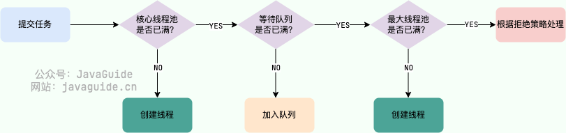

| title                | tags                 | background                                                   | auther | isSlow |
| -------------------- | -------------------- | ------------------------------------------------------------ | ------ | ------ |
| 自定义线程池拒绝策略 | Java/并发编程/线程池 | 最近在项目中使用线程池来并发执行任务，从而提高任务执行的效率，但是在开发的过程中，发现总会有任务会莫名的终止，还有就是线程池的拒绝策略该如何使用，采用默认的还是自己实现，通过这篇文章，让我们来一起讨论线程池的使用和需要注意的一些细节。 | depers | true   |

# 线程池拒绝策略的触发时机

这里需要附一张线程池的工作流程图



触发线程池拒绝策略的条件有两个，满足其中一个就会触发拒绝策略

1. 线程池已经被关闭。

2. 任务队列已满且maximumPoolSizes已满。


# JDK默认的拒绝策略

1. **AbortPolicy**：**默认拒绝策略**，抛出异常`RejectedExecutionException`拒绝提交任务

    1. 在线程池已经关闭的情况下使用该拒绝策略会抛出异常，代码演示如下：

        ```Java
        @Slf4j
        public class AbortPolicyExample {
        
        
            /**
             * 使用默认的线程池拒绝策略：ThreadPoolExecutor.AbortPolicy()ｿ
             */
        
            static ThreadPoolExecutor executor = new ThreadPoolExecutor(5, 5, 0L, TimeUnit.SECONDS,
                    new LinkedBlockingQueue<>(5), Executors.defaultThreadFactory(), new ThreadPoolExecutor.AbortPolicy());
        
            public static void main(String[] args) throws InterruptedException {
                CountDownLatch countDownLatch = new CountDownLatch(1);
                executor.execute(() -> {
                    log.info("执行一些异步任务");
                    countDownLatch.countDown();
                });
        
                countDownLatch.await();
        
                executor.shutdown();
                log.info("执行结束，线程池已关闭");
                executor.execute(() -> {
                    log.info("接着执行一些异步任务");
                });
            }
        
        }
        ```
    
          控制台输出：
    
        ```Bash
        [2025-09-23 21:38:24.401][pool-2-thread-1][INFO][com.bravedawn.concurrency.example.threadPool.rejecthandler.AbortPolicyExample.lambda$main$0(25)]-执行一些异步任务 
        [2025-09-23 21:38:24.406][main][INFO][com.bravedawn.concurrency.example.threadPool.rejecthandler.AbortPolicyExample.main(32)]-执行结束，线程池已关闭 
        Exception in thread "main" java.util.concurrent.RejectedExecutionException: Task com.bravedawn.concurrency.example.threadPool.rejecthandler.AbortPolicyExample$$Lambda$103/0x0000000800d4b2a8@3972a855 rejected from java.util.concurrent.ThreadPoolExecutor@62e7f11d[Terminated, pool size = 0, active threads = 0, queued tasks = 0, completed tasks = 1]
                at java.base/java.util.concurrent.ThreadPoolExecutor$AbortPolicy.rejectedExecution(ThreadPoolExecutor.java:2065)
                at java.base/java.util.concurrent.ThreadPoolExecutor.reject(ThreadPoolExecutor.java:833)
                at java.base/java.util.concurrent.ThreadPoolExecutor.execute(ThreadPoolExecutor.java:1365)
                at com.bravedawn.concurrency.example.threadPool.rejecthandler.AbortPolicyExample.main(AbortPolicyExample.java:33)
        ```
    
    2. 在任务队列已满且maximumPoolSizes已满的情况下使用该拒绝策略
    
        -   如果在for循环中向线程池添加任务的逻辑不进行异常捕获，程序会卡死，代码如下：
    
            ```Java
            @Slf4j
            public class AbortPolicyExample3 {
            
            
                /**
                 * 使用默认的线程池拒绝策略：ThreadPoolExecutor.AbortPolicy()
                 */
            
                static ThreadPoolExecutor executor = new ThreadPoolExecutor(1, 1, 0L, TimeUnit.SECONDS,
                        new LinkedBlockingQueue<>(1), Executors.defaultThreadFactory(), new ThreadPoolExecutor.AbortPolicy());
            
                public static void main(String[] args) throws InterruptedException {
                    for (int i = 0; i < 10; i++) {
            
                        // 下面代码如果不捕获异常，异常会从main线程抛出，导致主线程关闭，从而不会执行关闭线程池的逻辑，导致程序一直卡住
                        executor.execute(() -> {
                            log.info("执行一些异步任务, 执行线程：{}", Thread.currentThread().getName());
                        });
                    }
            
                    executor.shutdown();
                    log.info("执行结束，线程池关闭");
                }
            }
            ```
    
            出现这种情况的原因是主线程在提交任务时没有正确处理 `RejectedExecutionException`，这个异常会从 main 线程抛出。main 线程的`for`循环会因这个未处理的异常而立即终止。代码不会继续执行后面的循环，也不会执行到 `executor.shutdown()`这一行。从外部看，程序好像“卡住”了或“阻塞”了，因为主线程已经崩溃退出了，但线程池里的线程还在运行（如果是守护线程，可能会随主线程结束；如果是用户线程，则会继续运行直到任务完成）。
    
        - 所以在使用配置了**AbortPolicy**拒绝策略的时候，需要捕获异常，这样就不会造成主线程的阻塞了。代码如下：
    
            ```TypeScript
             @Slf4j
            public class AbortPolicyExample2 {
            
            
                /**
                 * 使用默认的线程池拒绝策略：ThreadPoolExecutor.AbortPolicy()ｿ
                 */
            
                static ThreadPoolExecutor executor = new ThreadPoolExecutor(1, 1, 0L, TimeUnit.SECONDS,
                        new LinkedBlockingQueue<>(1), Executors.defaultThreadFactory(), new ThreadPoolExecutor.AbortPolicy());
            
                public static void main(String[] args) throws InterruptedException {
                    for (int i = 0; i < 3; i++) {
                        try {
                            executor.execute(() -> {
                                log.info("执行一些异步任务, 执行线程：{}", Thread.currentThread().getName());
                            });
                        } catch (Throwable e) {
                            // 切记这里要捕获异常，如果不捕获，线程池就会阻塞到这里
            
                            /**
                             * 如果你没有用 try-catch 捕获这个异常：
                             *   这个异常会从 main 线程抛出。
                             *   main 线程的 for 循环会因这个未处理的异常而立即终止。
                             *   代码不会继续执行后面的循环，也不会执行到 executor.shutdown() 这一行。
                             *   从外部看，程序好像“卡住”了或“阻塞”了，因为主线程已经崩溃退出了，但线程池里的线程还在运行（如果是守护线程，可能会随主线程结束；如果是用户线程，则会继续运行直到任务完成）。
                             */
                            log.error("多线程执行出现异常", e);
                        }
            
                    }
            
                    executor.shutdown();
                    log.info("执行结束，线程池关闭");
                }
            
            }
            ```
    
              控制台输出：
    
            ```TypeScript
            [2025-09-23 21:39:20.943][pool-2-thread-1][INFO][com.bravedawn.concurrency.example.threadPool.rejecthandler.AbortPolicyExample2.lambda$main$0(26)]-执行一些异步任务, 执行线程：pool-2-thread-1 
            [2025-09-23 21:39:20.945][pool-2-thread-1][INFO][com.bravedawn.concurrency.example.threadPool.rejecthandler.AbortPolicyExample2.lambda$main$0(26)]-执行一些异步任务, 执行线程：pool-2-thread-1 
            [2025-09-23 21:39:20.943][main][ERROR][com.bravedawn.concurrency.example.threadPool.rejecthandler.AbortPolicyExample2.main(38)]-多线程执行出现异常 
            java.util.concurrent.RejectedExecutionException: Task com.bravedawn.concurrency.example.threadPool.rejecthandler.AbortPolicyExample2$$Lambda$99/0x0000000800d43d70@366647c2 rejected from java.util.concurrent.ThreadPoolExecutor@6a6afff2[Running, pool size = 1, active threads = 1, queued tasks = 1, completed tasks = 0]
                    at java.util.concurrent.ThreadPoolExecutor$AbortPolicy.rejectedExecution(ThreadPoolExecutor.java:2065) ~[?:?]
                    at java.util.concurrent.ThreadPoolExecutor.reject(ThreadPoolExecutor.java:833) ~[?:?]
                    at java.util.concurrent.ThreadPoolExecutor.execute(ThreadPoolExecutor.java:1365) ~[?:?]
                    at com.bravedawn.concurrency.example.threadPool.rejecthandler.AbortPolicyExample2.main(AbortPolicyExample2.java:25) [classes/:?]
            [2025-09-23 21:39:20.946][main][INFO][com.bravedawn.concurrency.example.threadPool.rejecthandler.AbortPolicyExample2.main(44)]-执行结束，线程池关闭
            ```
    
        -   还有一种办法就是设置线程工厂时，手动设置线程的异常处理机制，从而实现线程池线程的异常捕获，具体代码如下：
    
          ```Java
          @Slf4j
          public class CustomThreadFactory implements ThreadFactory {
          
              private String namePrefix;
              private LongAdder threadNum = new LongAdder();
          
              public CustomThreadFactory(String namePrefix) {
                  this.namePrefix = namePrefix;
              }
          
              @Override
              public Thread newThread(Runnable r) {
                  Thread t = new Thread(r);
                  t.setName(this.namePrefix + "-" + this.threadNum);
                  // 处理线程执行逻辑抛出异常不输出日志到文件的问题
                  t.setUncaughtExceptionHandler(new Thread.UncaughtExceptionHandler() {
                      @Override
                      public void uncaughtException(Thread t, Throwable e) {
                          log.error("线程池线程执行出现异常", e);
                      }
                  });
                  this.threadNum.increment();
                  return t;
              }
          }
          ```
    
2. **CallerRunsPolicy**：由调用execute方法提交任务的线程来执行这个任务；

    1. **在线程池已经关闭的情况下**使用该拒绝策略主线程会接着执行提交到线程池中的任务，代码演示如下：

        ```Java
        @Slf4j
        public class CallerRunsPolicyExample {
        
        
            /**
             * 在线程池已经关闭的情况下，使用该拒绝策略，主线程会接着执行提交到线程池中的任务
             */
        
        
            static ThreadPoolExecutor executor = new ThreadPoolExecutor(5, 5, 0L, TimeUnit.SECONDS,
                    new LinkedBlockingQueue<>(5), Executors.defaultThreadFactory(), new ThreadPoolExecutor.CallerRunsPolicy());
        
        
            public static void main(String[] args) throws InterruptedException {
                CountDownLatch countDownLatch = new CountDownLatch(1);
                executor.execute(() -> {
        
                    log.info("执行异步任务");
                    countDownLatch.countDown();
                });
        
                countDownLatch.await();
                executor.shutdown();
                log.info("执行结束，线程关闭");
                executor.execute(() -> {
                    log.info("接着执行一些任务。。。。");
                });
            }
        }
        ```

    2. **在任务队列已满且maximumPoolSizes已满的情况下**使用该拒绝策略，主线程会继续执行被线程池拒绝的消息，代码演示如下：

        ```Java
        @Slf4j
        public class CallerRunsPolicyExample2 {
        
        
            /**
             * 在线程池任务队列已满且线程数超过maximumPoolSizes的情况下ｿ，使用该拒绝策略，主线程会接着执行提交到线程池中的任务
             */
        
        
            static ThreadPoolExecutor executor = new ThreadPoolExecutor(1, 1, 0L, TimeUnit.SECONDS,
                    new LinkedBlockingQueue<>(1), Executors.defaultThreadFactory(), new ThreadPoolExecutor.CallerRunsPolicy());
        
        
            public static void main(String[] args) throws InterruptedException {
                CountDownLatch countDownLatch = new CountDownLatch(10);
                for (int i = 0; i < 10; i++) {
                    executor.execute(() -> {
                        log.info("执行异步任务");
                        countDownLatch.countDown();
                    });
                }
        
        
        
                countDownLatch.await();
                executor.shutdown();
                log.info("执行结束，线程关闭");
            }
        }
        ```

3. **DiscardPolicy**：直接丢弃新提交的任务；

    1. 在**线程池已经关闭的情况下**使用该拒绝策略被提交到线程池中的任务会被丢弃，代码演示如下：

        ```Java
        @Slf4j
        public class DiscardPolicyExample {
        
        
            /**
             * 在线程池已经关闭的情况下，使用该拒绝策略，新的任务会被忽略
             */
        
        
            static ThreadPoolExecutor executor = new ThreadPoolExecutor(5, 5, 0L, TimeUnit.SECONDS,
                    new LinkedBlockingQueue<>(5), Executors.defaultThreadFactory(), new ThreadPoolExecutor.DiscardPolicy());
        
        
            public static void main(String[] args) throws InterruptedException {
                CountDownLatch countDownLatch = new CountDownLatch(1);
                executor.execute(() -> {
        
                    log.info("执行异步任务");
                    countDownLatch.countDown();
                });
        
                countDownLatch.await();
                executor.shutdown();
                log.info("执行结束，线程关闭");
                executor.execute(() -> {
                    log.info("接着执行一些任务。。。。");
                });
            }
        }
        ```

    2. **在任务队列已满且maximumPoolSizes已满的情况下**使用该拒绝策略，被线程池拒绝的消息会被丢弃，代码演示如下：

        ```Java
        @Slf4j
        public class CallerRunsPolicyExample2 {
        
        
            /**
             * 在线程池任务队列已满且线程数超过maximumPoolSizes的情况下ｿ，使用该拒绝策略，主线程会接着执行提交到线程池中的任务
             */
        
        
            static ThreadPoolExecutor executor = new ThreadPoolExecutor(1, 1, 0L, TimeUnit.SECONDS,
                    new LinkedBlockingQueue<>(1), Executors.defaultThreadFactory(), new ThreadPoolExecutor.CallerRunsPolicy());
        
        
            public static void main(String[] args) throws InterruptedException {
                CountDownLatch countDownLatch = new CountDownLatch(10);
                for (int i = 0; i < 10; i++) {
                    executor.execute(() -> {
                        log.info("执行异步任务");
                        countDownLatch.countDown();
                    });
                }
        
                countDownLatch.await();
                executor.shutdown();
                log.info("执行结束，线程关闭");
            }
        }
        ```

4. **DiscardOldestPolicy**：如果执行器没有关闭，队列头的任务将会被丢弃，然后执行器重新尝试执行任务（如果失败，则重复这一过程）

    在线程池没有被关闭的前提下，**在任务队列已满且maximumPoolSizes已满的情况下**使用该拒绝策略，后面被添加的任务会将之前先加入队列人任务挤走，代码如下所示：
    
    ```Java
    @Slf4j
    public class DiscardPolicyExample {
    
    
        /**
         * 在线程池已经关闭的情况下，使用该拒绝策略，新的任务会被忽略
         */
    
    
        static ThreadPoolExecutor executor = new ThreadPoolExecutor(5, 5, 0L, TimeUnit.SECONDS,
                new LinkedBlockingQueue<>(5), Executors.defaultThreadFactory(), new ThreadPoolExecutor.DiscardPolicy());
    
    
        public static void main(String[] args) throws InterruptedException {
            CountDownLatch countDownLatch = new CountDownLatch(1);
            executor.execute(() -> {
    
                log.info("执行异步任务");
                countDownLatch.countDown();
            });
    
    
            countDownLatch.await();
            executor.shutdown();
            log.info("执行结束，线程关闭");
            executor.execute(() -> {
                log.info("接着执行一些任务。。。。");
            });
        }
    }
    ```

# 任务被提交到线程池，主线程允许阻塞

我们在使用线程池异步处理一批任务的时候，往往会将任务提交到线程池的这一操作，封装在while或是for循环中，这样主线程就会将任务不断地添加到线程池中，代发范式如下：

```Java
for (int i = 0; i < 100; i++) {
    
    executor.execute(() -> {
        // 做一些操作
    })；
}
```

这种情况下一般出现在**批量任务**中，大量的任务就会被提交到线程池，线程池的核心线程数已满的情况下，这些任务会不断的添加到线程池的阻塞队列中，但是阻塞队列的容量是有限的，如果阻塞队列满了且已达到线程池的最大线程数，此时就会触发线程池的拒绝策略。但是在我们的业务逻辑中，我们并不希望我们的任务被拒绝，如果任务出现拒绝，那么我们就要花费额外的精力去人工补偿和维护，那真是太难受了。该怎么解决这个问题呢？

第一种思路：将堵塞队列的容量放大，确保它能够放下足够多的任务。

- 优点
    - 简单，只需要修改参数。
    - 不会阻塞主线程。
- 缺点
    - 占用内存资源过多。
    - 需要根据任务数量的上限来估算，但是即便是这样也有可能会因任务数量过多，导致任务被丢弃，存在生产隐患。

第二种思路：限制主线程添加任务到线程池的速度，不要过快的将所有的任务添加到线程池中。

- 优点
    - 能够保证每一个任务都会被执行，不会被丢弃。
    - 无需制定拒绝策略。
- 缺点
    - 实现先比第一种会复杂点。
    - 会阻塞主线程。

下面我们来着重讨论下第二种思路的实现，我们先来看一段代码：

```Java
@Slf4j
public class RejectExecutionHandlerExample2 {


    /**
     * 使用Semaphore避免触发线程池的拒绝策略，控制主线程添加任务到线程池的速率
     */

    static AtomicInteger atomicIntegerExecute = new AtomicInteger(0);
    static AtomicInteger atomicIntegerNoExecute = new AtomicInteger(0);

    // 定义线程池
    static ThreadPoolExecutor threadPoolExecutor = new ThreadPoolExecutor(8, 8, 60L, TimeUnit.SECONDS,
            new LinkedBlockingQueue<>(20), Executors.defaultThreadFactory(), new MyRejectedExecutionHandle());

    // 定义计数器
    static final CountDownLatch countDownLatch = new CountDownLatch(100);

    // 定义信号量，信号量设置为线程池阻塞队列的大小ｿ
    static final Semaphore semaphore = new Semaphore(20);

    private static class MyRejectedExecutionHandle implements RejectedExecutionHandler {
        @Override
        public void rejectedExecution(Runnable r, ThreadPoolExecutor executor) {
            // 要点一：拒绝策略这里也要进行计数器减一的操作，否则会导致主线程阻塞
            countDownLatch.countDown();
            log.error("线程池执行超过队列长度， count={}, countDownLatch={}", atomicIntegerNoExecute.incrementAndGet(), countDownLatch.getCount());
        }
    }

    static int getRandomNumber(int min, int max) {
        Random random = new Random();
        return random.nextInt(max - min) + min;
    }


    public static void main(String[] args) throws InterruptedException {
        long startTime = System.currentTimeMillis();
        List<FutureTask<?>> futureTasks = new ArrayList<>();
        for (int i = 0; i < 100; i++) {
            semaphore.acquireUninterruptibly();
            FutureTask<Integer> futureTask = (FutureTask<Integer>) threadPoolExecutor.submit(() -> {
                int a = getRandomNumber(0, 10);
                try {
                    log.info("线程池开始执行代码逻辑, a={}, count={}", a, atomicIntegerExecute.incrementAndGet());
                    return 100 / a;
                } catch (Throwable e) {
                    log.error("异步执行出现异常", e);
                } finally {
                    countDownLatch.countDown();
                    semaphore.release();
                    log.info("任务执行完成, a={}, countDownLatch={}, taskCount={}", a, countDownLatch.getCount(), threadPoolExecutor.getTaskCount());
                }
                return null;
            });
            futureTasks.add(futureTask);
        }


        // 切记await方法在多线程任务执行完成之后写
        countDownLatch.await();
        // 关闭线程池
        threadPoolExecutor.shutdown();


        for (FutureTask<?> task : futureTasks) {
            try {
                // 要点二：future要先判断是否执行完成，然后再去使用get()，否则已经进入拒绝策略的任务永远不会结束，主线程会阻塞到get()方法这里
                if (task.isDone()) {
                    log.info("线程池的执行结果是：{}", task.get());
                } else {
                    log.info("线程未获取到结果");
                }
            } catch (Throwable e) {
                log.error("多线程运行出现异常", e);
            }
        }


        log.info("执行结束, 耗时：{}ms", System.currentTimeMillis() - startTime);
        log.info("最后执行的情况, executeCount={}, noExecuteCount={}", atomicIntegerExecute.get(), atomicIntegerNoExecute.get());
        log.info("异步任务的大小：{}, 任务数量：{}， 活跃线程数：{}", futureTasks.size(), threadPoolExecutor.getTaskCount(), threadPoolExecutor.getActiveCount());

    }
}
```

在上面的代码可以看到，通过`Semaphore`信号量控制主线程提交任务到线程池中的速度，其中值得注意的是**信号量许可的大小要和线程池阻塞队列的长度设置为一致**。假设我们的核心线程数和最大线程数都是5，阻塞队列长度是3，按照线程池执行的三个步骤来看，第一步判断工作线程数是否小于核心线程数，对于正在运行的线程池工作线程数肯定是等于核心线程数的，这里不会新建核心线程数；第二步接着将任务添加到阻塞队列中，这里我们设置的**信号量大小等于堵塞队列长度**，所以不会有额外的任务再添加进来，就不会执行第三步判断最大线程数创建线程，就不会触发线程池的拒绝策略，从而保证了所有任务都能被线程池执行。

除此之外，需要在异步任务执行之后释放信号量，以便让新的任务被提交执行。因为使用了信号量，所以如果在信号量没有许可的情况下，主线程会被阻塞。

# 任务被提交到线程池，主线程不允许阻塞

除了上面提到的批量提交任务到线程池的这种应用场景外，还有就是在实时性要求比较高的联机交易中，会通过线程池将耗时操作转为异步进行执行。这种情况下，提交任务的主线程是不允许长时间被阻塞的，这种情况下我们的线程池的拒绝策略该如何制定呢？

首先在实时联机交易中做异步处理，我们其实不需要保证我们的异步操作必须要被执行，因为如果执行失败或是异步任务被丢弃，都可以重新发送联机交易进行重试，所以在这种情况下，我们有两种策略：

- 使用`Semaphore`的`tryAcquire(long timeout, TimeUnit unit)`方法，设置获取许可的超时时间，如果超过超时时间就返回异常到前端。
- 不使用Semaphore对提交任务到线程池的速率进行控制，直接提交任务到线程池，对于超过线程池阻塞队列长度且超过最大线程数的任务触发拒绝策略。

其实上面两种方案都是可行的，具体大家可以看自己的使用场景决定。

# 参考文章

- [【线程池】史上最全的ThreadPoolExecutor源码详解](https://blog.csdn.net/cy973071263/article/details/131484311)