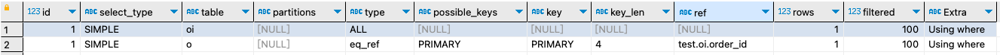
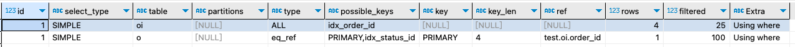
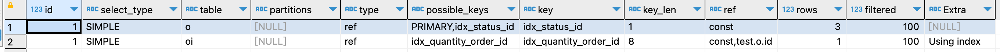

| title                   | tags         | background                                                   | auther | isSlow |
| ----------------------- | ------------ | ------------------------------------------------------------ | ------ | ------ |
| MySQL中join查询如何优化 | MySQL/数据库 | 最近在项目开发中遇到了一个和复杂的sql，这个sql中使用了大量的左外连接查询，所以就想着把这句sql做下优化，通过这篇文章和大家一起探讨下join查询的优化如何来做。 | depers | true   |

# 创建实验表

为了方便演示，这里首先创建两张表：

```sql
-- 创建订单表
CREATE TABLE orders (
    id INT PRIMARY KEY AUTO_INCREMENT COMMENT '订单ID，主键',
    order_no VARCHAR(32) NOT NULL COMMENT '订单编号，唯一',
    user_id INT NOT NULL COMMENT '用户ID',
    total_amount DECIMAL(10, 2) NOT NULL DEFAULT 0.00 COMMENT '订单总金额',
    status TINYINT NOT NULL DEFAULT 1 COMMENT '订单状态：1-待支付 2-已支付 3-已发货 4-已完成 5-已取消',
    payment_method TINYINT COMMENT '支付方式：1-支付宝 2-微信 3-银行卡',
    payment_time DATETIME COMMENT '支付时间',
    create_time DATETIME NOT NULL DEFAULT CURRENT_TIMESTAMP COMMENT '创建时间',
    update_time DATETIME NOT NULL DEFAULT CURRENT_TIMESTAMP ON UPDATE CURRENT_TIMESTAMP COMMENT '更新时间'
) ENGINE=InnoDB DEFAULT CHARSET=utf8mb4 COMMENT='订单表';

-- 创建订单详情表
CREATE TABLE order_items (
    id INT PRIMARY KEY AUTO_INCREMENT COMMENT '详情ID，主键',
    order_id INT NOT NULL COMMENT '订单ID，关联orders.id',
    product_id INT NOT NULL COMMENT '商品ID',
    product_name VARCHAR(100) NOT NULL COMMENT '商品名称',
    unit_price DECIMAL(10, 2) NOT NULL COMMENT '商品单价',
    quantity INT NOT NULL DEFAULT 1 COMMENT '购买数量',
    subtotal DECIMAL(10, 2) NOT NULL COMMENT '小计金额 = unit_price * quantity',
    create_time DATETIME NOT NULL DEFAULT CURRENT_TIMESTAMP COMMENT '创建时间'
) ENGINE=InnoDB DEFAULT CHARSET=utf8mb4 COMMENT='订单详情表';

INSERT INTO orders (id, order_no, user_id, total_amount, status, payment_method, payment_time, create_time, update_time) VALUES(1, '2025122001', 221, 518.20, 1, 1, '2025-12-20 18:20:12', '2025-12-20 21:50:30', '2025-12-20 21:50:30');
INSERT INTO orders (id, order_no, user_id, total_amount, status, payment_method, payment_time, create_time, update_time) VALUES(2, '2025122002', 222, 299.00, 1, 1, '2025-12-20 18:20:12', '2025-12-20 21:50:30', '2025-12-20 21:50:30');
INSERT INTO orders (id, order_no, user_id, total_amount, status, payment_method, payment_time, create_time, update_time) VALUES(3, '2025122003', 223, 320.20, 1, 1, '2025-12-20 18:20:12', '2025-12-20 21:50:30', '2025-12-20 21:50:30');


INSERT INTO order_items (id, order_id, product_id, product_name, unit_price, quantity, subtotal, create_time) VALUES(1, 1, 1, 'iphone17 pro', 518.20, 1, 518.20, '2025-12-20 21:52:55');
INSERT INTO order_items (id, order_id, product_id, product_name, unit_price, quantity, subtotal, create_time) VALUES(2, 1, 1, 'iphone15 pro', 518.20, 1, 518.20, '2025-12-20 21:52:55');
INSERT INTO order_items (id, order_id, product_id, product_name, unit_price, quantity, subtotal, create_time) VALUES(3, 2, 2, '耳机', 299.00, 1, 299.00, '2025-12-20 21:54:11');
INSERT INTO order_items (id, order_id, product_id, product_name, unit_price, quantity, subtotal, create_time) VALUES(4, 3, 3, '帽子', 320.20, 1, 320.20, '2025-12-20 21:54:33');

```

# join查询的顺序

先来看一段sql：

```sql
select * from order o 
left join order_items oi on o.id = oi.order_id
where o.status = 1 and oi.quantity = 1;
```

让我们站在MySQL优化器的角度想一下该如何执行这条sql：

1. 逻辑转换：从 LEFT JOIN 到 INNER JOIN

    因为where条件中使用了`oi.quantity = 1`，所以任何 oi 为 NULL 的行都会被`oi.quantity=1`过滤掉，这条sql会变成内连接查询：

    ```sql
    SELECT *
    FROM order o
    JOIN order_items oi ON o.id = oi.order_id
    WHERE o.status = 1
    AND oi.quantity = 1;
    ```

2. 优化阶段：选择驱动表

    因为变成了内循环，所以MySQL优化器需要重新估算扫描行数和索引效率，决定谁是驱动表。这里我们不确定两张表的各自的总行数，没有新建索引的情况下。

    - **场景 A（o 为驱动表）：** 如果 `status` 上有高效索引，或者 `o` 表满足条件的行数很少。
    - **场景 B（oi 为驱动表）：** 如果 `quantity` 上有高效索引，优化器可能选择先扫描 `oi`。

    通常情况下，MySQL 遵循**“小结果集驱动大结果集”**的原则。

3. 执行阶段：嵌套循环关联 (Nested Loop Join)

    假设优化器选择了 `order o` 作为驱动表，执行流程如下：

    1. **扫描驱动表（o）：**
        - 通过索引（如 `status` 的索引）或者全表扫描，找出所有 `status = 1` 的记录。
    2. **逐行匹配（Loop）：** 对于读取到的每一条 `o` 表记录，获取其 `id` 值。
    3. **查询被驱动表（oi）：**
        - 使用 `o.id` 去 `order_items` 表中查找。
        - **理想状态：** `oi.order_id` 上有索引。MySQL 会直接通过索引定位到关联的行，而不是扫描整个 `oi` 表。
    4. **应用右表过滤：**
        - 在关联到的 `oi` 行中，检查 `quantity = 1` 是否成立。
    5. **结果合并：**
        - 如果匹配成功且条件成立，则将 `o` 和 `oi` 的列合并存入结果集。

通过上面的描述，如果在完全不加索引的情况下，我们来看下执行计划：



从上面的执行计划中我们可以看出，因为上面这句sql被转化为了INNER  JOIN，所以驱动表的选择由优化器决定，从上面可以看出，MySQL选择了`order_items`作为了驱动表，原因也很简单，就是如果选择`orders`作为驱动表的话，两张表都会走全表扫描，而如果使用`order_items`作为驱动表的话，可以使用`orders`表的id索引。

对于`orders`表，如果我们添加如下索引：

```sql
alter table `orders` add index `idx_status_id` (`status`, `id`);
```

对于`order_items`表，我们添加如下索引：

```sql
alter table `order_items` add index `idx_order_id` (`order_id`);
```

加上这两条索引之后，我们再执行一次`explain`查看下执行计划：



你会发现，优化器这一次还是将`order_items`作为驱动表。我们来分析一下：

1. 如果`orders`作为驱动表
    * 首先会全表扫描`orders`表，筛选出`status=1`的记录
    * 拿着订单的id去`order_items`的`idx_order_id`索引寻找匹配项
    * 回表`order_item`，过滤`quantity=1`
2. 如果`order_items`作为驱动表
    * 首先会全表扫描`order_items`表，筛选出`quantity=1`的记录
    * 拿着记录的`order_id`去`orders`表中查找，此时使用的是 **`orders` 表的主键索引**
    * 检查 `status = 1`。

**优化器倾向于方案 B 的原因是：**

- **主键查找极快**：使用 `order_items` 驱动时，在 `orders` 表中是基于 `id`（主键）进行等值查询。在 InnoDB 中，主键查找是效率最高的（聚簇索引），不需要二次回表。
- **数据量估算（Statistics）**：如果 MySQL认为扫描 `order_items` 并通过主键回查 `orders` 的总成本低于全表扫描 `orders` 表再查 `order_items` 辅助索引的成本，它就会反转驱动顺序。

所以这里我觉得最后的索引是：

```sql
alter table `orders` add index `idx_status_id` (`status`, `id`);
alter table `order_items` add index `idx_quantity_order_id` (`quantity`, `order_id`);
```

此时的执行计划：



所以针对join查询新建索引，我的建议是：

1. 选择驱动表和被驱动表，这里我们按照表数据量的大小来做判断，表数据量小的为驱动表

2. 对于驱动表，如何新建索引

    1. 如果有该表的where条件，对于where条件后面的字段要建索引。

    1. 对于join之后的字段也要建索引。

3. 对于被驱动表，如何新建索引

    1. 如果有该表的where条件，对于where条件后面的字段要建索引。

    1. 对于join之后的字段也要建索引。

# join查询优化算法

## 1. Simple Nested-Loop Join(SNJJ，简单嵌套循环连接)

算法思想：

* 对于驱动表取出每一行。
* 对于被驱动表是全表扫描，拿着这一行驱动表记录去和被驱动表进行匹配。

通俗来讲，就是驱动表有10行记录，被驱动表有100行记录，一共要读取10*100=1000行数据，开销极大，效率很低。

## 2. Index Nested-Loop Join (INLJ, 索引嵌套循环连接)

算法思想：

* 前提是**被驱动表中关联查询的字段上面要有索引**，就是on条件后面被驱动表的字段要有索引。
* 从驱动表取出一行数据，根据关联字段直接通过索引去被驱动表中查找。

优点在于，避免了全表扫描被驱动表，查询效率由$O(N \times M)$ 降低为$O(N \times \log M)$（其中 $N$ 为驱动表行数，$M$ 为被驱动表行数）。

## 3. Block Nested-Loop Join (BNL, 块嵌套循环连接)

算法思想：

* **当被驱动表关联字段没有索引时**，MySQL 为了避免 SNLJ 导致的频繁磁盘 I/O，会使用 BNLJ。
* **Join Buffer（连接缓冲区）**：MySQL 会开辟一块内存（`join_buffer_size`），一次性把驱动表的若干行数据加载进去。
* **扫描方式**：扫描一遍被驱动表，将被驱动表的每一行与 Buffer 中的所有驱动表数据进行比对。

**优点**：减少了扫描被驱动表的次数。例如 Buffer 能存 10 行，那么扫描被驱动表的次数就减少到了原来的 1/10。

 join_buffer 在 BNL 算法里的作用，是暂存驱动表的数据。

## 4. Batched Key Access (BKA, 批量键访问)

### MRR优化

假设我们新建了一张表t1，具体sql如下：

```sql
create table `t1` (
  `id` int primary key auto_increment comment '主键',
  `a` int not null default '0' comment 'a字段',
  key `idx_a` (`a`)
) engine=innodb comment 't1表';

-- 插入一千行数据
drop procedure if exists idata;
delimiter $$
create procedure idata()
begin 
  declare i int; 
  set i=1; 
  while(i<=1000)do 
    insert into t1 values(i, 1001-i); 
    set i=i+1; 
  end while; 
end$$
delimiter ;
call idata();
```

接着我们执行下面这条语句：

```Java
select * from t1 where a>=1 and a<=100;
```

因为给`a`字段加了索引，所以这句sql会先去非聚簇索引树上查询满足条件的a和id，然后再一行一行的到聚簇索引上进行回表查询，我们之间有意将a字段和id的循序做成逆序的效果是，如果a为100，id为1；如果a为1，id为100，也就是id是倒序的，这样回表操作就会变成随机访问，性能很差。**如果按照主键的递增顺序查询的话，对磁盘的读比较接近顺序读，能够提升读性能。**

MRR 优化的设计思路。此时，语句的执行流程变成了这样：

1. 根据索引 a，定位到满足条件的记录，将 id 值放入 read_rnd_buffer 中 ;
2. 将 read_rnd_buffer 中的 id 进行递增排序；
3. 排序后的 id 数组，依次到主键 id 索引中查记录，并作为结果返回。

>  read_rnd_buffer 的大小是由 read_rnd_buffer_size 参数控制的。
>
> 另外需要说明的是，如果你想要稳定地使用 MRR 优化的话，需要设置set optimizer_switch="mrr_cost_based=off"。

此时执行explain查询执行计划：


**MRR 能够提升性能的核心**在于，这条查询语句在索引 a 上做的是一个范围查询（也就是说，这是一个多值查询），可以得到足够多的主键 id。这样通过排序以后，再去主键索引查数据，才能体现出“顺序性”的优势。

### Batched Key Access (BKA)

BKA是对 **Index Nested-Loop Join** 的一种增强，通常配合 **MRR (Multi-Range Read)** 技术使用。

算法思想：

* 将驱动表的join key取出放到join buffer中。
* 将驱动表的join key排序后批量发送给被驱动表的索引。
* 对被驱动表进行“批量索引查找”，一次性返回匹配行。

如果要使用 BKA 优化算法的话，你需要在执行 SQL 语句之前，先设置：

```Java
set optimizer_switch='mrr=on,mrr_cost_based=off,batched_key_access=on';
```

其中，前两个参数的作用是要启用 MRR。这么做的原因是，BKA 算法的优化要依赖于 MRR。

## 5. Hash Join (哈希连接)

在 **MySQL 8.0.18** 之后，官方引入了 Hash Join 来替代 BNLJ，成为处理**等值连接（Equi-join）且无索引**场景的主流算法。

算法思想：

* 将驱动表的数据按 Join Key 计算 Hash 值，存入内存中的 Hash Table。
* 扫描被驱动表，对每一行计算 Hash 值，去 Hash Table 中直接匹配。

- **优点**：通常比 BNLJ 快得多，因为它将匹配的时间复杂度从 $O(N)$ 降到了 $O(1)$。

> **注意**：从 MySQL 8.0.20 开始，BNLJ 已被完全废弃，所有原本使用 BNLJ 的场景都会自动切换为 Hash Join。

# join查询的优化要点

## 1. 索引优化

* **为被驱动表（Inner Table）的关联字段建立索引**：确保 `ON` 子句中的字段在被驱动表中都有索引。这样 MySQL 可以将算法从效率极低的 BNLJ 或 Hash Join 转换为高效的 **Index Nested-Loop Join (INLJ)**。

* **保证字段类型完全一致**：连接字段的**数据类型**、**字符集（Charset）**和**排序规则（Collation）**必须一致。如果一个是 `int` 另一个是 `varchar`，或者一个是 `utf8` 另一个是 `utf8mb4`，索引将失效，导致隐式类型转换。

* **覆盖索引（Covering Index）**：如果索引中已经包含了 `SELECT` 和 `ON` 需要的所有字段，MySQL 就可以直接从索引树中读取数据，无需回表（Look up the actual data rows），速度会提升数倍。

## 2. “小表驱动大表”：执行顺序优化

**驱动表的定义**：这里的“小表”并不是指总行数少的表，而是指**经过 `WHERE` 条件过滤后，参与 JOIN 的结果集较小**的表。

**对于 `INNER JOIN`：** MySQL 通常会自动选择小表驱动大表，但如果使用了 `STRAIGHT_JOIN` 关键字，MySQL 会强制按照语句中表的顺序进行 JOIN。

**对于 `LEFT JOIN`：** 左表是驱动表，右表是被驱动表。优化器不会改变这个顺序。确保左表的数据量相对较小，或者在左表的 WHERE 条件能显著过滤数据。

可以强制指定顺序：

```sql
SELECT *
FROM small_table
STRAIGHT_JOIN big_table ON ...
```

**提前过滤**：尽量在 JOIN 之前通过 `WHERE` 子句过滤掉不必要的数据。

## 3. SQL 编写技巧

**拒绝 `SELECT *`**：只取需要的列。这不仅减少了网络传输，更重要的是能让 **Join Buffer** 存储更多的行。Buffer 存得越多，扫描被驱动表的次数就越少。

**优先使用 INNER JOIN**：如果不需要保留左/右表的 NULL 记录，优先使用 `INNER JOIN`。`LEFT JOIN` 会限制优化器的调整空间（因为它必须先读左表）。

**避免在关联字段上使用函数**：

- ❌ `ON DATE(a.time) = b.date`（索引失效）
- ✅ `ON a.time >= '2025-01-01' AND a.time < '2025-01-02'`

## 4. 系统参数微调

当无法通过索引优化（如非等值连接或临时表操作）时，可以调整内存参数：

- **`join_buffer_size`**：控制 Block Nested-Loop Join 使用的内存大小。
    - 如果有很多没有索引的 JOIN，可以适当调大该值（默认通常为 256KB）。
    - **建议**：仅在当前会话（Session）中调大，避免全局设置导致内存溢出。
- **`optimizer_switch`**：
    - 在 MySQL 8.0 中，可以控制是否开启 **Hash Join**。
    - 在支持 **BKA (Batched Key Access)** 的场景下，确保 `mrr=on, mrr_cost_based=off, batched_key_access=on` 开启，以提升磁盘顺序读取性能。

# 参考文章

* [MySQL 查询优化：JOIN 操作背后的性能代价与更优选择](https://juejin.cn/post/7497886347308466211?searchId=202512112200456F1FAE7D5F5894D8C746#heading-17)