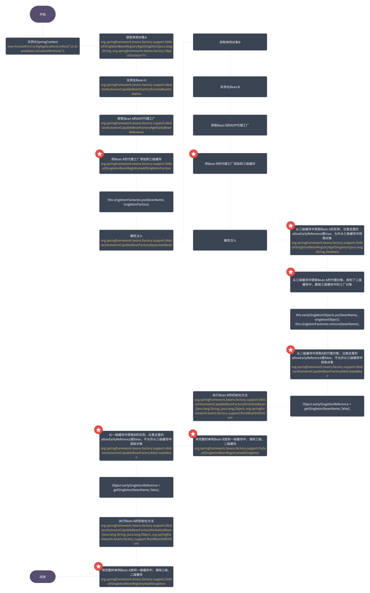

| title                      | tags   | background                                                   | auther | isSlow |
| -------------------------- | ------ | ------------------------------------------------------------ | ------ | ------ |
| Spring是如何解决循环依赖的 | Spring | 最近在读jsoncat的源码，代码实现中使用的是两级缓存，就想研究下Spring是如何为解决循环依赖的，再加上这是一道很好的面试题，在这里做下总结。 | depers | true   |

# 创建Bean的三个方法

Spring在创建Bean的过程中分为三步

1. 实例化，对应方法：`AbstractAutowireCapableBeanFactory`中的`createBeanInstance`方法，简单理解就是new了一个对象。
2. 属性注入，对应方法：`AbstractAutowireCapableBeanFactory`的`populateBean`方法，为实例化中new出来的对象填充属性。
3. 初始化，对应方法：`AbstractAutowireCapableBeanFactory`的`initializeBean`，执行aware接口中的方法，初始化方法，完成AOP代理。

# 三级缓存

Spring 中使用提供了**三级缓存**解决循环的问题，三级缓存分别如下：

- **SingletonObjects**：**一级缓存**，存储完整的 Bean
- **EarlySingletonObjects**：**二级缓存**，存储从第三级缓存中创建出代理对象的 Bean，即半成品的 Bean
- **SingletonFactory**：**三级缓存**，提前暴露的一个单例工厂，二级缓存中存储的就是从这个工厂中获取到的对象

# 程序调用图



# 在给B属性注入的时候，为啥注入了A的代理对象？

因为不管是`cglib`代理还是`jdk`动态代理生成的代理类，内部都持有一个目标类的引用，当调用代理对象的方法时，实际会去调用目标对象的方法，A完成初始化相当于代理对象自身也完成了初始化。

# 如果只使用一级缓存，可以吗

如果只使用一级缓存，也就是说只存储完整的Bean，假设我们先去实例化A，此时属性注入的时候要实例化B，然后我们再去实例化A，然后循环依赖仍旧存在，因为依赖注入发生在属性实例化之前，一级缓存中无法保存完整实例化的对象。

# 为什么要使用三级缓存？

从程序调用图中，我们可以看到，对于每个实例化的Bean都会创建一个AOP的代理工厂，没有循环依赖，也会将其添加到三级缓存中。但是只有产生循环依赖才会去利用代理工厂去生成代理对象。

按照Spring AOP的设计，代理对象是通过`AnnotationAwareAspectJAutoProxyCreator`这个后置处理器来完成的，在这个后置处理的`postProcessAfterInitialization`方法中对初始化后的Bean完成`AOP`代理。

如果出现了循环依赖，那没有办法，只有给Bean先创建代理，但是没有出现循环依赖的情况下，设计之初就是让Bean在生命周期的最后一步完成代理而不是在实例化后就立马完成代理。

# 循环依赖被完全解决了吗

## 1.  循环依赖只支持单例对象

对于 `scope` 为 `property` 的 Bean，三级缓存是没有解决循环依赖的。因为它们的作用域是原型，每次使用到时都会创建一个新对象，不进缓存。

1. ## 通过构造器注入的类无法解决循环依赖

```TypeScript
@Component
public class A {


    private B b;


    public A(B b) {
        this.b = b;
    }

    public void print() {
        System.out.println("我是A");
    }

}
@Component
public class B {

    private A a;

    public B(A a) {
        this.a = a;
    }
}
public class Test {

    public static void main(String[] args) {
        ApplicationContext ctx = new AnnotationConfigApplicationContext("cn.bravedawn.circularreferences");
        A a = ctx.getBean("a", A.class);
        a.print();
    }
}
```

运行输出如下：

```Python
Exception in thread "main" org.springframework.beans.factory.BeanNotOfRequiredTypeException: Bean named 'a' is expected to be of type 'cn.bravedawn.contructInjectCircularreference.A' but was actually of type 'cn.bravedawn.circularreferences.A'
        at org.springframework.beans.factory.support.AbstractBeanFactory.adaptBeanInstance(AbstractBeanFactory.java:411)
        at org.springframework.beans.factory.support.AbstractBeanFactory.doGetBean(AbstractBeanFactory.java:392)
        at org.springframework.beans.factory.support.AbstractBeanFactory.getBean(AbstractBeanFactory.java:205)
        at org.springframework.context.support.AbstractApplicationContext.getBean(AbstractApplicationContext.java:1240)
        at cn.bravedawn.contructInjectCircularreference.Test.main(Test.java:15)
```

建议改为使用 Setter/字段注入。

```TypeScript
@Component
public class ServiceA {
    @Autowired  // 字段注入
    private ServiceB serviceB;
    
    // 或者 Setter 注入
    @Autowired
    public void setServiceB(ServiceB serviceB) {
        this.serviceB = serviceB;
    }
}

@Component
public class ServiceB {
    @Autowired
    private ServiceA serviceA;
    
    @Autowired
    public void setServiceA(ServiceA serviceA) {
        this.serviceA = serviceA;
    }
}
```

# 参考文章

- [面试必杀技，讲一讲Spring中的循环依赖](https://developer.aliyun.com/article/766880)
- [面试官：详细介绍一下Spring的循环依赖](https://juejin.cn/post/7347210988259835914?searchId=20251205155918DB81712559C56E8ED9BE)
- [Spring---循环依赖探讨](https://juejin.cn/post/7483329722496581658?searchId=20251205155918DB81712559C56E8ED9BE)