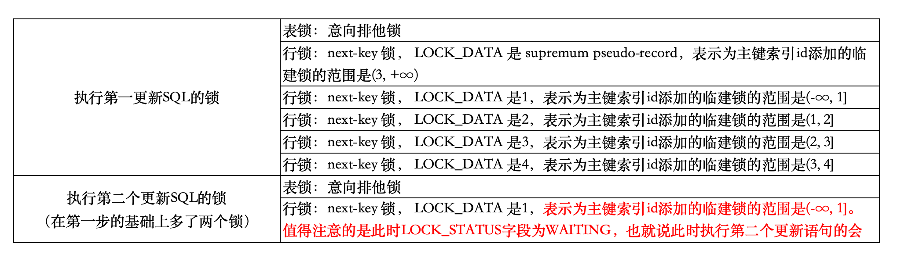

| title                    | tags          | background                                                   | auther | isSlow |
| ------------------------ | ------------- | ------------------------------------------------------------ | ------ | ------ |
| update没加索引引发的问题 | MySQL/锁/事务 | 最近在生产项目中遇到了一个问题，当我在更新一张表的记录时，发现表更新的速度很慢，最后加了索引之后问题就被解决了，下面我们一起来探究下，为什么update没有加索引会导致更新操作很慢？ | depers | true   |

最近在生产项目中遇到了一个问题，当我在更新一张表的记录时，发现表更新的速度很慢，最后加了索引之后问题就被解决了，下面我们一起来探究下，为什么update没有加索引会导致更新操作很慢？

# 实验演示

首先，我的业务表大概长这样：

```sql
CREATE TABLE `order` (
  `id` bigint NOT NULL AUTO_INCREMENT COMMENT 'id',
  `aoccunt` varchar(100) COLLATE utf8mb4_general_ci NOT NULL COMMENT '账号',
  `status` tinyint NOT NULL COMMENT '订单状态，0-待代付，1-代付成功，2-代付失败',
  PRIMARY KEY (`id`)
) ENGINE=InnoDB DEFAULT CHARSET=utf8mb4 COLLATE=utf8mb4_general_ci COMMENT='订单表';
```


我的业务逻辑**读取对账单文件，一条一条的更新订单表的状态**，根据**账号字段**，将`status`字段更新为**1-代付成功。**

我的更新sql如下所示：

```SQL
update order set status = '1' where aoccunt = 'xxx';
```

## 执行第一个更新SQL

下面我通过sql来演示下：

第一步：开启事务，执行更新sql：

```SQL
begin;

update `order` set status = 1 where aoccunt  = '1000';
```

第二步：查看锁的执行情况，接着执行：

```SQL
select * from performance_schema.data_locks\G;
```

执行的结果如下：

```SQL
mysql> select * from performance_schema.data_locks\G;
*************************** 1. row ***************************
               ENGINE: INNODB
       ENGINE_LOCK_ID: 5477208752:1631:5282785896
ENGINE_TRANSACTION_ID: 359000
            THREAD_ID: 216
             EVENT_ID: 57
        OBJECT_SCHEMA: mybatis
          OBJECT_NAME: order
       PARTITION_NAME: NULL
    SUBPARTITION_NAME: NULL
           INDEX_NAME: NULL
OBJECT_INSTANCE_BEGIN: 5282785896
            LOCK_TYPE: TABLE
            LOCK_MODE: IX
          LOCK_STATUS: GRANTED
            LOCK_DATA: NULL
*************************** 2. row ***************************
               ENGINE: INNODB
       ENGINE_LOCK_ID: 5477208752:569:4:1:5285383192
ENGINE_TRANSACTION_ID: 359000
            THREAD_ID: 216
             EVENT_ID: 57
        OBJECT_SCHEMA: mybatis
          OBJECT_NAME: order
       PARTITION_NAME: NULL
    SUBPARTITION_NAME: NULL
           INDEX_NAME: PRIMARY
OBJECT_INSTANCE_BEGIN: 5285383192
            LOCK_TYPE: RECORD
            LOCK_MODE: X
          LOCK_STATUS: GRANTED
            LOCK_DATA: supremum pseudo-record
*************************** 3. row ***************************
               ENGINE: INNODB
       ENGINE_LOCK_ID: 5477208752:569:4:2:5285383192
ENGINE_TRANSACTION_ID: 359000
            THREAD_ID: 216
             EVENT_ID: 57
        OBJECT_SCHEMA: mybatis
          OBJECT_NAME: order
       PARTITION_NAME: NULL
    SUBPARTITION_NAME: NULL
           INDEX_NAME: PRIMARY
OBJECT_INSTANCE_BEGIN: 5285383192
            LOCK_TYPE: RECORD
            LOCK_MODE: X
          LOCK_STATUS: GRANTED
            LOCK_DATA: 1
*************************** 4. row ***************************
               ENGINE: INNODB
       ENGINE_LOCK_ID: 5477208752:569:4:3:5285383192
ENGINE_TRANSACTION_ID: 359000
            THREAD_ID: 216
             EVENT_ID: 57
        OBJECT_SCHEMA: mybatis
          OBJECT_NAME: order
       PARTITION_NAME: NULL
    SUBPARTITION_NAME: NULL
           INDEX_NAME: PRIMARY
OBJECT_INSTANCE_BEGIN: 5285383192
            LOCK_TYPE: RECORD
            LOCK_MODE: X
          LOCK_STATUS: GRANTED
            LOCK_DATA: 2
*************************** 5. row ***************************
               ENGINE: INNODB
       ENGINE_LOCK_ID: 5477208752:569:4:4:5285383192
ENGINE_TRANSACTION_ID: 359000
            THREAD_ID: 216
             EVENT_ID: 57
        OBJECT_SCHEMA: mybatis
          OBJECT_NAME: order
       PARTITION_NAME: NULL
    SUBPARTITION_NAME: NULL
           INDEX_NAME: PRIMARY
OBJECT_INSTANCE_BEGIN: 5285383192
            LOCK_TYPE: RECORD
            LOCK_MODE: X
          LOCK_STATUS: GRANTED
            LOCK_DATA: 3
*************************** 6. row ***************************
               ENGINE: INNODB
       ENGINE_LOCK_ID: 5477208752:569:4:5:5285383192
ENGINE_TRANSACTION_ID: 359000
            THREAD_ID: 216
             EVENT_ID: 57
        OBJECT_SCHEMA: mybatis
          OBJECT_NAME: order
       PARTITION_NAME: NULL
    SUBPARTITION_NAME: NULL
           INDEX_NAME: PRIMARY
OBJECT_INSTANCE_BEGIN: 5285383192
            LOCK_TYPE: RECORD
            LOCK_MODE: X
          LOCK_STATUS: GRANTED
            LOCK_DATA: 4
6 rows in set (0.00 sec)
```

## 执行第二个更新SQL

第三步：新启会话接着执行下面这句sql，会被阻塞：

```SQL
begin;

update `order` set status = 1 where aoccunt  = '1001';
```

第四步：查看锁的执行情况，接着执行：

```SQL
select * from performance_schema.data_locks\G;
```

执行的结果如下：

```SQL
mysql> select * from performance_schema.data_locks\G;
*************************** 1. row ***************************
               ENGINE: INNODB
       ENGINE_LOCK_ID: 5477209544:1631:5282786920
ENGINE_TRANSACTION_ID: 359001
            THREAD_ID: 223
             EVENT_ID: 45
        OBJECT_SCHEMA: mybatis
          OBJECT_NAME: order
       PARTITION_NAME: NULL
    SUBPARTITION_NAME: NULL
           INDEX_NAME: NULL
OBJECT_INSTANCE_BEGIN: 5282786920
            LOCK_TYPE: TABLE
            LOCK_MODE: IX
          LOCK_STATUS: GRANTED
            LOCK_DATA: NULL
*************************** 2. row ***************************
               ENGINE: INNODB
       ENGINE_LOCK_ID: 5477209544:569:4:2:5285387800
ENGINE_TRANSACTION_ID: 359001
            THREAD_ID: 223
             EVENT_ID: 45
        OBJECT_SCHEMA: mybatis
          OBJECT_NAME: order
       PARTITION_NAME: NULL
    SUBPARTITION_NAME: NULL
           INDEX_NAME: PRIMARY
OBJECT_INSTANCE_BEGIN: 5285387800
            LOCK_TYPE: RECORD
            LOCK_MODE: X
          LOCK_STATUS: WAITING
            LOCK_DATA: 1
*************************** 3. row ***************************
               ENGINE: INNODB
       ENGINE_LOCK_ID: 5477208752:1631:5282785896
ENGINE_TRANSACTION_ID: 359000
            THREAD_ID: 216
             EVENT_ID: 57
        OBJECT_SCHEMA: mybatis
          OBJECT_NAME: order
       PARTITION_NAME: NULL
    SUBPARTITION_NAME: NULL
           INDEX_NAME: NULL
OBJECT_INSTANCE_BEGIN: 5282785896
            LOCK_TYPE: TABLE
            LOCK_MODE: IX
          LOCK_STATUS: GRANTED
            LOCK_DATA: NULL
*************************** 4. row ***************************
               ENGINE: INNODB
       ENGINE_LOCK_ID: 5477208752:569:4:1:5285383192
ENGINE_TRANSACTION_ID: 359000
            THREAD_ID: 216
             EVENT_ID: 57
        OBJECT_SCHEMA: mybatis
          OBJECT_NAME: order
       PARTITION_NAME: NULL
    SUBPARTITION_NAME: NULL
           INDEX_NAME: PRIMARY
OBJECT_INSTANCE_BEGIN: 5285383192
            LOCK_TYPE: RECORD
            LOCK_MODE: X
          LOCK_STATUS: GRANTED
            LOCK_DATA: supremum pseudo-record
*************************** 5. row ***************************
               ENGINE: INNODB
       ENGINE_LOCK_ID: 5477208752:569:4:2:5285383192
ENGINE_TRANSACTION_ID: 359000
            THREAD_ID: 216
             EVENT_ID: 57
        OBJECT_SCHEMA: mybatis
          OBJECT_NAME: order
       PARTITION_NAME: NULL
    SUBPARTITION_NAME: NULL
           INDEX_NAME: PRIMARY
OBJECT_INSTANCE_BEGIN: 5285383192
            LOCK_TYPE: RECORD
            LOCK_MODE: X
          LOCK_STATUS: GRANTED
            LOCK_DATA: 1
*************************** 6. row ***************************
               ENGINE: INNODB
       ENGINE_LOCK_ID: 5477208752:569:4:3:5285383192
ENGINE_TRANSACTION_ID: 359000
            THREAD_ID: 216
             EVENT_ID: 57
        OBJECT_SCHEMA: mybatis
          OBJECT_NAME: order
       PARTITION_NAME: NULL
    SUBPARTITION_NAME: NULL
           INDEX_NAME: PRIMARY
OBJECT_INSTANCE_BEGIN: 5285383192
            LOCK_TYPE: RECORD
            LOCK_MODE: X
          LOCK_STATUS: GRANTED
            LOCK_DATA: 2
*************************** 7. row ***************************
               ENGINE: INNODB
       ENGINE_LOCK_ID: 5477208752:569:4:4:5285383192
ENGINE_TRANSACTION_ID: 359000
            THREAD_ID: 216
             EVENT_ID: 57
        OBJECT_SCHEMA: mybatis
          OBJECT_NAME: order
       PARTITION_NAME: NULL
    SUBPARTITION_NAME: NULL
           INDEX_NAME: PRIMARY
OBJECT_INSTANCE_BEGIN: 5285383192
            LOCK_TYPE: RECORD
            LOCK_MODE: X
          LOCK_STATUS: GRANTED
            LOCK_DATA: 3
*************************** 8. row ***************************
               ENGINE: INNODB
       ENGINE_LOCK_ID: 5477208752:569:4:5:5285383192
ENGINE_TRANSACTION_ID: 359000
            THREAD_ID: 216
             EVENT_ID: 57
        OBJECT_SCHEMA: mybatis
          OBJECT_NAME: order
       PARTITION_NAME: NULL
    SUBPARTITION_NAME: NULL
           INDEX_NAME: PRIMARY
OBJECT_INSTANCE_BEGIN: 5285383192
            LOCK_TYPE: RECORD
            LOCK_MODE: X
          LOCK_STATUS: GRANTED
            LOCK_DATA: 4
8 rows in set (0.00 sec)           
```

通过与第二步的比较，我们可以看到，这次查询锁的情况，多了两行记录：

```SQL
*************************** 1. row ***************************
               ENGINE: INNODB
       ENGINE_LOCK_ID: 5477209544:1631:5282786920
ENGINE_TRANSACTION_ID: 359001
            THREAD_ID: 223
             EVENT_ID: 45
        OBJECT_SCHEMA: mybatis
          OBJECT_NAME: order
       PARTITION_NAME: NULL
    SUBPARTITION_NAME: NULL
           INDEX_NAME: NULL
OBJECT_INSTANCE_BEGIN: 5282786920
            LOCK_TYPE: TABLE
            LOCK_MODE: IX
          LOCK_STATUS: GRANTED
            LOCK_DATA: NULL
*************************** 2. row ***************************
               ENGINE: INNODB
       ENGINE_LOCK_ID: 5477209544:569:4:2:5285387800
ENGINE_TRANSACTION_ID: 359001
            THREAD_ID: 223
             EVENT_ID: 45
        OBJECT_SCHEMA: mybatis
          OBJECT_NAME: order
       PARTITION_NAME: NULL
    SUBPARTITION_NAME: NULL
           INDEX_NAME: PRIMARY
OBJECT_INSTANCE_BEGIN: 5285387800
            LOCK_TYPE: RECORD
            LOCK_MODE: X
          LOCK_STATUS: WAITING
            LOCK_DATA: 1
```

# 锁的情况统计



从上面的表格中，我们可以看到在执行第一条更新sql时，在该事务未提交的情况下，其他事务就会被阻塞。这是因为第一个事务的`update`语句中`where`条件没有索引列，触发了全表扫描，在扫描过程中会对索引加锁，所以全表扫描的场景下，所有记录都会被加锁，也就是这条`update`语句产生了 4 个记录锁和 5 个间隙锁，相当于锁住了全表。


如果没有使用索引，就会给全表的加上 next-key 锁， 那么锁就会持续很长一段时间，直到事务结束，而这期间除了 `select ... from`语句，其他语句都会被锁住不能执行，业务会因此停滞。

# 使用explain查看执行计划

## 在没有为`account`字段添加索引之前

执行sql语句：`explain update `order` set status = 1 where aoccunt  = '1000';`


这里我们主要来看type字段，type表示数据扫描类型，这里的值是**index（全索引扫描）**，这表示MySQL 正在**遍历整个索引树**来查找数据，也就是说**数据库会遍历主键id构建的聚簇索引树来匹配数据**。

## 在为`account`字段添加索引后

首先执行添加索引的操作，执行sql：

接着再执行sql：`explain update `order` set status = 1 where account = '1000';`

此时type字段的值是**range（索引范围扫描）**，range 表示采用了索引范围扫描，一般在 where 子句中使用 < 、>、in、between 等关键词，只检索给定范围的行，属于范围查找。从这一级别开始，**索引的作用会越来越明显，因此我们需要尽量让** **SQL** **查询可以使用到 range 这一级别及以上的 type 访问方式。**


# 结论

**当我们要执行 update 语句的时候，确保 where 条件中带上了索引列**，并且在测试机确认该语句是否走的是索引扫描，防止因为扫描全表，而对表中的所有记录加上锁。