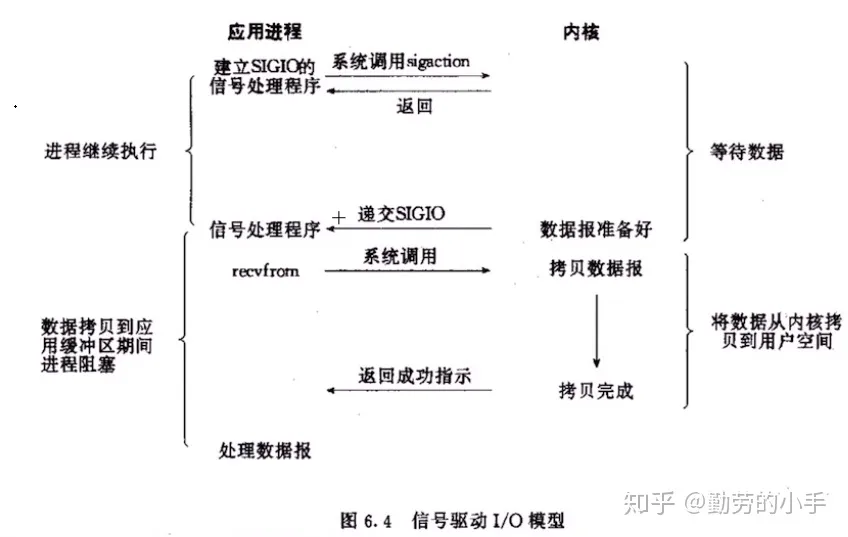
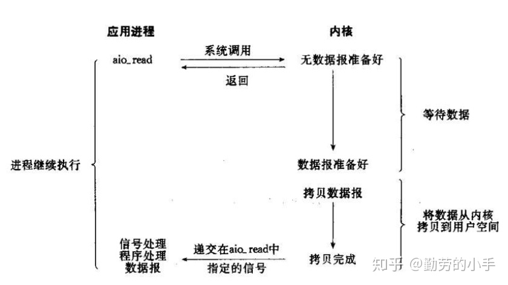
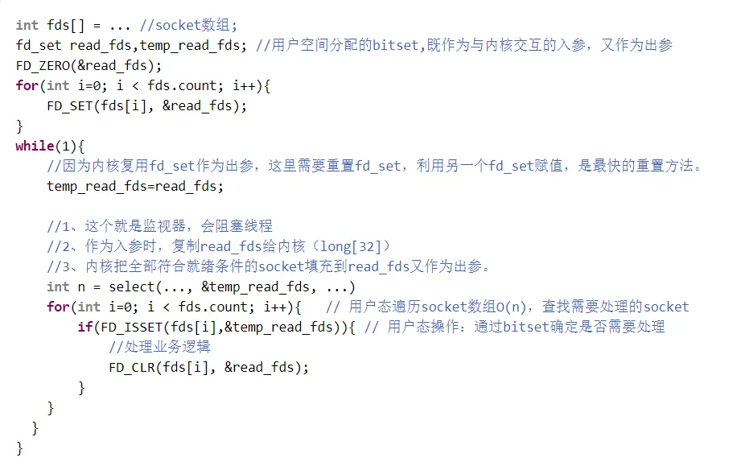
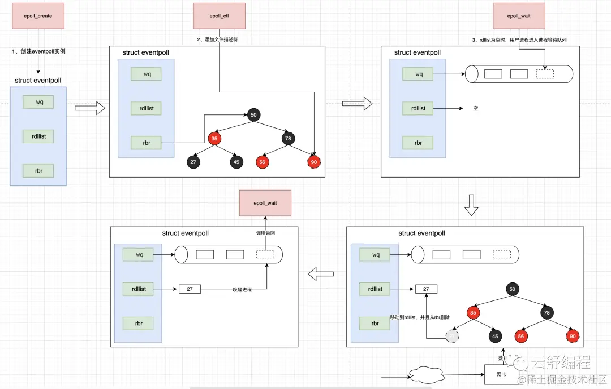
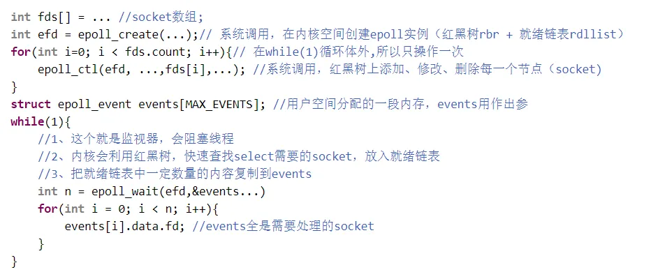

| title      | tags | background                                                   | auther | isSlow |
| ---------- | ---- | ------------------------------------------------------------ | ------ | ------ |
| IO多路复用 | IO   | 之前在项目中用到了Nginx和Netty这些开源组件，对其底层优化的知识点理解不深入，这里我通过这篇文章进行步讨论下IO多路复用底层原理。 | depers | true   |

# 前言

## Linux 中的 I/O 模型

首先我们来梳理下 Linux 中的 IO 模型：

1. Blocking I/O

   
   阻塞 IO 就是当应用发起读取数据申请时，在内核数据没有准备好之前，应用进程会一直处于等待数据状态，直到内核把数据准备好了交给应用才结束。
   在这种 I/O 模型下，我们不得不为每一个 Socket 都分配一个线程，这会造成很大的资源浪费。
   Blocking I/O 优缺点都非常明显。优点是**简单易用**，对于本地 I/O 而言性能很高。缺点是处理网络 I/O 时，造成**进程阻塞空等，浪费资源**。
   注: `read() ` 和 `recvfrom()` 的区别是，前者从文件系统读取数据，后者从 socket 接收数据。

2. No-Blocking I/O

   非阻塞 I/O 隔一段时间就发起 system call 看数据是否就绪(ready)。

   如果数据就绪，就从 kernel space 复制到 user space，操作数据; 如果还没就绪，kernel 会**立即**返回 `EWOULDBLOCK` 这个错误。
   
   Non-blocking I/O 的优势在于，**进程发起 I/O 操作时，不会因为数据还没就绪而阻塞**，这就是”非阻塞”的含义。缺点是**对于 Socket 而言，大量的 system call 十分消耗 CPU**。

3. I/O multiplexing (`select` 、`poll`、 `epoll`)

   I/O Multiplexing 又叫 IO 多路复用，这是借用了集成电路多路复用中的概念。它优化了非阻塞 I/O 大量发起 system call 的问题。

   上面介绍的 I/O 模型都是直接发起 I/O 操作，而 I/O Multiplexing 首先向 kernel 发起 system call，传入 file descriptor 和感兴趣的事件(readable、writable 等)，让 kernel 监测，当其中一个或多个 fd 数据就绪，就会返回结果。程序再发起真正的 I/O 操作 `recvfrom` 读取数据。
   
   在 linux 中，有 3 种 system call 可以让内核监测 file descriptors，分别是 select、poll、epoll。关于这三种实现的细节，我们在后续的逻辑中再讨论。

4. Signal Driven I/O (`SIGIO`)

   首先开启套接口信号驱动 IO 功能，并通过系统调用 `sigaction` 执行一个信号处理函数，此时请求即刻返回，当数据准备就绪时，就生成对应进程的 SIGIO 信号，通过信号回调通知应用线程调用 `recvfrom` 来读取数据。

   IO 复用模型里面的 select 虽然可以监控多个 fd 了，但 `select` 其实现的本质上还是通过不断的轮询 fd 来监控数据状态， 因为大部分轮询请求其实都是无效的，所以信号驱动 IO 意在通过这种建立信号关联的方式，实现了发出请求后只需要等待数据就绪的通知即可，这样就可以避免大量无效的数据状态轮询操作。
   

5. Asynchronous I/O (the POSIX `aio_` functions)

   通过观察我们发现，不管是 IO 复用还是信号驱动，我们要读取一个数据总是要发起两阶段的请求，第一次发送读取请求，询问数据状态是否准备好，第二次发送 `recvform` 请求读取数据。

   应用只需要向内核发送一个 `read` 请求，告诉内核它要读取数据后即刻返回；内核收到请求后会建立一个信号联系，当数据准备就绪，内核会主动把数据从内核复制到用户空间，等所有操作都完成之后，内核会发起一个通知告诉应用，我们称这种一劳永逸的模式为异步 IO 模型。
   

## 阻塞和非阻塞

阻塞 I/O 发起真正的 I/O 操作时(如 `read`、`recvfrom` 等)将会阻塞等待 kernel 数据就绪。非阻塞 I/O 会不断发起 system call，直到 kernel 数据就绪。

## I/O multiplexing 是非阻塞 I/O 吗

不是。

不管是 select、poll、epoll 都会导致进程阻塞。发起真正的 IO 操作时(比如 `recvfrom`)，进程也会阻塞。

I/O Multiplexing 优点在于一次性可以监控大量的 file descriptors。

## 同步和异步

POSIX 对这两个术语定义如下:

- 同步 I/O 操作将会造成请求进程阻塞，直到 I/O 操作完成
- 异步 I/O 操作不会造成进程阻塞

根据上面的定义我们可以看出，前面 4 种 I/O 模型都是同步 I/O，因为它们的 I/O 操作(recvfrom)都会造成进程阻塞。只有最后一个 I/O 模型匹配异步 I/O 的定义。

**特别注意: select、poll、epoll 并不是 I/O 操作，read、recvfrom 这些才是。**

## Java 中支持的 I/O 模型

Java 中的支持的 I/O 模型有三种，分别是：

- BIO（Blocking I/O）

  Java 的 BIO 就是基于 Linux 的 Blocking I/O 模型进行实现的，思想是一样的。

- NIO（Non-blocking/New I/O）

  Java 中的 NIO 不是指非阻塞 IO，是基于 Liunx 的 I/O multiplexing 进行实现的。

- AIO（Asynchronous I/O）
  
  不完全相同。Java AIO 在 Linux 平台的实现并非直接基于 Linux 原生 AIO (io_submit 等系统调用)，而是主要使用了以下混合实现方式：
  
  1. 在 Linux 上，Java AIO 实际上使用了 epoll + 线程池模拟 的方式实现异步效果
  2. 只有 文件 I/O 部分可能会尝试使用 Linux 原生 AIO (libaio)
  3. Windows 平台则使用了真正的 IOCP (完成端口) 实现

# IO 多路复用解决的问题是什么

简单的 BIO 模型读写时会阻塞，从而导致 CPU 空转，利用率上不去。

多线程版本的 BIO 虽然读写操作是使用线程池异步去做处理的，提升了 CPU 的利用率，但是大量线程的创建和销毁成本很高，线程本身会占用大量内存，线程的上下文切换成本也很高，虽然提升了 CPU 的利用率但是性能的损耗和资源的占用问题也很严重。

所以为了解决 CPU 利用率不高和资源损耗问题，NIO 诞生了。

# IO 多路复用是如何解决这些问题的？

1. 为了优化上线文切换，设计了“IO 多路复用”。其实就是线程复用。
2. 为了优化“内核与监视进程的交互”，设计了三个版本的 API（select，poll，epoll）。

# 网络数据包的处理流程

1. 网卡收到一段客户端请求数据，通过 DMA 方式写入到内存。（DMA 指的是一种允许某些硬件子系统直接访问系统内存的技术，而无需中央处理单元（CPU）的介入。）
2. 网卡向 CPU 发起硬件中断，告诉他有网络数据过来了。
3. 操作系统切换到内核态，对中断进行处理，将网络数据包解析出来，找到端口对应的 PID，然后包装成 socket 发送给那个进程。
4. 操作系统切换为用户态，用户进程处理内核传递过来的 socket 数据。

# select 的工作流程

下面按照 select 系统调用来说明。

1. 当服务端程序接收到一个连接，也可以理解为一个已连接的请求，这里连接就是一个文件描述符，会将这个连接放到文件描述符集合，然后**调用 select 函数将文件描述符集合拷贝到内核里**，让内核来检查是否有网络事件产生。
2. 内核检查的方式很粗暴，就是**通过遍历文件描述符集合**的方式，当检查到有事件产生后，将此 Socket 标记为可读或可写。
3. 最后内核返回 select 的结果给用户线程，即就绪的文件描述符数量。
4. 接着用户程序还需要通过**遍历文件描述符集合**找到可读或可写的 Socket。
5. 最后用户线程对就绪的文件描述符进行读写操作。

**从上面我们可以看到用户程序都是一个线程在进行处理。**

**所谓 IO 多路复用指的就是使用一个或者几个线程去监控多个网络请求，由他们去完成数据准备阶段的操作。当有数据准备就绪之后再分配对应的线程去读取数据，这样就可以使用少量的线程维护大量的网络请求，这就是 IO 多路复用。**

**IO 多路复用的复用指的是复用线程，而不是 IO 连接，目的是让少量线程能够处理多个 IO 连接。**

下图是 select 的代码示例：

# epoll 的工作流程

epoll 实例中有三个关键结构：

- `wq`：当用户进程执行了 `epoll_wait` 导致了阻塞后，用户进程就会存储到这，等待后续数据准备完成后唤醒。这里我叫他**进程阻塞队列**。
- `rdllist`：当某个文件描述符就绪了后，就会从 `rbr` 复制到这。其本质是一个链表。这里我叫他**就绪链表**。
- `rbr`：用户调用 `epoll_ctl` 增加的文件描述都存储在这，其本质是一颗**红黑树**。

从上面的流程图中可以看到，epoll 涉及到三个关键的函数：

- `epoll_create`：创建一个 epoll 实例。
- `epoll_ctl`：在创建完 epoll 实例之后，可以通过调用 `epoll_ctl ` 往 `epoll` 实例增加、修改或删除需要监控的 IO 事件。
- `epoll_wait`：调用该函数等待 I/O 事件就绪，返回的是就绪文件描述符的个数。
- `epoll_event_callback()`：这个函数并没有在上图中被标识出来，这个函数是操作系统内核调用的，当发生客户端三路握手连入、可读、可写、客户端断开等情况时，操作系统会调用这个函数，用以往双向链表中增加一个节点。

看完上面的的相关函数和参数后，我们来具体看一看 epoll 执行的过程：

1. 用户程序调用 `epoll_create` 函数在操作系统内核中创建 `epoll` 实例（包含一个红黑树和一个双链表）。
2. 接着调用 `epoll_ctl` 函数将文件描述符添加到 epoll 实例的 `rbr` 红黑树中，并指定感兴趣的事件类型。
3. 当网卡收到客户端请求的数据，具体参考上面“网络数据包的处理流程”。
4. 用户程序接着调用 `epoll_wait` 函数等待 I/O 事件就绪，如果就绪链表 `rdllist` 为空，会将用户进程就会存储到进程阻塞队列 `wq` 中。
5. `epoll` 实例中的红黑树中文件描述符有事件被触发时，内核会调用 `epoll_event_callback` 方法将就绪的文件描述符从 `rbr` 红黑树复制到 `rdllist` 就绪链表中。内核根据 scoket 报文头中的端口号和之前保存在进程阻塞队列的进程进行比对，响应的用户进程就会被唤醒。
6. 用户进程通过调用 `epoll_wait` 方法获取就绪文件描述符的个数，接着用户程序读取 `epoll` 实例中的就绪链表前 N 个文件描述符的数据即可。

下图是调用 epoll 的代码示例：

# select/poll/epoll 的区别

|                                    | select                                   | poll                                     | epoll                                                        |
| ---------------------------------- | ---------------------------------------- | ---------------------------------------- | ------------------------------------------------------------ |
| **存储文件描述符的底层数据结构**   | 数组                                     | 链表                                     | **红黑树**存储监控的文件描述符**双链表**存储就绪的文件描述符 |
| **内核监控事件的时间复杂度**       | 获得就绪的文件描述符需要遍历fd数组，O(n) | 获得就绪的文件描述符需要遍历fd链表，O(n) | 当有就绪事件时，系统注册的回调函数就会被调用，将就绪的fd放入到就绪链表中。O(1) |
| **最大连接数（文件描述符的数量）** | 1024                                     | 无限制                                   | 无限制                                                       |

# select/poll/epoll 的优缺点

| 多路复用的实现 | 优势                                                         | 缺点                                                         |
| -------------- | ------------------------------------------------------------ | ------------------------------------------------------------ |
| select         |                                                              | 1.**每次调用 select，都需要把** **fd** **集合从用户态拷贝到内核态**。当fd很多时，开销很大。2.**会「遍历」2 次文件描述符集合**。一次是在内核态里，一个次是在用户态里。遍历数组查找可读或可写的 Socket，时间复杂度是O(n)。3.**处理连接的数量有限，最多1024**。文件描述符集合本质是一个数组，同时操作系统限制了其长度，导致其只能接受文件描述符数值在1024以内的。 |
| poll           | 1.**处理连接的数量不受限制**。采用了动态数组，以链表形式来存储文件描述符。 | 1.**每次调用 select，都需要把 fd 集合从用户态拷贝到内核态**。当fd很多时，开销很大。2.**会「遍历」2 次文件描述符集合**。一次是在内核态里，一个次是在用户态里。遍历数组查找可读或可写的 Socket，时间复杂度是O(n)。 |
| epoll          | 1.**epoll 采用红黑树管理文件描述符，红黑树插入和删除的都是时间复杂度 O(logN)，不会随着文件描述符数量增加而改变**。select、poll采用数组或者链表的形式管理文件描述符，那么在遍历文件描述符时，时间复杂度会随着文件描述的增加而增加。2.**epoll 将文件描述符添加和检测分离，减少了文件描述符拷贝的消耗**。select&poll 调用时会将全部监听的 fd 从用户态空间拷贝至内核态空间并线性扫描一遍找出就绪的 fd 再返回到用户态。下次需要监听时，又需要把之前已经传递过的文件描述符再读传递进去，增加了拷贝文件的无效消耗，当文件描述很多时，性能瓶颈更加明显。而epoll只需要使用epoll_ctl添加一次，后续的检查使用epoll_wait，减少了文件拷贝的消耗。 |                                                              |

# epoll 的两种模式

## 水平触发（level trigger）

简称 LT，这种模式下支持我们多次读取或写入数据到缓冲区。比如我的缓冲区有 2k 的数据，我第一次调用 epoll_wait 读取 1k 的数据，第二次再调用 epoll_wait 读取 1k 的数据。也就是说可以支持我多次读取缓存区的数据。也就是说有数据可读就能触发读操作，有空间可写就能触发写操作。所以水平触发支持阻塞读写和非阻塞读写。

## 边缘触发（edge trigger）

简称 ET，这种模式只支持我们一次性的读取和写入数据到缓冲区。比如我们的缓冲区有 2k 的数据，我第一次调用 epoll_wait 必须把 2K 数据全部读取完，如果我只读了 1k，第二次再调用 epoll_wait 就无法读取到数据了，因为只有新数据到来才会触发读事件，所以读操作最好一次性全部读取完。也就是说有新数据来的时候才会触发，有新的空间可写才触发写操作。所以边缘触发只支持非阻塞读写。

为什么边缘触发不支持阻塞读写？

1. 堵塞读会造成死锁，具体流程如下：

   1. 第一次 epoll_wait()返回，通知有数据可读
   2. read()读取了部分数据(比如只读了 1024 字节中的 500 字节)
   3. 剩余数据仍在缓冲区，但没有新数据到达，就不会再次通知有数据可读
   4. 再次调用 read()会阻塞(因为使用的是阻塞 I/O)
   5. 程序永远阻塞在这里，因为 epoll 不会再通知
2. 阻塞写导致性能问题，具体流程如下：

   1. 第一次 epoll_wait()返回，通知可写
   2. write()写入部分数据后缓冲区满，阻塞
   3. 其他文件描述符的事件无法处理
   4. 造成 I/O 吞吐量下降

## LT 和 ET 的区别

- LT 模式的优点主要在于其简单且稳定，不容易出现问题，传统的 select 和 poll 都是使用这个模式。但是也有缺点，就是因为事件触发过多导致效率降低。
- ET 最大的优点就是减少了 epoll 的触发次数，但是这也带来了巨大的代价，就是要求必须一次性将所有的数据处理完，虽然效率得到了提高，但是代码的复杂程度大大的增加了。Nginx 就是默认采用 ET 模式，Netty 默认也采用了 ET 模式。

# 参考文章

- [Nginx 与 epoll 的协同工作机制](https://pphc.lvwenhan.com/part-three/web-servers/section-3)
- [万字图解 | 深入揭秘 IO 多路复用](https://cloud.tencent.com/developer/article/2383534)
- [Java Guide Java NIO 核心知识总结](https://javaguide.cn/java/io/nio-basis.html)
- [小林 coding I/O 多路复用：select/poll/epoll](https://www.xiaolincoding.com/os/8_network_system/selete_poll_epoll.html#%E6%9C%80%E5%9F%BA%E6%9C%AC%E7%9A%84-socket-%E6%A8%A1%E5%9E%8B)
- [IO 系列 3-详解 IO 多路复用（select、poll、epoll）](https://juejin.cn/post/7050773195745411085?searchId=20241203134339183E590A0EE8746B7C9C)
- [深入浅出 MappedByteBuffer](https://www.jianshu.com/p/f90866dcbffc)
- [面试官：Java NIO 了解？](https://mp.weixin.qq.com/s/mZobf-U8OSYQfHfYBEB6KA)
- [Java NIO 浅析](https://tech.meituan.com/2016/11/04/nio.html)
- [Java NIO：Buffer、Channel 和 Selector](https://www.javadoop.com/post/java-nio)
- [select/poll/epoll 对比分析](http://gityuan.com/2015/12/06/linux_epoll/)
- [源码解读 epoll 内核机制](http://gityuan.com/2019/01/06/linux-epoll/)
- [源码解读 poll/select 内核机制](http://gityuan.com/2019/01/05/linux-poll-select/)
- [深入理解 ](https://mp.weixin.qq.com/s?__biz=MzA3NDcyMTQyNQ==&mid=2649266286&idx=1&sn=16214c57d7c68daf6db48903849d6776&chksm=87674990b010c08672794dcdec82a0536bb1e2cbfe9f9003d29c955af197edef9ac2874b2552&token=1513796187&lang=zh_CN#rd)[epoll](https://mp.weixin.qq.com/s?__biz=MzA3NDcyMTQyNQ==&mid=2649266286&idx=1&sn=16214c57d7c68daf6db48903849d6776&chksm=87674990b010c08672794dcdec82a0536bb1e2cbfe9f9003d29c955af197edef9ac2874b2552&token=1513796187&lang=zh_CN#rd)
- [I/O 多路复用之 select 系统调用](https://leehao.me/I-O%E5%A4%9A%E8%B7%AF%E5%A4%8D%E7%94%A8%E4%B9%8Bselect%E7%B3%BB%E7%BB%9F%E8%B0%83%E7%94%A8/)
- [带你彻底理解 Linux 五种 I/O 模型 ](https://wiyi.org/linux-io-model.html#non-blocking-io)
- [Java NIO 比传统 IO 强在哪里？](https://javabetter.cn/nio/nio-better-io.html)
